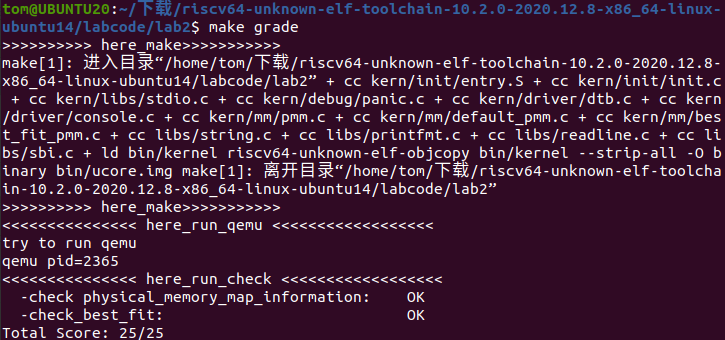
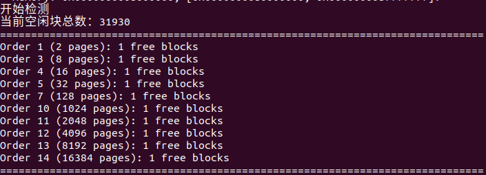
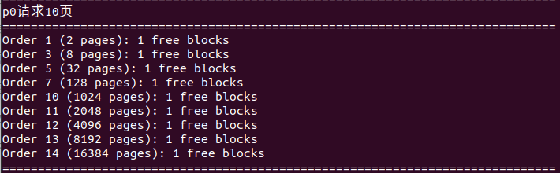
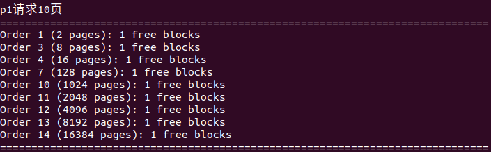
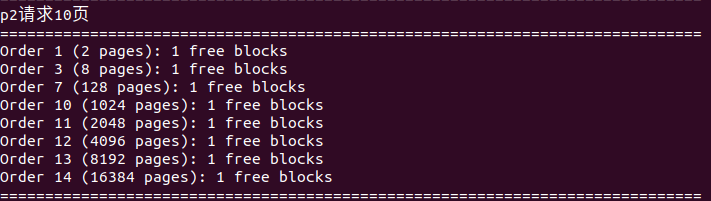
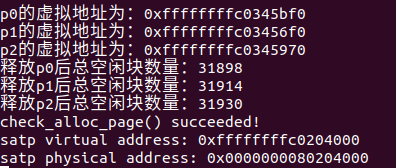

# <center>Lab 2</center>

## 练习 1: 理解first-fit 连续物理内存分配算法（思考题）

&emsp;&emsp;我将逐段解释`kern/mm/default_pmm.c`中的代码，归纳每个函数、结构体的作用，最后总结该 $C$ 代码的设计流程及效果。代码解读时将使用原文件的行号以便对代码所处位置进行定位。

- 行 $1-61$：文件引入与注释

```c
// pmm 头文件引入
#include <pmm.h>
// 链表变量结构头文件引入
#include <list.h>
// string 型变量头文件引入
#include <string.h>
// default_pmm 头文件引入
#include <default_pmm.h>
// 注释部分详细说明了 First-Fit 内存分配算法（FFMA）的基本思想：在空闲链表中找到第一个满足需求的内存块分配出去
/* In the first fit algorithm, the allocator keeps a list of free blocks (known as the free list) and,
   on receiving a request for memory, scans along the list for the first block that is large enough to
   satisfy the request. If the chosen block is significantly larger than that requested, then it is 
   usually split, and the remainder added to the list as another free block.
   Please see Page 196~198, Section 8.2 of Yan Wei Min's chinese book "Data Structure -- C programming language"
*/
// LAB2 EXERCISE 1: YOUR CODE
// you should rewrite functions: default_init,default_init_memmap,default_alloc_pages, default_free_pages.
/*
 * Details of FFMA
 * (1) Prepare: In order to implement the First-Fit Mem Alloc (FFMA), we should manage the free mem block use some list.
 *              The struct free_area_t is used for the management of free mem blocks. At first you should
 *              be familiar to the struct list in list.h. struct list is a simple doubly linked list implementation.
 *              You should know howto USE: list_init, list_add(list_add_after), list_add_before, list_del, list_next, list_prev
 *              Another tricky method is to transform a general list struct to a special struct (such as struct page):
 *              you can find some MACRO: le2page (in memlayout.h), (in future labs: le2vma (in vmm.h), le2proc (in proc.h),etc.)
 * (2) default_init: you can reuse the  demo default_init fun to init the free_list and set nr_free to 0.
 *              free_list is used to record the free mem blocks. nr_free is the total number for free mem blocks.
 * (3) default_init_memmap:  CALL GRAPH: kern_init --> pmm_init-->page_init-->init_memmap--> pmm_manager->init_memmap
 *              This fun is used to init a free block (with parameter: addr_base, page_number).
 *              First you should init each page (in memlayout.h) in this free block, include:
 *                  p->flags should be set bit PG_property (means this page is valid. In pmm_init fun (in pmm.c),
 *                  the bit PG_reserved is setted in p->flags)
 *                  if this page  is free and is not the first page of free block, p->property should be set to 0.
 *                  if this page  is free and is the first page of free block, p->property should be set to total num of block.
 *                  p->ref should be 0, because now p is free and no reference.
 *                  We can use p->page_link to link this page to free_list, (such as: list_add_before(&free_list, &(p->page_link)); )
 *              Finally, we should sum the number of free mem block: nr_free+=n
 * (4) default_alloc_pages: search find a first free block (block size >=n) in free list and reszie the free block, return the addr
 *              of malloced block.
 *              (4.1) So you should search freelist like this:
 *                       list_entry_t le = &free_list;
 *                       while((le=list_next(le)) != &free_list) {
 *                       ....
 *                 (4.1.1) In while loop, get the struct page and check the p->property (record the num of free block) >=n?
 *                       struct Page *p = le2page(le, page_link);
 *                       if(p->property >= n){ ...
 *                 (4.1.2) If we find this p, then it' means we find a free block(block size >=n), and the first n pages can be malloced.
 *                     Some flag bits of this page should be setted: PG_reserved =1, PG_property =0
 *                     unlink the pages from free_list
 *                     (4.1.2.1) If (p->property >n), we should re-caluclate number of the the rest of this free block,
 *                           (such as: le2page(le,page_link))->property = p->property - n;)
 *                 (4.1.3)  re-caluclate nr_free (number of the the rest of all free block)
 *                 (4.1.4)  return p
 *               (4.2) If we can not find a free block (block size >=n), then return NULL
 * (5) default_free_pages: relink the pages into  free list, maybe merge small free blocks into big free blocks.
 *               (5.1) according the base addr of withdrawed blocks, search free list, find the correct position
 *                     (from low to high addr), and insert the pages. (may use list_next, le2page, list_add_before)
 *               (5.2) reset the fields of pages, such as p->ref, p->flags (PageProperty)
 *               (5.3) try to merge low addr or high addr blocks. Notice: should change some pages's p->property correctly.
 */
static free_area_t free_area;
// 为两个变量类型设置宏名字
// free_list 表示空闲块双向链表的链表头
#define free_list (free_area.free_list)
// nr_free 表示空闲页数量
#define nr_free (free_area.nr_free)
```

- 行 $62-67$：函数 $default\_init$，用于初始化空闲块链表空间和空闲页数量

```C
static void
default_init(void) {
    list_init(&free_list);
    nr_free = 0;
}
```

- 行 $68-95$，函数 $default\_init\_memmap$，用于初始化一段连续的空闲物理页

```C
// 标记从 base 开始、长度为 n 的一段页为可分配空闲页块
static void
default_init_memmap(struct Page *base, size_t n) {
    // 块长需大于 0
    assert(n > 0);
    // 初始化指针 p 指向输入参数 base 的地址
    struct Page *p = base;
    // 对每个页结构体重置标志位 flags 与 property，清空引用计数
    for (; p != base + n; p ++) {
        assert(PageReserved(p));
        p->flags = p->property = 0;
        set_page_ref(p, 0);
    }
    // 对块首页 base 设置 property = n，代表块长度
    base->property = n;
    // 设置 PageProperty 标志
    SetPageProperty(base);
    // 空闲页数量加 n
    nr_free += n;
    // 将该块插入空闲链表中，按物理地址从低到高顺序排列
    if (list_empty(&free_list)) {
        // list_empty 宏会检查 free_list 的前驱和后继是否都指向自身，若空闲链表为空，直接插入
        list_add(&free_list, &(base->page_link));
    } else {
        // 若不为空，自头结点遍历链表
        list_entry_t* le = &free_list;
        while ((le = list_next(le)) != &free_list) {
            // 找到当前链表节点对应的物理页 page
            struct Page* page = le2page(le, page_link);
            // 如果当前要插入的块 base 的地址小于当前节点 page 的地址，在此节点前插入
            if (base < page) {
                list_add_before(le, &(base->page_link));
                break;
            } else if (list_next(le) == &free_list) {
                // 否则在链表末尾插入
                list_add(le, &(base->page_link));
            }
        }
    }
}
```

- 行 $96-125$，函数 $default\_alloc\_pages$，实现 $First-Fit$ 分配算法

```C
static struct Page *
default_alloc_pages(size_t n) {
    // 所需连续空闲页数量需大于 0
    assert(n > 0);
    // 所需连续空闲页数量大于空闲页数量，则找不到合适的空闲块，返回空
    if (n > nr_free) {
        return NULL;
    }
    // 自头节点遍历链表
    struct Page *page = NULL;
    list_entry_t *le = &free_list;
    while ((le = list_next(le)) != &free_list) {
        // 找到当前链表节点对应的物理页 page
        struct Page *p = le2page(le, page_link);
        // 若空闲页块大小比所求大，直接移出链表
        if (p->property >= n) {
            page = p;
            break;
        }
    }
    // 将移除的空闲页删去后，更新链表中空闲页块信息，空闲页数量减少 n
    if (page != NULL) {
        list_entry_t* prev = list_prev(&(page->page_link));
        list_del(&(page->page_link));
        if (page->property > n) {
            struct Page *p = page + n;
            p->property = page->property - n;
            SetPageProperty(p);
            list_add(prev, &(p->page_link));
        }
        nr_free -= n;
        ClearPageProperty(page);
    }
    return page;
}
```

- 行 $126-175$，函数 $default\_free\_pages$，用于完成空闲页回收与空闲块合并

```C
static void
default_free_pages(struct Page *base, size_t n) {
    // 以下直至下次注释用于将被释放的页块 base 初始化为空闲页块状态，分割其为数量为 n 的连续空闲页并插入空闲页链表
    assert(n > 0);
    struct Page *p = base;
    for (; p != base + n; p ++) {
        assert(!PageReserved(p) && !PageProperty(p));
        p->flags = 0;
        set_page_ref(p, 0);
    }
    base->property = n;
    SetPageProperty(base);
    nr_free += n;

    if (list_empty(&free_list)) {
        list_add(&free_list, &(base->page_link));
    } else {
        list_entry_t* le = &free_list;
        while ((le = list_next(le)) != &free_list) {
            struct Page* page = le2page(le, page_link);
            if (base < page) {
                list_add_before(le, &(base->page_link));
                break;
            } else if (list_next(le) == &free_list) {
                list_add(le, &(base->page_link));
            }
        }
    }
    // 自头节点遍历链表
    list_entry_t* le = list_prev(&(base->page_link));
    if (le != &free_list) {
        p = le2page(le, page_link);
        // 如果存在前后相邻的页连续，合并为更大块
        if (p + p->property == base) {
            p->property += base->property;
            ClearPageProperty(base);
            list_del(&(base->page_link));
            base = p;
        }
    }
    // 更新 property 并删除被合并节点
    le = list_next(&(base->page_link));
    if (le != &free_list) {
        p = le2page(le, page_link);
        if (base + base->property == p) {
            base->property += p->property;
            ClearPageProperty(p);
            list_del(&(p->page_link));
        }
    }
}
```

- 行 $176-180$，函数 $default\_nr\_free\_pages$，用于返回当前空闲页总数

```C
static size_t
default_nr_free_pages(void) {
    return nr_free;
}
```

- 行 $181-231$，函数 $basic\_check$，用于进行内存分配器的基本功能验证，不多详述

```C
static void
basic_check(void) {
    struct Page *p0, *p1, *p2;
    p0 = p1 = p2 = NULL;
    assert((p0 = alloc_page()) != NULL);
    assert((p1 = alloc_page()) != NULL);
    assert((p2 = alloc_page()) != NULL);

    assert(p0 != p1 && p0 != p2 && p1 != p2);
    assert(page_ref(p0) == 0 && page_ref(p1) == 0 && page_ref(p2) == 0);

    assert(page2pa(p0) < npage * PGSIZE);
    assert(page2pa(p1) < npage * PGSIZE);
    assert(page2pa(p2) < npage * PGSIZE);

    list_entry_t free_list_store = free_list;
    list_init(&free_list);
    assert(list_empty(&free_list));

    unsigned int nr_free_store = nr_free;
    nr_free = 0;

    assert(alloc_page() == NULL);

    free_page(p0);
    free_page(p1);
    free_page(p2);
    assert(nr_free == 3);

    assert((p0 = alloc_page()) != NULL);
    assert((p1 = alloc_page()) != NULL);
    assert((p2 = alloc_page()) != NULL);

    assert(alloc_page() == NULL);

    free_page(p0);
    assert(!list_empty(&free_list));

    struct Page *p;
    assert((p = alloc_page()) == p0);
    assert(alloc_page() == NULL);

    assert(nr_free == 0);
    free_list = free_list_store;
    nr_free = nr_free_store;

    free_page(p);
    free_page(p1);
    free_page(p2);
}
```

- 行 $232-296$，函数 $default\_check$，同样用于进行内存分配器的基本功能验证，不多详述

```C
// LAB2: below code is used to check the first fit allocation algorithm (your EXERCISE 1) 
// NOTICE: You SHOULD NOT CHANGE basic_check, default_check functions!
static void
default_check(void) {
    int count = 0, total = 0;
    list_entry_t *le = &free_list;
    while ((le = list_next(le)) != &free_list) {
        struct Page *p = le2page(le, page_link);
        assert(PageProperty(p));
        count ++, total += p->property;
    }
    assert(total == nr_free_pages());

    basic_check();

    struct Page *p0 = alloc_pages(5), *p1, *p2;
    assert(p0 != NULL);
    assert(!PageProperty(p0));

    list_entry_t free_list_store = free_list;
    list_init(&free_list);
    assert(list_empty(&free_list));
    assert(alloc_page() == NULL);

    unsigned int nr_free_store = nr_free;
    nr_free = 0;

    free_pages(p0 + 2, 3);
    assert(alloc_pages(4) == NULL);
    assert(PageProperty(p0 + 2) && p0[2].property == 3);
    assert((p1 = alloc_pages(3)) != NULL);
    assert(alloc_page() == NULL);
    assert(p0 + 2 == p1);

    p2 = p0 + 1;
    free_page(p0);
    free_pages(p1, 3);
    assert(PageProperty(p0) && p0->property == 1);
    assert(PageProperty(p1) && p1->property == 3);

    assert((p0 = alloc_page()) == p2 - 1);
    free_page(p0);
    assert((p0 = alloc_pages(2)) == p2 + 1);

    free_pages(p0, 2);
    free_page(p2);

    assert((p0 = alloc_pages(5)) != NULL);
    assert(alloc_page() == NULL);

    assert(nr_free == 0);
    nr_free = nr_free_store;

    free_list = free_list_store;
    free_pages(p0, 5);

    le = &free_list;
    while ((le = list_next(le)) != &free_list) {
        struct Page *p = le2page(le, page_link);
        count --, total -= p->property;
    }
    assert(count == 0);
    assert(total == 0);
}
```

- 行 $297-306$，结构体 $pmm\_manager$，这是物理内存管理模块的“函数指针表”，系统初始化时通过此结构调用相应函数

```C
const struct pmm_manager default_pmm_manager = {
    .name = "default_pmm_manager",
    .init = default_init,
    .init_memmap = default_init_memmap,
    .alloc_pages = default_alloc_pages,
    .free_pages = default_free_pages,
    .nr_free_pages = default_nr_free_pages,
    .check = default_check,
};
```

&emsp;&emsp;<font color="red">**总结：**</font>该 $C$ 代码用于实现基础的内存分配算法，添加空闲块时，按地址从小到大的顺序插入链表；进行内存分配时，按从空闲页链表上查找第一个大小大于所需内存的块，分配；回收时，按照地址从小到大的顺序插入链表，并且合并与之相邻且连续的空闲内存块。

## 练习 2: 实现 Best-Fit 连续物理内存分配算法（需要编程）

&emsp;&emsp;以下是我们在源代码基础上修改实现的 $Best-Fit$ 连续物理内存分配算法 ，展示如下：

```C
#include <pmm.h>
#include <list.h>
#include <string.h>
#include <best_fit_pmm.h>
#include <stdio.h>

/* In the first fit algorithm, the allocator keeps a list of free blocks (known as the free list) and,
   on receiving a request for memory, scans along the list for the first block that is large enough to
   satisfy the request. If the chosen block is significantly larger than that requested, then it is 
   usually split, and the remainder added to the list as another free block.
   Please see Page 196~198, Section 8.2 of Yan Wei Min's chinese book "Data Structure -- C programming language"
*/
// LAB2 EXERCISE 1: YOUR CODE
// you should rewrite functions: default_init,default_init_memmap,default_alloc_pages, default_free_pages.
/*
 * Details of FFMA
 * (1) Prepare: In order to implement the First-Fit Mem Alloc (FFMA), we should manage the free mem block use some list.
 *              The struct free_area_t is used for the management of free mem blocks. At first you should
 *              be familiar to the struct list in list.h. struct list is a simple doubly linked list implementation.
 *              You should know howto USE: list_init, list_add(list_add_after), list_add_before, list_del, list_next, list_prev
 *              Another tricky method is to transform a general list struct to a special struct (such as struct page):
 *              you can find some MACRO: le2page (in memlayout.h), (in future labs: le2vma (in vmm.h), le2proc (in proc.h),etc.)
 * (2) default_init: you can reuse the  demo default_init fun to init the free_list and set nr_free to 0.
 *              free_list is used to record the free mem blocks. nr_free is the total number for free mem blocks.
 * (3) default_init_memmap:  CALL GRAPH: kern_init --> pmm_init-->page_init-->init_memmap--> pmm_manager->init_memmap
 *              This fun is used to init a free block (with parameter: addr_base, page_number).
 *              First you should init each page (in memlayout.h) in this free block, include:
 *                  p->flags should be set bit PG_property (means this page is valid. In pmm_init fun (in pmm.c),
 *                  the bit PG_reserved is setted in p->flags)
 *                  if this page  is free and is not the first page of free block, p->property should be set to 0.
 *                  if this page  is free and is the first page of free block, p->property should be set to total num of block.
 *                  p->ref should be 0, because now p is free and no reference.
 *                  We can use p->page_link to link this page to free_list, (such as: list_add_before(&free_list, &(p->page_link)); )
 *              Finally, we should sum the number of free mem block: nr_free+=n
 * (4) default_alloc_pages: search find a first free block (block size >=n) in free list and reszie the free block, return the addr
 *              of malloced block.
 *              (4.1) So you should search freelist like this:
 *                       list_entry_t le = &free_list;
 *                       while((le=list_next(le)) != &free_list) {
 *                       ....
 *                 (4.1.1) In while loop, get the struct page and check the p->property (record the num of free block) >=n?
 *                       struct Page *p = le2page(le, page_link);
 *                       if(p->property >= n){ ...
 *                 (4.1.2) If we find this p, then it' means we find a free block(block size >=n), and the first n pages can be malloced.
 *                     Some flag bits of this page should be setted: PG_reserved =1, PG_property =0
 *                     unlink the pages from free_list
 *                     (4.1.2.1) If (p->property >n), we should re-caluclate number of the the rest of this free block,
 *                           (such as: le2page(le,page_link))->property = p->property - n;)
 *                 (4.1.3)  re-caluclate nr_free (number of the the rest of all free block)
 *                 (4.1.4)  return p
 *               (4.2) If we can not find a free block (block size >=n), then return NULL
 * (5) default_free_pages: relink the pages into  free list, maybe merge small free blocks into big free blocks.
 *               (5.1) according the base addr of withdrawed blocks, search free list, find the correct position
 *                     (from low to high addr), and insert the pages. (may use list_next, le2page, list_add_before)
 *               (5.2) reset the fields of pages, such as p->ref, p->flags (PageProperty)
 *               (5.3) try to merge low addr or high addr blocks. Notice: should change some pages's p->property correctly.
 */
static free_area_t free_area;

#define free_list (free_area.free_list)
#define nr_free (free_area.nr_free)

static void
best_fit_init(void) {
    list_init(&free_list);
    nr_free = 0;
}

static void
best_fit_init_memmap(struct Page *base, size_t n) {
    assert(n > 0);
    struct Page *p = base;
    for (; p != base + n; p ++) {
        assert(PageReserved(p));
        /*LAB2 EXERCISE 2: 2313815_段俊宇_2313485_陈展_2310591_李相儒*/ 
        // 清空当前页框的标志和属性信息，并将页框的引用计数设置为0
        assert(PageReserved(p));
        p->flags = p->property = 0;
        set_page_ref(p, 0);
    }
    base->property = n;
    SetPageProperty(base);
    nr_free += n;
    if (list_empty(&free_list)) {
        list_add(&free_list, &(base->page_link));
    } else {
        list_entry_t* le = &free_list;
        while ((le = list_next(le)) != &free_list) {
            struct Page* page = le2page(le, page_link);
            /*LAB2 EXERCISE 2: 2313815_段俊宇_2313485_陈展_2310591_李相儒*/ 
            // 编写代码
            // 1、当base < page时，找到第一个大于base的页，将base插入到它前面，并退出循环
            // 2、当list_next(le) == &free_list时，若已经到达链表结尾，将base插入到链表尾部
            if(base < page)
            {
                list_add_before(le, &(base->page_link));
                break;
            }
            else if(list_next(le) == &free_list)
            {
                list_add(le, &(base->page_link));
            }
        }
    }
}

static struct Page *
best_fit_alloc_pages(size_t n) {
    assert(n > 0);
    if (n > nr_free) {
        return NULL;
    }
    struct Page *page = NULL;
    list_entry_t *le = &free_list;
    size_t best_size = nr_free + 1;
    /*LAB2 EXERCISE 2: 2313815_段俊宇_2313485_陈展_2310591_李相儒*/ 
    // 下面的代码是first-fit的部分代码，请修改下面的代码改为best-fit
    // 遍历空闲链表，查找满足需求的空闲页框
    // 如果找到满足需求的页面，记录该页面以及当前找到的最小连续空闲页框数量
    // 遍历空闲链表并找到最小但是可以满足n页的块
    while ((le = list_next(le)) != &free_list) {
        struct Page *p = le2page(le, page_link);
        if (p->property >= n && p->property < best_size) {
            best_size = p->property;
            page = p;
        }
    }
    // 找到最小的块并分配
    if (page != NULL) {
        list_entry_t* prev = list_prev(&(page->page_link));
        list_del(&(page->page_link));
        if (page->property > n) {
            struct Page *p = page + n;
            p->property = page->property - n;
            SetPageProperty(p);
            list_add(prev, &(p->page_link));
        }
        nr_free -= n;
        ClearPageProperty(page);
    }
    return page;
}

static void
best_fit_free_pages(struct Page *base, size_t n) {
    assert(n > 0);
    struct Page *p = base;
    for (; p != base + n; p ++) {
        assert(!PageReserved(p) && !PageProperty(p));
        p->flags = 0;
        set_page_ref(p, 0);
    }
    /*LAB2 EXERCISE 2: 2313815_段俊宇_2313485_陈展_2310591_李相儒*/ 
    // 编写代码
    // 具体来说就是设置当前页块的属性为释放的页块数、并将当前页块标记为已分配状态、最后增加nr_free的值
    base->property = n;
    SetPageProperty(base);
    nr_free += n;

    if (list_empty(&free_list)) {
        list_add(&free_list, &(base->page_link));
    } else {
        list_entry_t* le = &free_list;
        while ((le = list_next(le)) != &free_list) {
            struct Page* page = le2page(le, page_link);
            if (base < page) {
                list_add_before(le, &(base->page_link));
                break;
            } else if (list_next(le) == &free_list) {
                list_add(le, &(base->page_link));
            }
        }
    }

    list_entry_t* le = list_prev(&(base->page_link));
    if (le != &free_list) {
        p = le2page(le, page_link);
        /*LAB2 EXERCISE 2: 2313815_段俊宇_2313485_陈展_2310591_李相儒*/ 
        // 编写代码
        // 1、判断前面的空闲页块是否与当前页块是连续的，如果是连续的，则将当前页块合并到前面的空闲页块中
        // 2、首先更新前一个空闲页块的大小，加上当前页块的大小
        // 3、清除当前页块的属性标记，表示不再是空闲页块
        // 4、从链表中删除当前页块
        // 5、将指针指向前一个空闲页块，以便继续检查合并后的连续空闲页块
        if(p + p->property == base)
        {
            p->property += base->property;
            ClearPageProperty(base);
            list_del(&(base->page_link));
            base = p;
        }
    }

    le = list_next(&(base->page_link));
    if (le != &free_list) {
        p = le2page(le, page_link);
        if (base + base->property == p) {
            base->property += p->property;
            ClearPageProperty(p);
            list_del(&(p->page_link));
        }
    }
}

static size_t
best_fit_nr_free_pages(void) {
    return nr_free;
}

static void
basic_check(void) {
    struct Page *p0, *p1, *p2;
    p0 = p1 = p2 = NULL;
    assert((p0 = alloc_page()) != NULL);
    assert((p1 = alloc_page()) != NULL);
    assert((p2 = alloc_page()) != NULL);

    assert(p0 != p1 && p0 != p2 && p1 != p2);
    assert(page_ref(p0) == 0 && page_ref(p1) == 0 && page_ref(p2) == 0);

    assert(page2pa(p0) < npage * PGSIZE);
    assert(page2pa(p1) < npage * PGSIZE);
    assert(page2pa(p2) < npage * PGSIZE);

    list_entry_t free_list_store = free_list;
    list_init(&free_list);
    assert(list_empty(&free_list));

    unsigned int nr_free_store = nr_free;
    nr_free = 0;

    assert(alloc_page() == NULL);

    free_page(p0);
    free_page(p1);
    free_page(p2);
    assert(nr_free == 3);

    assert((p0 = alloc_page()) != NULL);
    assert((p1 = alloc_page()) != NULL);
    assert((p2 = alloc_page()) != NULL);

    assert(alloc_page() == NULL);

    free_page(p0);
    assert(!list_empty(&free_list));

    struct Page *p;
    assert((p = alloc_page()) == p0);
    assert(alloc_page() == NULL);

    assert(nr_free == 0);
    free_list = free_list_store;
    nr_free = nr_free_store;

    free_page(p);
    free_page(p1);
    free_page(p2);
}

// LAB2: below code is used to check the best fit allocation algorithm (your EXERCISE 1) 
// NOTICE: You SHOULD NOT CHANGE basic_check, default_check functions!
static void
best_fit_check(void) {
    int score = 0 ,sumscore = 6;
    int count = 0, total = 0;
    list_entry_t *le = &free_list;
    while ((le = list_next(le)) != &free_list) {
        struct Page *p = le2page(le, page_link);
        assert(PageProperty(p));
        count ++, total += p->property;
    }
    assert(total == nr_free_pages());

    basic_check();

    #ifdef ucore_test
    score += 1;
    cprintf("grading: %d / %d points\n",score, sumscore);
    #endif
    struct Page *p0 = alloc_pages(5), *p1, *p2;
    assert(p0 != NULL);
    assert(!PageProperty(p0));

    #ifdef ucore_test
    score += 1;
    cprintf("grading: %d / %d points\n",score, sumscore);
    #endif
    list_entry_t free_list_store = free_list;
    list_init(&free_list);
    assert(list_empty(&free_list));
    assert(alloc_page() == NULL);

    #ifdef ucore_test
    score += 1;
    cprintf("grading: %d / %d points\n",score, sumscore);
    #endif
    unsigned int nr_free_store = nr_free;
    nr_free = 0;

    // * - - * -
    free_pages(p0 + 1, 2);
    free_pages(p0 + 4, 1);
    assert(alloc_pages(4) == NULL);
    assert(PageProperty(p0 + 1) && p0[1].property == 2);
    // * - - * *
    assert((p1 = alloc_pages(1)) != NULL);
    assert(alloc_pages(2) != NULL);      // best fit feature
    assert(p0 + 4 == p1);

    #ifdef ucore_test
    score += 1;
    cprintf("grading: %d / %d points\n",score, sumscore);
    #endif
    p2 = p0 + 1;
    free_pages(p0, 5);
    assert((p0 = alloc_pages(5)) != NULL);
    assert(alloc_page() == NULL);

    #ifdef ucore_test
    score += 1;
    cprintf("grading: %d / %d points\n",score, sumscore);
    #endif
    assert(nr_free == 0);
    nr_free = nr_free_store;

    free_list = free_list_store;
    free_pages(p0, 5);

    le = &free_list;
    while ((le = list_next(le)) != &free_list) {
        struct Page *p = le2page(le, page_link);
        count --, total -= p->property;
    }
    assert(count == 0);
    assert(total == 0);
    #ifdef ucore_test
    score += 1;
    cprintf("grading: %d / %d points\n",score, sumscore);
    #endif
}

const struct pmm_manager best_fit_pmm_manager = {
    .name = "best_fit_pmm_manager",
    .init = best_fit_init,
    .init_memmap = best_fit_init_memmap,
    .alloc_pages = best_fit_alloc_pages,
    .free_pages = best_fit_free_pages,
    .nr_free_pages = best_fit_nr_free_pages,
    .check = best_fit_check,
};
```

使用make命令编译后，再使用make grade命令验证算法功能并进行评分，最终结果如下：


### 问题回答

&emsp;&emsp;`kern/mm/default_pmm.c`：对于代码实现的 $First-Fit$ 算法，我认为有两点可以改进：
$$
\begin{cases}
\ 适用块搜索策略:~我们可以使用更快的搜索方法而不是从头遍历所有节点，比如使用二分法搜索 \\
\ 最优适用块策略:~我们可以将可能适用的块进行二次比较，找出最接近所需块大小的连续空白块，避免连续空闲内存碎片化 \\
\end{cases}
$$
&emsp;&emsp;`kern/mm/best_fit_pmm.c`：对于代码实现的 $Best-Fit$ 算法，我认为可以对适用块的搜索策略进行优化，例如使用最小堆的方式对空闲块进行排序，这样可以减少分配时间，提升代码性能。

## 扩展练习Challenge：buddy system（伙伴系统）分配算法（需要编程）

&emsp;&emsp;通过参考实验指导书中关于buddy system算法的极简实现并查阅资料，我发现该算法是将空闲的内存空间分为不同大小的块来进行管理，这些块的大小都是$2$的不同次幂，例如$2,4,8,16\cdots$

&emsp;&emsp;在实现过程中我选择了使用链表数组来实现，每个数组成员都是一个链表，存储一类大小的空闲块，这样就可以分别进行管理而不会产生冲突。分配内存时，当内存块比所需要的块大，就尝试分裂成两个伙伴内存块，一个进行分配，另一个存储到下一级链表中；释放内存块时，寻找地址相邻的块进行合并即可。

### 开发文档

#### 设计数据结构

&emsp;&emsp;为实现该算法，我们参考之前的结构体设计了新的结构体

```c
typedef struct {
    list_entry_t free_list[16];     // 每个阶对应的空闲链表
    unsigned int nr_free;           // 空闲链表中的空闲页数量
} buddy_free_area_t;
```

&emsp;&emsp;初始设置的数组大小为$10$，然而经过测试发现一共有$31930$个块，因此设置数组为$16$，最大阶数为$15$即可。

#### 辅助函数

&emsp;实现算法过程中用到的辅助函数

- get_order：计算所需阶数
- is_power_of_2：判断是否为2的幂
- get_buddy：获取伙伴块
- show_array：输出总空闲块数量和每一阶的空闲块数量

#### 初始化链表

```c
// 初始化结构体中的链表数组和参数,MAX_ORDER为最大阶数，设置为15
static void
buddy_system_init(void) 
{
    for (int i = 0; i <= MAX_ORDER; i++) 
    {
        list_init(&free_list[i]);
    }
    nr_free = 0;
}

static void
buddy_system_init_memmap(struct Page *base, size_t n) 
{
    assert(n > 0);
    
    // 初始化所有空闲页，对每个页结构体重置标志位 flags 与 property，清空引用计数
    struct Page *p = base;
    for (; p != base + n; p++) 
    {
        assert(PageReserved(p));
        p->flags = p->property = 0;
        set_page_ref(p, 0);
    }
    // 空闲页数量加 n
    nr_free += n;
    
    // 将内存块分解为2的幂次方块并添加到合适的阶链表中
    size_t remaining = n;
    struct Page *current = base;
    
    while (remaining > 0) 
    {
        // 找到最大的可以放入的2的幂次内存块,从最大的开始找，依次递减
        unsigned int order = 0;
        size_t block_size = 1;
        
        while (order < MAX_ORDER && block_size * 2 <= remaining) 
        {
            order++;
            block_size *= 2;
        }
        
        // 设置块属性
        current->property = block_size;
        SetPageProperty(current);
        
        // 添加到对应阶的空闲链表
        list_add(&free_list[order], &(current->page_link));
        
        // 剩余空闲块数量递减，为下一轮寻找做准备
        current += block_size;
        remaining -= block_size;
    }
}
```

#### 分配设计

```c
static struct Page *
buddy_system_alloc_pages(size_t n)
{
    // 所需连续空闲页数量需大于 0
    assert(n > 0);
    // 所需连续空闲页数量大于空闲页数量，则找不到合适的空闲块，返回空
    if (n > nr_free) 
    {
        return NULL;
    }
    
    // 计算需要的阶
    unsigned int req_order = get_order(n);
    // 所需空闲块对应的阶大于当前最大的阶，则找不到合适的空闲块，返回空
    if (req_order > MAX_ORDER) 
    {
        return NULL;
    }
    
    // 从req_order开始向上查找可用的块
    unsigned int current_order = req_order;
    struct Page *page = NULL;
    list_entry_t *le = NULL;
    
    while (current_order <= MAX_ORDER) 
    {
        if (!list_empty(&free_list[current_order])) 
        {
            // 找到可用的块
            le = list_next(&free_list[current_order]);
            page = le2page(le, page_link);
            // 从空闲链表中删除该节点，该节点对应的空闲块已经被分配
            list_del(le);
            break;
        }
        current_order++;
    }
    
    if (page == NULL) 
    {
        return NULL;  // 没有找到合适的块
    }
    
    // 如果找到的块比需要的大，需要分裂
    while (current_order > req_order) 
    {
        // 分裂后的伙伴块应当添加到下一级链表中
        current_order--;
        
        // 分裂块，将伙伴块添加到空闲链表
        struct Page *buddy = get_buddy(page, current_order);
        if (buddy != NULL) 
        {
            buddy->property = (1 << current_order);
            SetPageProperty(buddy);
            list_add(&free_list[current_order], &(buddy->page_link));
        }
    }
    
    // 设置分配页面的属性
    ClearPageProperty(page);  // 清除空闲标记
    nr_free -= (1 << req_order);  // 减去实际分配的大小
    
    return page;
}
```

#### 释放设计

```c
static void
buddy_system_free_pages(struct Page *base, size_t n) 
{
    // 释放的页数量需大于0
    assert(n > 0);
    // 被释放的页指针不应当为空
    assert(base != NULL);
    
    // 初始化释放的页面
    struct Page *p = base;
    for (; p != base + n; p++) 
    {
        assert(!PageReserved(p) && !PageProperty(p));
        p->flags = 0;
        set_page_ref(p, 0);
    }
    
    // 计算块的阶，向上取整到2的幂
    unsigned int order = get_order(n);
    
    // 对块首页设置页属性为取整后的阶
    size_t actual_size = (1 << order);
    base->property = actual_size;
    // 设置PageProperty标志
    SetPageProperty(base);
    // 空闲页数量加n
    nr_free += actual_size;
    
    // 尝试合并buddy
    struct Page *current = base;
    unsigned int current_order = order;
    
    while (current_order < MAX_ORDER) 
    {
        struct Page *buddy = get_buddy(current, current_order);
        
        // 检查伙伴块是否空闲、大小相同且在同一个内存区域
        if (buddy == NULL || !PageProperty(buddy) || 
            buddy->property != (1 << current_order) ||
            buddy < pages || buddy >= pages + npage) 
        {
            break;  // 不能合并
        }
        
        // 从空闲链表中移除伙伴块，因为被合并了
        list_del(&(buddy->page_link));
        
        // 确定合并后的块，取地址较小的那个
        if (current > buddy) 
        {
            struct Page *temp = current;
            current = buddy;
            buddy = temp;
        }
        
        // 合并块
        current->property = (1 << (current_order + 1));
        ClearPageProperty(buddy);
        buddy->property = 0;
        
        // 尝试与上一阶的伙伴块合并
        current_order++;
    }
    
    // 将合并结束的块添加到空闲链表
    list_add(&free_list[current_order], &(current->page_link));
}
```

#### 测试样例

```c
static void
base_check(void) 
{
    struct Page *p0, *p1, *p2;
    p0 = p1 = p2 = NULL;
    cprintf("开始检测\n");
    cprintf("当前空闲块总数：%d\n", nr_free);
    // 未分配时刻的空闲块情况
    show_array();

    cprintf("p0请求10页\n");
    p0 = buddy_system_alloc_pages(10);
    // p0分配后的空闲块情况
    show_array();

    cprintf("p1请求10页\n");
    p1 = buddy_system_alloc_pages(10);
    // p1分配后的空闲块情况
    show_array();

    cprintf("p2请求10页\n");
    p2 = buddy_system_alloc_pages(10);
    // p2分配后的空闲块情况
    show_array();
	
    cprintf("p0的虚拟地址为：%p\n", p0);
    cprintf("p1的虚拟地址为：%p\n", p1);
    cprintf("p2的虚拟地址为：%p\n", p2);

    // p0释放后的空闲块情况
    buddy_system_free_pages(p0, 10);
    cprintf("释放p0后总空闲块数量：%d\n", nr_free);

    // p1释放后的空闲块情况
    buddy_system_free_pages(p1, 10);
    cprintf("释放p1后总空闲块数量：%d\n", nr_free);

    // p2释放后的空闲块情况
    buddy_system_free_pages(p2, 10);
    cprintf("释放p2后总空闲块数量：%d\n", nr_free);
}
```

&emsp;&emsp;如下是测试结果，初始空闲块共有$31930$个，分布情况如图所示



&emsp;&emsp;p$0$分配$10$页，因为没有合适的块，因此将大小为$16$的块分配，所以$order4$的空闲块不再存在，这说明基础分配没有问题



&emsp;&emsp;p$1$分配$10$页，此时没有合适的块，需要将大小为$32$的块进行分裂，分裂后的伙伴块存储在$order4$的链表中，验证了分裂功能



&emsp;&emsp;p$2$分配$10$页，和p$0$分配过程相同，此处就不再赘述



&emsp;&emsp;然后释放了p$0$、p$1$以及p$2$分配的内存块，最终内存块数量为$31930$，验证了算法的基本功能



&emsp;&emsp;这样就完成了算法功能的全部测试！
