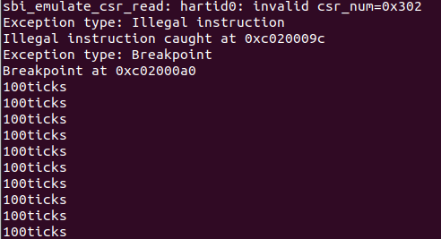
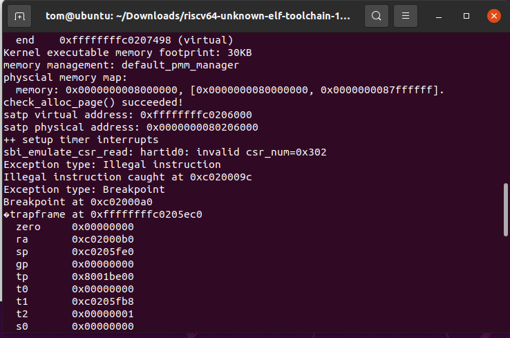

# <center>Lab3</center>

## 练习1：完善中断处理 （需要编程）

&emsp;&emsp;如下是我们编程实现的时钟中断处理代码，我将在下面使用注释的形式解释。

```c
// Code/kern/trap/trap.c
case IRQ_S_TIMER:
            // "All bits besides SSIP and USIP in the sip register are
            // read-only." -- privileged spec1.9.1, 4.1.4, p59
            // In fact, Call sbi_set_timer will clear STIP, or you can clear it
            // directly.
            // cprintf("Supervisor timer interrupt\n");
             /* LAB3 EXERCISE1   2313815_段俊宇_2313485_陈展_2310591_李相儒  */
            /*(1)设置下次时钟中断- clock_set_next_event()
             *(2)计数器（ticks）加一
             *(3)当计数器加到100的时候，我们会输出一个`100ticks`表示我们触发了100次时钟中断，同时打印次数（num）加一
            * (4)判断打印次数，当打印次数为10时，调用<sbi.h>中的关机函数关机
            */
            ;
            int num = 0;	// 设置打印次数计数器
            while(1)		// 进入循环
            {
                clock_set_next_event();	// 设置下次时钟中断函数
                ticks++;				// 时钟中断次数加一
                if(ticks==TICK_NUM)		// TICK_NUM为宏定义的常量100，当时钟中断次数达到100的时候输出100ticks
                {
                    cprintf("100ticks\n");
                    ticks = 0;			// ticks计数器清零
                    num++;				// 打印次数计数器加一
                }
                if(num == 10)			// 当打印次数达到10次时，调用关机函数关机
                    sbi_shutdown();		// 关机函数，需要在最上面添加#include<sbi.h>进行声明
            }
            break;
```

&emsp;&emsp;使用$make{\quad}qemu$命令运行上面的代码，发现成功输出了10次100ticks，之后系统就停止了，说明关机成功


## 扩展练习 Challenge1：描述与理解中断流程

&emsp;&emsp;当 CPU 发生异常或中断时，系统会进入统一的入口 `__alltraps`，随后保存上下文、调用 C 层处理函数，最终恢复现场返回。

### 1. 异常与中断的产生

&emsp;&emsp;当 CPU 检测到中断或异常时：

- 自动保存当前指令地址到寄存器；
- 切换至内核态；
- 跳转至内核中断入口 `__alltraps`。

&emsp;&emsp;该入口在 `trapentry.S` 中定义，用于统一处理所有 trap。

------

### 2. __alltraps：保存现场（SAVE_ALL）

&emsp;&emsp;在进入 `__alltraps` 后，CPU 仍处于中断现场。
&emsp;&emsp;此时，系统必须立即保存寄存器状态，以免在执行 C 函数时被破坏。

```asm
__alltraps:
    SAVE_ALL
    mov a0, sp
    jal trap
```

&emsp;&emsp;`SAVE_ALL` 宏会：

- 在当前内核栈上分配一块空间；
- 按固定顺序将所有通用寄存器以及关键信息保存到栈中；
- 栈顶指针 `sp` 最终指向一个完整的中断帧`trapframe`。

### 3. trap() 函数处理

&emsp;&emsp;在该函数中，系统会根据 `trapframe` 中的标志判断中断或异常类型，并调用相应的处理例程，例如时钟中断、系统调用或页错误。

```C
void exception_handler(struct trapframe *tf) {
    switch (tf->cause) {
        case CAUSE_MISALIGNED_FETCH:
            break;
        case CAUSE_FAULT_FETCH:
            break;
        case CAUSE_ILLEGAL_INSTRUCTION:
             // 非法指令异常处理
             /* LAB3 CHALLENGE3   YOUR CODE :  */
            /*(1)输出指令异常类型（ Illegal instruction）
             *(2)输出异常指令地址
             *(3)更新 tf->epc寄存器
            */
            break;
        case CAUSE_BREAKPOINT:
            //断点异常处理
            /* LAB3 CHALLLENGE3   YOUR CODE :  */
            /*(1)输出指令异常类型（ breakpoint）
             *(2)输出异常指令地址
             *(3)更新 tf->epc寄存器
            */
            break;
        case CAUSE_MISALIGNED_LOAD:
            break;
        case CAUSE_FAULT_LOAD:
            break;
        case CAUSE_MISALIGNED_STORE:
            break;
        case CAUSE_FAULT_STORE:
            break;
        case CAUSE_USER_ECALL:
            break;
        case CAUSE_SUPERVISOR_ECALL:
            break;
        case CAUSE_HYPERVISOR_ECALL:
            break;
        case CAUSE_MACHINE_ECALL:
            break;
        default:
            print_trapframe(tf);
            break;
    }
}

static inline void trap_dispatch(struct trapframe *tf) {
    if ((intptr_t)tf->cause < 0) {
        // interrupts
        interrupt_handler(tf);
    } else {
        // exceptions
        exception_handler(tf);
    }
}

/* *
 * trap - handles or dispatches an exception/interrupt. if and when trap()
 * returns,
 * the code in kern/trap/trapentry.S restores the old CPU state saved in the
 * trapframe and then uses the iret instruction to return from the exception.
 * */
void trap(struct trapframe *tf) {
    // dispatch based on what type of trap occurred
    trap_dispatch(tf);
}
```

### 4.恢复现场与返回

&emsp;&emsp;在中断或异常处理完成后，程序会进入恢复阶段：

```asm
__trapret:
    RESTORE_ALL
    sret
```

&emsp;&emsp;其中：

- `RESTORE_ALL` 宏将先前保存在 `trapframe` 中的寄存器值重新装载回 CPU；
- `sret`（或 `eret/mret`）指令将控制权返回到异常发生前的程序地址。

#### &emsp;&emsp;`mov a0, sp` 的目的

&emsp;&emsp;`mov a0, sp` 的作用是：

- 将当前栈指针作为参数传递给 C 函数 `trap(struct trapframe *tf)`；
- 在 RISC-V/MIPS 调用约定中，`a0` 是第一个函数参数寄存器，因此这条指令实现了 `trap()` 的参数传递。
- `trap()` 函数接收 `trapframe` 指针作为参数，用于区分并分发异常类型。

#### 寄存器在栈中的保存位置

&emsp;&emsp;`SAVE_ALL` 的保存位置由 `trapframe` 结构体的定义顺序决定：

```
struct pushregs {
    uintptr_t zero;  // Hard-wired zero
    uintptr_t ra;    // Return address
    uintptr_t sp;    // Stack pointer
    uintptr_t gp;    // Global pointer
    uintptr_t tp;    // Thread pointer
    uintptr_t t0;    // Temporary
    uintptr_t t1;    // Temporary
    uintptr_t t2;    // Temporary
    uintptr_t s0;    // Saved register/frame pointer
    uintptr_t s1;    // Saved register
    uintptr_t a0;    // Function argument/return value
    uintptr_t a1;    // Function argument/return value
    uintptr_t a2;    // Function argument
    uintptr_t a3;    // Function argument
    uintptr_t a4;    // Function argument
    uintptr_t a5;    // Function argument
    uintptr_t a6;    // Function argument
    uintptr_t a7;    // Function argument
    uintptr_t s2;    // Saved register
    uintptr_t s3;    // Saved register
    uintptr_t s4;    // Saved register
    uintptr_t s5;    // Saved register
    uintptr_t s6;    // Saved register
    uintptr_t s7;    // Saved register
    uintptr_t s8;    // Saved register
    uintptr_t s9;    // Saved register
    uintptr_t s10;   // Saved register
    uintptr_t s11;   // Saved register
    uintptr_t t3;    // Temporary
    uintptr_t t4;    // Temporary
    uintptr_t t5;    // Temporary
    uintptr_t t6;    // Temporary
};

struct trapframe {
    struct pushregs gpr;
    uintptr_t status;
    uintptr_t epc;
    uintptr_t badvaddr;
    uintptr_t cause;
};
```

&emsp;&emsp;每个寄存器的存储顺序由结构体定义而固定，偏移量也由结构体定义而固定。

#### &emsp;&emsp;对于任何中断，`__alltraps` 中都需要保存所有寄存器吗？

&emsp;&emsp;需要，理由如下：

1. **统一入口设计**
   所有异常和中断共用同一个入口 `__alltraps`。
   在进入时 CPU 并不知道当前是哪类 trap，因此必须无条件保存所有寄存器以确保安全。
2. **保护上下文**
   后续的 C 语言函数调用会使用调用约定中允许修改的寄存器，例如 t0–t6、a0–a7。
   如果不保存全部寄存器，返回时原程序的上下文可能被破坏。
3. **简化恢复逻辑**
   保存所有寄存器后，恢复阶段可以统一使用 `RESTORE_ALL`，无需区分不同中断类型，逻辑简洁可靠。

## 扩增练习 Challenge2：理解上下文切换机制

## 扩展练习Challenge3：完善异常中断

&emsp;&emsp;处理异常中断时，我们在$exception\_handler()$函数中编写输出信息的代码，我将使用注释来进行解释。

```c
// Code/kern/trap/trap.c
case CAUSE_ILLEGAL_INSTRUCTION:
             // 非法指令异常处理
             /* LAB3 CHALLENGE3   2313815_段俊宇_2313485_陈展_2310591_李相儒  */
            /*(1)输出指令异常类型（ Illegal instruction）
             *(2)输出异常指令地址
             *(3)更新 tf->epc寄存器
            */
			// 输出指令异常类型为非法指令
            cprintf("Exception type: Illegal instruction\n");			
			// 输出异常指令地址，ept是异常程序计数器，用于保存中断发生时正在执行的指令的地址，在处理完成后恢复执行
            cprintf("Illegal instruction caught at 0x%08x\n", tf->epc); 
			// 更新tf->epc寄存器，跳过非法指令，RISC-V中一条指令占4字节，因此需要加4
            tf->epc += 4;												
            break;
        case CAUSE_BREAKPOINT:
            //断点异常处理
            /* LAB3 CHALLLENGE3   2313815_段俊宇_2313485_陈展_2310591_李相儒  */
            /*(1)输出指令异常类型（ breakpoint）
             *(2)输出异常指令地址
             *(3)更新 tf->epc寄存器
            */
			// 输出指令异常类型为断点
            cprintf("Exception type: Breakpoint\n");
			// 输出异常指令地址
            cprintf("Breakpoint at 0x%08x\n", tf->epc);
			// 更新tf->epc寄存器，跳过断点
            tf->epc += 2;
            break;
```

&emsp;&emsp;还需要在$Code/kern/init/init.c$中$intr\_enable()$函数下面加入下面两行指令进行测试

```c
    asm("mret");
    asm("ebreak");
```

&emsp;&emsp;最后使用$make{\quad}qemu$命令运行结果如下所示，说明成功处理了非法指令和断点指令



## 遇到的问题

&emsp;&emsp;在处理断点指令的时候遇到了一个问题，通过查看$RV$硬件简要手册发现$ebreak$是$4$字节的指令，但是当$epc$加$4$的时候，按照$init.c$中的指令顺序，接下来应当什么都不做，进入死循环，然后输出时钟中断；然而输出结果如下所示，进入到了$default$分支，调用了$print\_trapframe()$函数，如下图所示，最终经过实验发现改为2的时候可以正确输出，但是不知道原因，届时需要询问助教。

