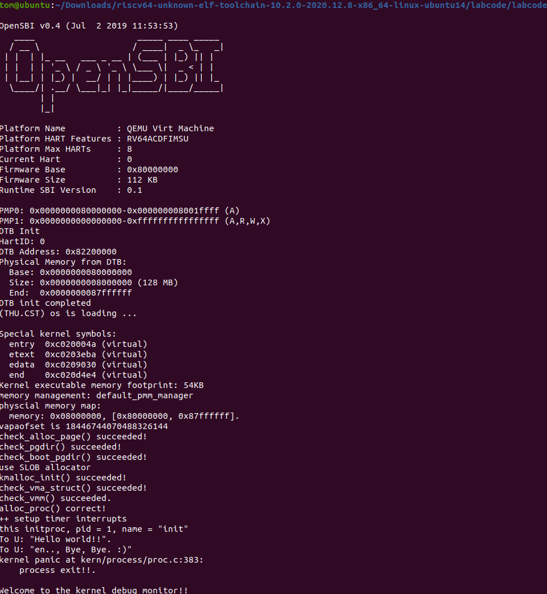

# <center>Lab4</center>

## 练习1：分配并初始化一个进程控制块（需要编码）

&emsp;&emsp;如下是初始化进程控制块的代码，下面将使用注释的形式解释。

```c
// alloc_proc - alloc a proc_struct and init all fields of proc_struct
static struct proc_struct *
alloc_proc(void)
{
    struct proc_struct *proc = kmalloc(sizeof(struct proc_struct));
    if (proc != NULL)
    {
        // LAB4:EXERCISE1 2313815_段俊宇_2313485_陈展_2310591_李相儒
        /*
         * below fields in proc_struct need to be initialized
         *       enum proc_state state;                      // Process state
         *       int pid;                                    // Process ID
         *       int runs;                                   // the running times of Proces
         *       uintptr_t kstack;                           // Process kernel stack
         *       volatile bool need_resched;                 // bool value: need to be rescheduled to release CPU?
         *       struct proc_struct *parent;                 // the parent process
         *       struct mm_struct *mm;                       // Process's memory management field
         *       struct context context;                     // Switch here to run process
         *       struct trapframe *tf;                       // Trap frame for current interrupt
         *       uintptr_t pgdir;                            // the base addr of Page Directroy Table(PDT)
         *       uint32_t flags;                             // Process flag
         *       char name[PROC_NAME_LEN + 1];               // Process name
         */
        proc->state = PROC_UNINIT;							 // 进程状态初始化为未启动状态
        proc->pid = -1;										 // 进程ID未分配，因此是-1
        proc->runs = 0;										 // 进程运行次数初始化为0
        proc->kstack = 0;									 // 内核栈指针初始化为0
        proc->need_resched = 0;								 // 是否需要重新调度设置为0，也就是不需要
        proc->parent = NULL;								 // 父进程指针初始化为NULL
        proc->mm = NULL;									 // 内存管理结构初始化为NULL
        memset(&(proc->context), 0, sizeof(struct context)); // 上下文结构体使用memset函数清零
        proc->tf = NULL;									 // 中断帧指针初始化为NULL
        proc->pgdir = boot_pgdir_pa;						 // 页目录基址初始化为引导页目录物理地址
        proc->flags = 0;									 // 进程标志清零
        memset(proc->name, 0, PROC_NAME_LEN+1);				 // 进程名称清零
    }
    return proc;
}
```

&emsp;&emsp;**请说明proc_struct中`struct context context`和`struct trapframe *tf`成员变量含义和在本实验中的作用是啥？（提示通过看代码和编程调试可以判断出来）**

1. **struct context context**
   - **含义：**这个结构体中保存了一系列寄存器的状态，因此$context$保存了进程切换的上下文信息，也就是关键寄存器的状态。
   - **作用：**在进程切换时保存关键寄存器的状态，便于在重新调度时恢复
2. **struct trapframe *tf**
   - **含义：**这个结构体保存了中断帧相关的信息，当进程从用户空间转向内核空间时，该结构体保存了执行状态。
   - **作用：**在进程从用户空间进入内核空间时保存进程的执行状态，便于在返回到用户空间时恢复之前的执行状态。

## 练习2 为新创建的内核线程分配资源（需要编码）

&emsp;&emsp;如下是我们编写的$do\_fork()$函数，下面将使用注释的形式解释。

```c
/* do_fork -     parent process for a new child process
 * @clone_flags: used to guide how to clone the child process
 * @stack:       the parent's user stack pointer. if stack==0, It means to fork a kernel thread.
 * @tf:          the trapframe info, which will be copied to child process's proc->tf
 */
int do_fork(uint32_t clone_flags, uintptr_t stack, struct trapframe *tf)
{
    int ret = -E_NO_FREE_PROC;
    struct proc_struct *proc;
    if (nr_process >= MAX_PROCESS)
    {
        goto fork_out;
    }
    ret = -E_NO_MEM;
    // LAB4:EXERCISE2 2313815_段俊宇_2313485_陈展_2310591_李相儒
    /*
     * Some Useful MACROs, Functions and DEFINEs, you can use them in below implementation.
     * MACROs or Functions:
     *   alloc_proc:   create a proc struct and init fields (lab4:exercise1)
     *   setup_kstack: alloc pages with size KSTACKPAGE as process kernel stack
     *   copy_mm:      process "proc" duplicate OR share process "current"'s mm according clone_flags
     *                 if clone_flags & CLONE_VM, then "share" ; else "duplicate"
     *   copy_thread:  setup the trapframe on the  process's kernel stack top and
     *                 setup the kernel entry point and stack of process
     *   hash_proc:    add proc into proc hash_list
     *   get_pid:      alloc a unique pid for process
     *   wakeup_proc:  set proc->state = PROC_RUNNABLE
     * VARIABLES:
     *   proc_list:    the process set's list
     *   nr_process:   the number of process set
     */

    //    1. call alloc_proc to allocate a proc_struct
    //    2. call setup_kstack to allocate a kernel stack for child process
    //    3. call copy_mm to dup OR share mm according clone_flag
    //    4. call copy_thread to setup tf & context in proc_struct
    //    5. insert proc_struct into hash_list && proc_list
    //    6. call wakeup_proc to make the new child process RUNNABLE
    //    7. set ret vaule using child proc's pid
    
    // 1.调用alloc_proc，首先获得一块用户信息块
    proc = alloc_proc();
    if(proc==NULL)
        goto fork_out;
    // 2.使用setup_kstack()函数为进程分配一个内核栈
    if((setup_kstack(proc)!=0))
        goto bad_fork_cleanup_proc;
    // 3.使用copy_mm()函数复制原进程的内存管理信息到新进程
    if(copy_mm(clone_flags, proc)!=0)
        goto bad_fork_cleanup_kstack;
	// 4.使用copy_thread()函数复制原进程上下文到新进程
    copy_thread(proc, stack, tf);
    
    // 初始化其他信息
    proc->pid = get_pid();	// 获取唯一进程号
    proc->state = PROC_UNINIT;
    proc->parent = current;	// 设置当前进程为新进程的父进程
    proc->runs = 0;

    // 将新进程添加到进程列表和哈希列表
    hash_proc(proc);
    list_add(&proc_list, &proc->list_link);

    // 使用wakeup_proc()函数唤醒新进程，将进程状态设置为PROC_RUNNABLE
    wakeup_proc(proc);

    // 返回新进程号
    ret = proc->pid;

fork_out:
    return ret;

bad_fork_cleanup_kstack:
    put_kstack(proc);
bad_fork_cleanup_proc:
    kfree(proc);
    goto fork_out;
}
```

&emsp;&emsp;**请说明ucore是否做到给每个新fork的线程一个唯一的id？请说明你的分析和理由。**

&emsp;&emsp;可以做到，$get\_pid()$函数可以为每一个进程分配唯一的进程$id$。$get\_pid $算法通过维护 $last\_pid$ 和 $next\_safe$两个状态变量来高效分配进程$ID$。它优先尝试简单递增 $last\_pid$，如果该值在安全范围内且未被占用则直接分配；一旦发现潜在的$PID$冲突或超出安全范围，算法便会扫描整个进程列表，在冲突时递增$ last\_pid$ 并重新扫描，同时记录下一个已占用$PID$作为新的安全上限，以此确保总是能找到并分配当前最小的可用$PID$，并在$PID$耗尽时从$1$开始回绕复用。

## 练习3：编写proc_run 函数（需要编码）

&emsp;&emsp;如下是我们编写的$proc\_run()$函数，下面将使用注释的形式解释。

```c
// proc_run - make process "proc" running on cpu
// NOTE: before call switch_to, should load  base addr of "proc"'s new PDT
void proc_run(struct proc_struct *proc)
{
    if (proc != current)
    {
        // LAB4:EXERCISE3 2313815_段俊宇_2313485_陈展_2310591_李相儒
        /*
         * Some Useful MACROs, Functions and DEFINEs, you can use them in below implementation.
         * MACROs or Functions:
         *   local_intr_save():        Disable interrupts
         *   local_intr_restore():     Enable Interrupts
         *   lsatp():                   Modify the value of satp register
         *   switch_to():              Context switching between two processes
         */
        // 记录进程标志
        unsigned long intrflag;
        struct proc_struct *prev = current;
        // 禁用中断
        local_intr_save(intrflag);
        // 将当前进程状态变成需要转换的进程状态
        current = proc;
        // 切换页表
        lsatp(proc->pgdir);
        // 是否需要调度设置为0
        proc->need_resched = 0;
        proc->runs++;
        // 切换进程，上下文切换
        switch_to(&(prev->context), &(proc->context));
        // 恢复中断机制
        local_intr_restore(intrflag);
    }
}
```

&emsp;&emsp;**在本实验的执行过程中，创建且运行了几个内核进程？**

&emsp;&emsp;创建并运行了两个内核进程，一个是$idleproc$，它表示空闲进程，主要是为了在没有系统进程调度时占用$CPU$以便后续统一调度；另一个是$initproc$，它$fork$了$idleproc$进程的信息，并且输出了$Hello\ world!$这一内容。

&emsp;&emsp;下面是使用$make\ \ qemu$命令运行的结果，成功输出了一系列信息，说明我们成功完成了进程初始化、$fork$创建新进程以及进程切换的任务！



## 扩展练习 Challenge

### &emsp;&emsp;1.说明语句local_intr_save(intr_flag);....local_intr_restore(intr_flag);是如何实现开关中断的？

### &emsp;&emsp;2.深入理解不同分页模式的工作原理（思考题）


