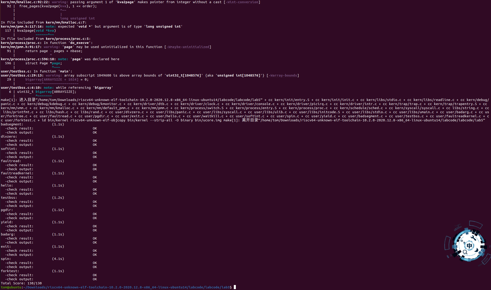
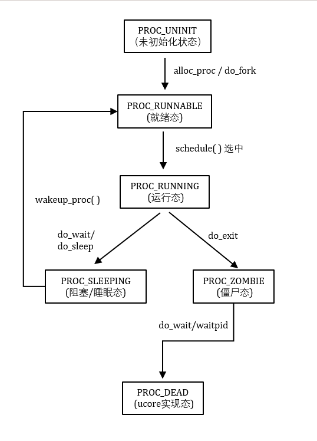
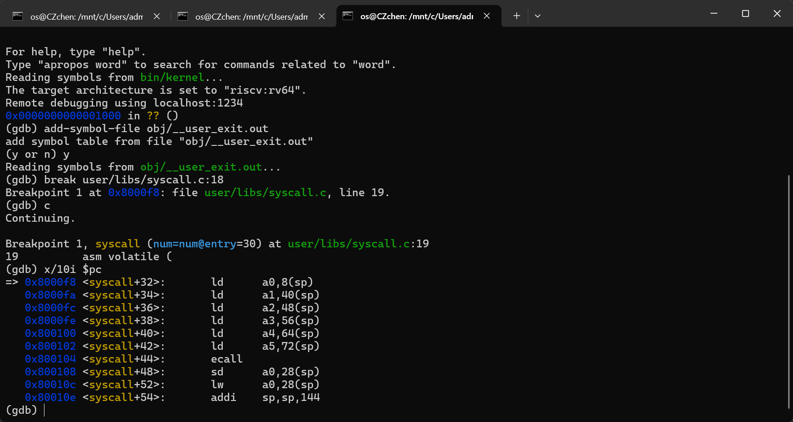
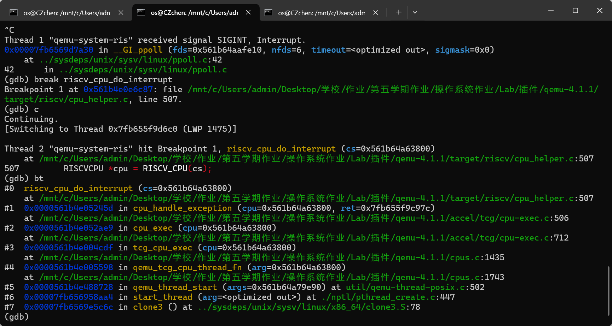
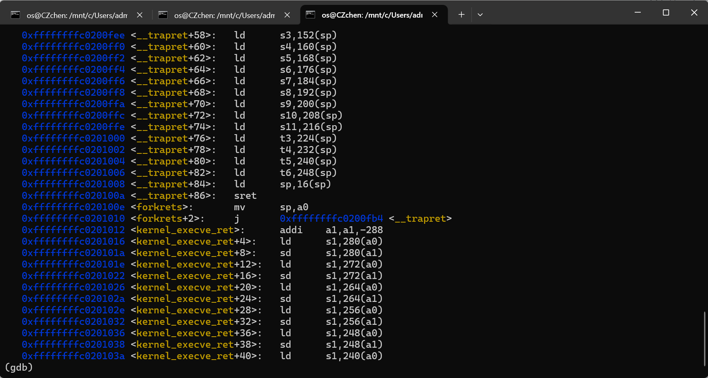
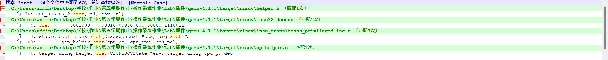

# <center>Lab5</center>

## 练习0：填写已有实验

&emsp;&emsp;如下是初始化进程控制块的代码，在这里面新增了对等待时间和三个指针的初始化，下面将使用注释的形式解释。

```c
// alloc_proc - alloc a proc_struct and init all fields of proc_struct
static struct proc_struct *
alloc_proc(void)
{
    struct proc_struct *proc = kmalloc(sizeof(struct proc_struct));
    if (proc != NULL)
    {
        // LAB4:EXERCISE1 2313815_段俊宇_2313485_陈展_2310591_李相儒
        /*
         * below fields in proc_struct need to be initialized
         *       enum proc_state state;                      // Process state
         *       int pid;                                    // Process ID
         *       int runs;                                   // the running times of Proces
         *       uintptr_t kstack;                           // Process kernel stack
         *       volatile bool need_resched;                 // bool value: need to be rescheduled to release CPU?
         *       struct proc_struct *parent;                 // the parent process
         *       struct mm_struct *mm;                       // Process's memory management field
         *       struct context context;                     // Switch here to run process
         *       struct trapframe *tf;                       // Trap frame for current interrupt
         *       uintptr_t pgdir;                            // the base addr of Page Directroy Table(PDT)
         *       uint32_t flags;                             // Process flag
         *       char name[PROC_NAME_LEN + 1];               // Process name
         */
        proc->state = PROC_UNINIT;                           // 进程状态初始化为未启动状态
        proc->pid = -1;                                      // 进程ID未分配，因此是-1
        proc->runs = 0;                                      // 进程运行次数初始化为0
        proc->kstack = 0;                                    // 内核栈指针初始化为0
        proc->need_resched = 0;                              // 是否需要重新调度设置为0，也就是不需要
        proc->parent = NULL;                                 // 父进程指针初始化为NULL
        proc->mm = NULL;                                     // 内存管理结构初始化为NULL
        memset(&(proc->context), 0, sizeof(struct context)); // 上下文结构体使用memset函数清零
        proc->tf = NULL;                                     // 中断帧指针初始化为NULL
        proc->pgdir = boot_pgdir_pa;                         // 页目录基址初始化为引导页目录物理地址
        proc->flags = 0;                                     // 进程标志清零
        memset(proc->name, 0, PROC_NAME_LEN+1);              // 进程名称清零
        list_init(&(proc->list_link));						 // 初始化进程链表
        list_init(&(proc->hash_link));						 // 初始化哈希链表
     
        // LAB5新增     
        proc->wait_state = 0;								 // 等待时间设置为0
        proc->cptr = NULL;									 // 指针初始化
        proc->optr = NULL;
        proc->yptr = NULL;
    }
    return proc;
}
```

&emsp;&emsp;如下是创建子进程函数的新增内容，下面将使用注释的形式解释

```c
int do_fork(uint32_t clone_flags, uintptr_t stack, struct trapframe *tf)
{
    int ret = -E_NO_FREE_PROC;
    struct proc_struct *proc;
    if (nr_process >= MAX_PROCESS)
    {
        goto fork_out;
    }
    ret = -E_NO_MEM;
    // LAB4:EXERCISE2 2313815_段俊宇_2313485_陈展_2310591_李相儒
    /*
     * Some Useful MACROs, Functions and DEFINEs, you can use them in below implementation.
     * MACROs or Functions:
     *   alloc_proc:   create a proc struct and init fields (lab4:exercise1)
     *   setup_kstack: alloc pages with size KSTACKPAGE as process kernel stack
     *   copy_mm:      process "proc" duplicate OR share process "current"'s mm according clone_flags
     *                 if clone_flags & CLONE_VM, then "share" ; else "duplicate"
     *   copy_thread:  setup the trapframe on the  process's kernel stack top and
     *                 setup the kernel entry point and stack of process
     *   hash_proc:    add proc into proc hash_list
     *   get_pid:      alloc a unique pid for process
     *   wakeup_proc:  set proc->state = PROC_RUNNABLE
     * VARIABLES:
     *   proc_list:    the process set's list
     *   nr_process:   the number of process set
     */

    //    1. call alloc_proc to allocate a proc_struct
    //    2. call setup_kstack to allocate a kernel stack for child process
    //    3. call copy_mm to dup OR share mm according clone_flag
    //    4. call copy_thread to setup tf & context in proc_struct
    //    5. insert proc_struct into hash_list && proc_list
    //    6. call wakeup_proc to make the new child process RUNNABLE
    //    7. set ret vaule using child proc's pid

    // LAB5 2313815_段俊宇_2313485_陈展_2310591_李相儒 : (update LAB4 steps)
    // TIPS: you should modify your written code in lab4(step1 and step5), not add more code.
    /* Some Functions
     *    set_links:  set the relation links of process.  ALSO SEE: remove_links:  lean the relation links of process
     *    -------------------
     *    update step 1: set child proc's parent to current process, make sure current process's wait_state is 0
     *    update step 5: insert proc_struct into hash_list && proc_list, set the relation links of process
     */
    // 1.调用alloc_proc，首先获得一块用户信息块
    proc = alloc_proc();
    if(proc==NULL)
        goto fork_out;
    // 2.使用setup_kstack()函数为进程分配一个内核栈
    if((setup_kstack(proc)!=0))
        goto bad_fork_cleanup_proc;
    // 3.使用copy_mm()函数复制原进程的内存管理信息到新进程
    if(copy_mm(clone_flags, proc)!=0)
        goto bad_fork_cleanup_kstack;
    // 4.使用copy_thread()函数复制原进程上下文到新进程
    copy_thread(proc, stack, tf);
	// 将现在进程设置为子进程的父进程并初始化等待时间
    proc->parent = current;
    assert(current->wait_state == 0);
    // 获取进程pid并添加到链表中，使用set_links函数
    proc->pid = get_pid();
    hash_proc(proc);
    set_links(proc);
	// 使用wakeup_proc()函数唤醒新进程，将进程状态设置为PROC_RUNNABLE
    wakeup_proc(proc);
	// 返回新进程号
    ret = proc->pid;

fork_out:
    return ret;

bad_fork_cleanup_kstack:
    put_kstack(proc);
bad_fork_cleanup_proc:
    kfree(proc);
    goto fork_out;
}
```

&emsp;&emsp;如下是$trap.c$中对时钟中断的设置，下面将使用注释的形式解释

```c
case IRQ_S_TIMER:
        // "All bits besides SSIP and USIP in the sip register are
        // read-only." -- privileged spec1.9.1, 4.1.4, p59
        // In fact, Call sbi_set_timer will clear STIP, or you can clear it
        // directly.
        // cprintf("Supervisor timer interrupt\n");
        /* LAB3 EXERCISE1   2313815_段俊宇_2313485_陈展_2310591_李相儒 :  */
        /*(1)设置下次时钟中断- clock_set_next_event()
         *(2)计数器（ticks）加一
         *(3)当计数器加到100的时候，我们会输出一个`100ticks`表示我们触发了100次时钟中断，同时打印次数（num）加一
         * (4)判断打印次数，当打印次数为10时，调用<sbi.h>中的关机函数关机
         */
		// 设置时钟中断
        clock_set_next_event();
		// 中断次数增加
        ticks++;
		// tick_num为100，打印次数加一
        if (ticks % TICK_NUM == 0) {
            print_ticks();
            // 当进程不为空时，状态设置为需要进行调度
            if(current != NULL)
            {
                current->need_resched = 1;
            }
        }
        break;
```


## 练习1 加载应用程序并执行（需要编码）

&emsp;&emsp;这是对$load\_icode$函数修改添加的部分，下面将使用注释解释

```c
//(6) setup trapframe for user environment
    struct trapframe *tf = current->tf;
    // Keep sstatus
    uintptr_t sstatus = tf->status;
    memset(tf, 0, sizeof(struct trapframe));
    /* LAB5:EXERCISE1 YOUR CODE
     * should set tf->gpr.sp, tf->epc, tf->status
     * NOTICE: If we set trapframe correctly, then the user level process can return to USER MODE from kernel. So
     *          tf->gpr.sp should be user stack top (the value of sp)
     *          tf->epc should be entry point of user program (the value of sepc)
     *          tf->status should be appropriate for user program (the value of sstatus)
     *          hint: check meaning of SPP, SPIE in SSTATUS, use them by SSTATUS_SPP, SSTATUS_SPIE(defined in risv.h)
     */
    // 设置用户栈指针
    tf->gpr.sp = (uintptr_t)USTACKTOP;

    // 设置程序入口指针
    tf->epc = (uintptr_t)elf->e_entry;

    // 设置用户态执行的返回值为0
    tf->gpr.a0 = 0;

    // 调整状态
    tf->status = (sstatus & ~SSTATUS_SPP) | SSTATUS_SPIE;
    
    ret = 0;
out:
    return ret;
bad_cleanup_mmap:
    exit_mmap(mm);
bad_elf_cleanup_pgdir:
    put_pgdir(mm);
bad_pgdir_cleanup_mm:
    mm_destroy(mm);
bad_mm:
    goto out;
```

&emsp;&emsp;**请简要描述这个用户态进程被$ucore$选择占用$CPU$执行（$RUNNING$态）到具体执行应用程序第一条指令的整个经过。**

1. 调度器选择一个就绪的用户进程并切换到它，使其进入 $RUNNING$态。
2. $exec$ 加载 $ELF$，建立页表和用户 $vma$，为用户程序设置$trapframe$，包含程序入口和返回值。
3. 内核执行$sret$，将$CPU$从内核态切换到用户态，并恢复用户上下文。
4. $CPU $跳到$EPC$，执行用户程序的第一条指令。


## 练习2 父进程复制自己的内存空间给子进程（需要编码）

&emsp;&emsp;如下是我们编写的$copy\_range()$函数，下面将使用注释的形式解释。

```c
/* copy_range - copy content of memory (start, end) of one process A to another
 * process B
 * @to:    the addr of process B's Page Directory
 * @from:  the addr of process A's Page Directory
 * @share: flags to indicate to dup OR share. We just use dup method, so it
 * didn't be used.
 *
 * CALL GRAPH: copy_mm-->dup_mmap-->copy_range
 */
int copy_range(pde_t *to, pde_t *from, uintptr_t start, uintptr_t end,
               bool share)
{
    assert(start % PGSIZE == 0 && end % PGSIZE == 0);
    assert(USER_ACCESS(start, end));
    // copy content by page unit.
    do
    {
        // call get_pte to find process A's pte according to the addr start
        pte_t *ptep = get_pte(from, start, 0), *nptep;
        if (ptep == NULL)
        {
            start = ROUNDDOWN(start + PTSIZE, PTSIZE);
            continue;
        }
        // call get_pte to find process B's pte according to the addr start. If
        // pte is NULL, just alloc a PT
        if (*ptep & PTE_V)
        {
            if ((nptep = get_pte(to, start, 1)) == NULL)
            {
                return -E_NO_MEM;
            }
            uint32_t perm = (*ptep & PTE_USER);
            // get page from ptep
            struct Page *page = pte2page(*ptep);
            // alloc a page for process B
            struct Page *npage = alloc_page();
            assert(page != NULL);
            assert(npage != NULL);
            /* LAB5:EXERCISE2 2313815_段俊宇_2313485_陈展_2310591_李相儒
             * replicate content of page to npage, build the map of phy addr of
             * nage with the linear addr start
             *
             * Some Useful MACROs and DEFINEs, you can use them in below
             * implementation.
             * MACROs or Functions:
             *    page2kva(struct Page *page): return the kernel vritual addr of
             * memory which page managed (SEE pmm.h)
             *    page_insert: build the map of phy addr of an Page with the
             * linear addr la
             *    memcpy: typical memory copy function
             *
             * (1) find src_kvaddr: the kernel virtual address of page
             * (2) find dst_kvaddr: the kernel virtual address of npage
             * (3) memory copy from src_kvaddr to dst_kvaddr, size is PGSIZE
             * (4) build the map of phy addr of  nage with the linear addr start
             */
            // 将源页和目标页转换成内核虚拟地址空间中的地址
            void *src_kvaddr = page2kva(page);
            void *dst_kvaddr = page2kva(npage);
            // 把整个旧页内容复制到新页
            memcpy(dst_kvaddr, src_kvaddr, PGSIZE);
            // 把新页映射到目标页表的虚拟地址上
            int ret = page_insert(to, npage, start, perm);
            assert(ret == 0);
        }
        start += PGSIZE;
    } while (start != 0 && start < end);
    return 0;
}
```

&emsp;&emsp;经过上面的修改后，依然不能得到$130$分，在讨论并询问大模型后，发现$trap.c$的内容需要进行修改，下面将使用注释的形式解释。

```c
// 处理页错误
static int
pgfault_handler(struct trapframe *tf) {
    // 取出错误地址
    uintptr_t addr = tf->tval;
    // 内核初始化阶段或进程切换尚未建立时发生错误
    if (current == NULL) {
        print_trapframe(tf);
        panic("page fault in kernel!");
    }
    // 内核线程运行时发生错误
    if (current->mm == NULL) {
        print_trapframe(tf);
        panic("page fault in kernel thread!");
    }

    return -E_INVAL;
}

// 具体错误处理
void exception_handler(struct trapframe *tf)
{
    int ret;
    switch (tf->cause)
    {
    case CAUSE_MISALIGNED_FETCH:
        cprintf("Instruction address misaligned\n");
        break;
    case CAUSE_FETCH_ACCESS:
        cprintf("Instruction access fault\n");
        break;
    case CAUSE_ILLEGAL_INSTRUCTION:
        cprintf("Illegal instruction\n");
        break;
    case CAUSE_BREAKPOINT:
        cprintf("Breakpoint\n");
        if (tf->gpr.a7 == 10)
        {
            tf->epc += 4;
            syscall();
            kernel_execve_ret(tf, current->kstack + KSTACKSIZE);
        }
        break;
    case CAUSE_MISALIGNED_LOAD:
        cprintf("Load address misaligned\n");
        break;
    case CAUSE_LOAD_ACCESS:
        cprintf("Load access fault\n");
        break;
    case CAUSE_MISALIGNED_STORE:
        panic("AMO address misaligned\n");
        break;
    case CAUSE_STORE_ACCESS:
        cprintf("Store/AMO access fault\n");
        break;
    case CAUSE_USER_ECALL:
        // cprintf("Environment call from U-mode\n");
        tf->epc += 4;
        syscall();
        break;
    case CAUSE_SUPERVISOR_ECALL:
        cprintf("Environment call from S-mode\n");
        tf->epc += 4;
        syscall();
        break;
    case CAUSE_HYPERVISOR_ECALL:
        cprintf("Environment call from H-mode\n");
        break;
    case CAUSE_MACHINE_ECALL:
        cprintf("Environment call from M-mode\n");
        break;
    // 指令取值异常，后面与这个的逻辑基本相同，只是输出不一致
    case CAUSE_FETCH_PAGE_FAULT:
        // 是否处理成功
        if ((ret = pgfault_handler(tf)) != 0) {
            // 打印错误信息
            cprintf("Fetch page fault\n");
            print_trapframe(tf);
            // 用户态进程造成的错误，直接结束进程
            if (current != NULL) {
                do_exit(-E_KILLED);
            } else {
                panic("kernel page fault");
            }
        }
        break;
    // 数据加载异常
    case CAUSE_LOAD_PAGE_FAULT:
        if ((ret = pgfault_handler(tf)) != 0) {
            cprintf("Load page fault\n");
            print_trapframe(tf);
            if (current != NULL) {
                do_exit(-E_KILLED);
            } else {
                panic("kernel page fault");
            }
        }
        break;
    // 数据存储异常
    case CAUSE_STORE_PAGE_FAULT:
        if ((ret = pgfault_handler(tf)) != 0) {
            cprintf("Store/AMO page fault\n");
            print_trapframe(tf);
            if (current != NULL) {
                do_exit(-E_KILLED);
            } else {
                panic("kernel page fault");
            }
        }
        break;
    default:
        print_trapframe(tf);
        break;
    }
}
```

&emsp;&emsp;经过上面的改动，在使用$make{\ }grade$命令时终于可以得到满分$130$，通过了全部的测试点，如下所示：




## 练习3：阅读分析源代码，理解进程执行 fork/exec/wait/exit 的实现，以及系统调用的实现（不需要编码）

&emsp;&emsp;我们来简要分析一下 $fork$ / $exec$ / $wait$ / $exit$ 这四个函数。总的来说，这几个函数是操作系统中用于管理“进程生命周期”的四个最核心的系统调用，它们描述了一个进程如何被创建、运行、等待，并最终结束，是一个完整的过程。

- $fork$ 是一个系统调用，用于创建一个新的进程，即子进程。子进程在逻辑上是父进程的复制品，拥有与父进程几乎完全相同的执行上下文。
- $exec$ 用于在当前进程中加载并运行一个新的程序。与 $fork$ 不同，$exec$ 并不会创建新进程，而是在保持当前进程 $PID$ 不变的情况下，彻底替换原有的地址空间和执行代码。
- $wait$ 用于使父进程等待其子进程结束。当子进程调用 $exit$ 后，并不会立即从系统中消失，而是进入僵尸进程（$zombie$）状态，保留退出码和部分内核信息，以便父进程获取。
- $exit$ 用于结束当前进程的执行。当进程调用 $exit$ 时，内核会释放其用户态相关资源，保存退出码，并唤醒正在等待该进程的父进程。

### 问题一

- 请分析$fork$/$exec$/$wait$/$exit$的执行流程。重点关注哪些操作是在用户态完成，哪些是在内核态完成？内核态与用户态程序是如何交错执行的？内核态执行结果是如何返回给用户程序的？

&emsp;&emsp;这部分的实现主要是在$kern$/$process$/$proc.c$中

#### 一、fork / exec / wait / exit 的执行流程与用户态—内核态分工

&emsp;&emsp;在 $ucore$ 中，进程管理相关的系统调用遵循统一的设计原则：**用户态仅负责发起请求，内核态完成所有关键操作**，具体而言：

- **fork**

&emsp;&emsp;$fork$ 的调用从用户态开始，用户程序调用 $fork()$ 后，通过 $ecall$ 指令陷入内核态，用户态本身不进行任何进程复制操作。

&emsp;&emsp;进入内核态后，内核在 $sys\_fork$ / $do\_fork$ 中完成全部核心工作，包括：为子进程分配进程控制块（$PCB$）和内核栈，复制或共享父进程的地址空间，拷贝父进程的寄存器现场，并建立父子进程关系及分配 $PID$，内核还会将子进程加入就绪队列并唤醒。在返回阶段，内核通过修改 $trapframe$，使父进程在 $fork()$ 中获得子进程 $PID$，而子进程在首次返回时看到的返回值为 $0$。

- **exec**

&emsp;&emsp;$exec$ 同样由用户态发起，用户进程调用 $execve()$ 后触发系统调用陷入内核，随后用户态代码不再继续执行。

&emsp;&emsp;在内核态中，$do\_execve$ 负责释放当前进程原有的用户地址空间，并为新程序创建新的 $mm$ 与页表；内核解析 $ELF$ 文件，映射代码段、数据段和 $BSS$，建立全新的用户栈，并切换到新的页表。随后，内核重构 $trapframe$，将用户栈指针设为 $USTACKTOP$，将 $epc$ 设置为程序入口地址，同时清除 $sstatus.SPP$、设置 $SPIE$，并将返回值置为 $0$。

 &emsp;&emsp; 当内核通过 $sret$ 返回时，$CPU$ 直接跳转到新程序的入口处执行，实现了在同一 $PID$ 下用新程序替换旧程序”的效果。

- **wait / waitpid**

&emsp;&emsp;$wait$ 与 $waitpid$ 也由用户态调用并通过 $ecall$ 进入内核，用户态仅发出等待请求，具体的等待与回收逻辑全部在内核完成。

&emsp;&emsp;内核在 $do\_wait$ 中查找是否存在处于 $ZOMBIE$ 状态的子进程：若找到，则回收其剩余资源，如内核栈与 $PCB$，并将子进程的退出码写回用户提供的地址；若当前没有 $ZOMBIE$ 子进程但仍有存活子进程，则将当前进程状态设置为 $WT\_CHILD$ 并睡眠，主动让出 $CPU$，等待子进程在 $exit$ 时唤醒；若不存在任何子进程，则直接返回错误。

- **exit**

&emsp;&emsp;$exit$ 由用户态调用，用于终止当前进程。用户态调用 $exit()$ 后通过系统调用进入内核态，此后不再返回到用户态。

&emsp;&emsp;在内核中，$do\_exit$ 负责释放当前进程占用的用户态资源，包括虚拟内存与页表，将进程状态标记为 $ZOMBIE$，并保存退出码；同时，内核会将其子进程重新挂接到 $initproc$，并唤醒正在等待该进程的父进程。随后，调度器被调用，当前进程彻底让出 $CPU$，其执行流到此结束。

#### 二、用户态与内核态的交错执行方式

&emsp;&emsp;用户态与内核态的切换主要通过 **系统调用（$ecall$）、异常和中断** 完成。

&emsp;&emsp;用户程序在 $U$ 模式下运行，当执行系统调用或发生异常 / 中断时，硬件自动切换到 $S$ 模式，并跳转到 $trap$ 入口。内核在 $trap$ 入口处将用户态寄存器保存到当前进程内核栈上的 $trapframe$，并根据异常类型或系统调用号分发到对应的 $sys_xxx$ / $do_xxx$ 处理函数。

&emsp;&emsp;在执行系统调用或处理中断期间，内核可能根据调度条件调用 $schedule()$，从而导致用户态执行被多次打断，并与内核态执行片段交错进行。对于阻塞型系统调用（如 $wait$、$sleep$），进程会在内核中主动让出 $CPU$，直到被事件唤醒后再次进入就绪或运行状态。

#### 三、内核态执行结果如何返回给用户态

&emsp;&emsp;系统调用处理完成后，内核通过修改 $trapframe$ 将结果返回给用户程序。

&emsp;&emsp;具体做法是：将系统调用的返回值写入 $trapframe$ 中的 $a0$ 寄存器，设置 $sepc$ 为下一条用户指令地址（通常是原 $PC + 4$），并配置 $sstatus$，即清除 $SPP$ 以返回 $U$ 模式，设置 $SPIE$ 以允许中断。随后执行 $sret$ 指令，硬件恢复用户态寄存器并切换回 $U$ 模式。

&emsp;&emsp;用户程序从系统调用指令后的代码继续执行，并从 $a0$ 中读取系统调用返回值。对于 $fork$，子进程的第一次执行并非由真实的系统调用返回，而是通过 $forkret$ / $forkrets$ 人工构造的 $trap$ 返回路径，使子进程在用户态中观察到 $fork()$ 的返回值为 $0$。

&emsp;&emsp;综上所述，$ucore$ 中 $fork$ / $exec$ / $wait$ / $exit$ 的实现遵循清晰的分工模式：**用户态只负责发起请求，内核态负责资源管理与进程控制**，两者通过 $trapframe$ 与 $sret$ 机制紧密协作，实现了用户态与内核态的安全切换及执行结果的正确传递。

### 问题二

- 请给出$ucore$中一个用户态进程的执行状态生命周期图（包执行状态，执行状态之间的变换关系，以及产生变换的事件或函数调用）。（字符方式画即可）

#### 用户态进程执行状态生命周期图



&emsp;&emsp;为便于理解调度过程，图中显式区分了运行态，即$RUNNING$状态，但在 $uCore$ 的实际实现中并不存在独立的 ，运行态被统一表示为 $PROC\_RUNNABLE$，同时$PROC\_DEAD$ 为实现层内部状态。

&emsp;&emsp;进程在创建之初处于 $PROC\_UNINIT$ 状态。此时内核仅完成了进程控制块 $proc\_struct$ 的分配，进程尚未完成初始化，也未加入就绪队列，因此既不会被调度执行，也不会占用 $CPU$。在图中，这一状态对应最上方的 $PROC\_UNINIT$，并通过 $alloc\_proc$ / $do\_fork$ 向下发生状态迁移。

&emsp;&emsp;当 $do\_fork$ 完成对子进程的基本初始化工作后，内核通过 $wakeup\_proc$ 将该进程加入就绪队列，进程状态由 $PROC\_UNINIT$ 转变为 $PROC\_RUNNABLE$。处于该状态的进程已经具备运行条件，但尚未实际在 $CPU$ 上执行，只是等待调度器进行选择。

&emsp;&emsp;调度器在 $schedule()$ 中选中该进程后，进程开始在 $CPU$ 上运行，逻辑上进入 $PROC\_RUNNING$ 状态，此时进程获得 $CPU$ 执行权，但其执行过程可能在用户态与内核态之间多次切换，例如执行系统调用或响应中断，这并不会改变其“运行态”的逻辑属性。

&emsp;&emsp;在 $PROC\_RUNNING$ 状态下，进程可能沿着多条路径发生状态变化。如果进程由于时间片耗尽或时钟中断而被设置了 $need\_resched$ 标志，调度器会在合适的时机将其切换回 $PROC\_RUNNABLE$ 状态，等待下一次被调度执行。如果进程在运行过程中调用了 $do\_wait$、$do\_sleep$ 等阻塞型操作，它会主动放弃 $CPU$，并将自身状态设置为 $PROC\_SLEEPING$，处于该状态的进程不再参与调度，直到所等待的事件发生，例如子进程退出或相关资源就绪。事件发生后，内核通过 $wakeup\_proc$ 将该进程重新唤醒，使其状态从 $PROC\_SLEEPING$ 回到 $PROC\_RUNNABLE$，再次进入可调度状态。

&emsp;&emsp;当进程在运行态中调用 $exit$ 并进入 $do\_exit$ 处理流程后，其状态被设置为 $PROC\_ZOMBIE$。此时进程的用户态资源已经被释放，不会再被调度执行，但其内核栈和进程控制块仍然保留，用于保存退出码并维持父子进程关系。最后，当父进程成功执行 $wait$ 或 $waitpid$ 回收该子进程后，内核释放其剩余的内核资源，包括内核栈和进程控制块，进程进入 $PROC\_DEAD$ 状态。该状态为 $uCore$ 中的实现态，表示进程已被彻底清理，其生命周期至此结束。

&emsp;&emsp;

## 分支任务：gdb 调试系统调用以及返回

&emsp;&emsp;**在大模型的帮助下，完成整个调试的流程，观察一下ecall指令和sret指令是如何被qemu处理的，并简单阅读一下调试中涉及到的qemu源码，解释其中的关键流程。**

&emsp;&emsp;首先，整个调试流程的编辑内容由我这里提供材料，大模型整理并提供初版，最后由我来进行微调得到。

&emsp;&emsp;其次，对下一问中$TCG Translation$部分关键函数文件$translate.c$的代码阅读，大模型提供了一定帮助。

&emsp;&emsp;现在，我们给出对$ecall$指令和$sret$指令调试的流程与具体分析：

- **1、找到 ecall 指令**

&emsp;&emsp;根据指导书上的指令，我们打断点并前进至断点处后，查看后续 10 条指令，发现 $ecall$ 位置



&emsp;&emsp;我们新创一个断点，使当前指令直接行进至 $ecall$ 处：$break~*0x800104$

- **2、设置 ecall 处断点**

&emsp;&emsp;首先打断 $qemu$ 的执行，接着如下设置断点：

```
break riscv_cpu_do_interrupt
c
```

- **3、观察异常处理**

&emsp;&emsp;我们向下执行指令，触发断点，结果如下所示：



```
[Switching to Thread 0x7fb655f9d6c0 (LWP 1475)]

Thread 2 "qemu-system-ris" hit Breakpoint 1, riscv_cpu_do_interrupt (cs=0x561b64a63800)
    at /mnt/c/Users/admin/Desktop/学校/作业/第五学期作业/操作系统作业/Lab/插件/qemu-4.1.1/target/riscv/cpu_helper.c:507
507         RISCVCPU *cpu = RISCV_CPU(cs);
(gdb) bt
#0  riscv_cpu_do_interrupt (cs=0x561b64a63800)
    at /mnt/c/Users/admin/Desktop/学校/作业/第五学期作业/操作系统作业/Lab/插件/qemu-4.1.1/target/riscv/cpu_helper.c:507
#1  0x0000561b4e05245d in cpu_handle_exception (cpu=0x561b64a63800, ret=0x7fb655f9c97c)
    at /mnt/c/Users/admin/Desktop/学校/作业/第五学期作业/操作系统作业/Lab/插件/qemu-4.1.1/accel/tcg/cpu-exec.c:506
#2  0x0000561b4e052ae9 in cpu_exec (cpu=0x561b64a63800)
    at /mnt/c/Users/admin/Desktop/学校/作业/第五学期作业/操作系统作业/Lab/插件/qemu-4.1.1/accel/tcg/cpu-exec.c:712
#3  0x0000561b4e004cdf in tcg_cpu_exec (cpu=0x561b64a63800)
    at /mnt/c/Users/admin/Desktop/学校/作业/第五学期作业/操作系统作业/Lab/插件/qemu-4.1.1/cpus.c:1435
#4  0x0000561b4e005598 in qemu_tcg_cpu_thread_fn (arg=0x561b64a63800)
    at /mnt/c/Users/admin/Desktop/学校/作业/第五学期作业/操作系统作业/Lab/插件/qemu-4.1.1/cpus.c:1743
#5  0x0000561b4e488728 in qemu_thread_start (args=0x561b64a79e90) at util/qemu-thread-posix.c:502
#6  0x00007fb656958aa4 in start_thread (arg=<optimized out>) at ./nptl/pthread_create.c:447
#7  0x00007fb6569e5c6c in clone3 () at ../sysdeps/unix/sysv/linux/x86_64/clone3.S:78
```

&emsp;&emsp;从代码可知，为抵达异常处理函数，也即是我们设置的断点，从 $qemu$ 线程启动函数开始，经过 $TCG~CPU$ 执行循环

- **4、找到 sret 指令**

&emsp;&emsp;根据此前的实验内容，在执行完 SAVE_ALL 后，还会执行 RESTORE_ALL，在此之后即执行 sret 指令。我们使用 $x/100i~\$pc$ 指令大范围搜索，找到 $sret$ 指令，并效仿前面的操作，设置断点并行进至 $sret$ 前 ：



- **5、根据源码分析流程**

&emsp;&emsp;我们在 $qemu$ 项目的 $riscv$ 目录中遍历寻找 $sret$ 字段，以寻找处理 $sret$ 指令的函数并进行分析：



&emsp;&emsp;我们得到了三个用于处理 $sret$ 的函数，我们对其进行分析：

```C
static bool trans_sret(DisasContext *ctx, arg_sret *a)
{
#ifndef CONFIG_USER_ONLY  // 只有在系统模式下才支持
    // 1. 将下一条指令地址保存到 cpu_pc
    tcg_gen_movi_tl(cpu_pc, ctx->base.pc_next);
    
    // 2. 检查是否支持 Supervisor 扩展（RVS）
    if (has_ext(ctx, RVS)) {
        // 3. 生成对 helper_sret 的调用
        gen_helper_sret(cpu_pc, cpu_env, cpu_pc);
        
        // 4. 设置翻译块退出标志
        exit_tb(ctx);  /* no chaining */
        ctx->base.is_jmp = DISAS_NORETURN;  // 不会返回到当前翻译块
        
        return true;
    } else {
        return false;  // 不支持 RVS 扩展
    }
#else
    return false;  // 用户模式下不支持
#endif
}

target_ulong helper_sret(CPURISCVState *env, target_ulong cpu_pc_deb)
{
    // 1. 权限检查：当前权限必须至少是 Supervisor
    if (!(env->priv >= PRV_S)) {
        riscv_raise_exception(env, RISCV_EXCP_ILLEGAL_INST, GETPC());
    }

    // 2. 获取返回地址（sepc - Supervisor Exception PC）
    target_ulong retpc = env->sepc;
    
    // 3. 对齐检查（如果没有 C 扩展，地址必须是 4 字节对齐）
    if (!riscv_has_ext(env, RVC) && (retpc & 0x3)) {
        riscv_raise_exception(env, RISCV_EXCP_INST_ADDR_MIS, GETPC());
    }

    // 4. TSR（Trap SRET）检查（特权版本 ≥ 1.10）
    if (env->priv_ver >= PRIV_VERSION_1_10_0 &&
        get_field(env->mstatus, MSTATUS_TSR)) {
        riscv_raise_exception(env, RISCV_EXCP_ILLEGAL_INST, GETPC());
    }

    // 5. 恢复 mstatus 寄存器状态
    target_ulong mstatus = env->mstatus;
    target_ulong prev_priv = get_field(mstatus, MSTATUS_SPP);  // 获取之前的权限级别
    
    // 恢复中断使能位
    mstatus = set_field(mstatus,
        env->priv_ver >= PRIV_VERSION_1_10_0 ?
        MSTATUS_SIE : MSTATUS_UIE << prev_priv,  // 根据特权版本选择正确的位
        get_field(mstatus, MSTATUS_SPIE));  // 将 SPIE 恢复到 SIE/UIE
    
    mstatus = set_field(mstatus, MSTATUS_SPIE, 0);  // 清除 SPIE
    mstatus = set_field(mstatus, MSTATUS_SPP, PRV_U);  // 设置 SPP 为用户模式
    
    // 6. 设置 CPU 模式和 mstatus
    riscv_cpu_set_mode(env, prev_priv);  // 切换到之前的权限级别
    env->mstatus = mstatus;
    
    // 7. 返回要跳转的地址
    return retpc;
}
```

&emsp;&emsp;**在执行ecall和sret这类汇编指令的时候，qemu进行了很关键的一步——指令翻译（TCG Translation），了解一下这个功能，思考一下另一个双重gdb调试的实验是否也涉及到了一些相关的内容。**

&emsp;&emsp;结论：有涉及到，在$ucore$执行访存指令时，就会调用$TCG$翻译访存指令，这里询问大模型得到函数位置位于$translate.c$。

&emsp;&emsp;我们现在来分析这个文件所涉及到的函数，这一部分完全由大模型处理：

```c
#include "qemu/osdep.h"
#include "qemu/log.h"
#include "cpu.h"
#include "tcg-op.h"
#include "disas/disas.h"
#include "exec/cpu_ldst.h"
#include "exec/exec-all.h"
#include "exec/helper-proto.h"
#include "exec/helper-gen.h"
#include "exec/translator.h"
#include "exec/log.h"
#include "instmap.h"

static TCGv cpu_gpr[32], cpu_pc;
static TCGv_i64 cpu_fpr[32];
static TCGv load_res;
static TCGv load_val;
#include "exec/gen-icount.h"

typedef struct DisasContext {
    DisasContextBase base;
    target_ulong pc_succ_insn;
    target_ulong priv_ver;
    uint32_t opcode;
    uint32_t mstatus_fs;
    uint32_t misa;
    uint32_t mem_idx;
    int frm;
    bool ext_ifencei;
} DisasContext;

#ifdef TARGET_RISCV64
static const int tcg_memop_lookup[8] = {
    [0 ... 7] = -1,
    [0] = MO_SB,
    [1] = MO_TESW,
    [2] = MO_TESL,
    [4] = MO_UB,
    [5] = MO_TEUW,
#ifdef TARGET_RISCV64
    [3] = MO_TEQ,
    [6] = MO_TEUL,
#endif
};
#endif

#ifdef TARGET_RISCV64
#define CASE_OP_32_64(X) case X: case glue(X, W)
#else
#define CASE_OP_32_64(X) case X
#endif

static inline bool has_ext(DisasContext *ctx, uint32_t ext)  // 检查CPU是否支持某个扩展
{
    return ctx->misa & ext;
}

static void generate_exception(DisasContext *ctx, int excp)  // 生成异常处理代码
{
    tcg_gen_movi_tl(cpu_pc, ctx->base.pc_next);
    TCGv_i32 helper_tmp = tcg_const_i32(excp);
    gen_helper_raise_exception(cpu_env, helper_tmp);
    tcg_temp_free_i32(helper_tmp);
    ctx->base.is_jmp = DISAS_NORETURN;
}

static void generate_exception_mbadaddr(DisasContext *ctx, int excp)  // 生成带错误地址的异常
{
    tcg_gen_movi_tl(cpu_pc, ctx->base.pc_next);
    tcg_gen_st_tl(cpu_pc, cpu_env, offsetof(CPURISCVState, badaddr));
    TCGv_i32 helper_tmp = tcg_const_i32(excp);
    gen_helper_raise_exception(cpu_env, helper_tmp);
    tcg_temp_free_i32(helper_tmp);
    ctx->base.is_jmp = DISAS_NORETURN;
}

static void gen_exception_debug(void)  // 生成调试异常
{
    TCGv_i32 helper_tmp = tcg_const_i32(EXCP_DEBUG);
    gen_helper_raise_exception(cpu_env, helper_tmp);
    tcg_temp_free_i32(helper_tmp);
}

static void exit_tb(DisasContext *ctx)  // 退出翻译块，处理单步执行
{
    if (ctx->base.singlestep_enabled) {
        gen_exception_debug();
    } else {
        tcg_gen_exit_tb(NULL, 0);
    }
}

static void lookup_and_goto_ptr(DisasContext *ctx)  // 查找并跳转到翻译块
{
    if (ctx->base.singlestep_enabled) {
        gen_exception_debug();
    } else {
        tcg_gen_lookup_and_goto_ptr();
    }
}

static void gen_exception_illegal(DisasContext *ctx)  // 生成非法指令异常
{
    generate_exception(ctx, RISCV_EXCP_ILLEGAL_INST);
}

static void gen_exception_inst_addr_mis(DisasContext *ctx)  // 生成指令地址不对齐异常
{
    generate_exception_mbadaddr(ctx, RISCV_EXCP_INST_ADDR_MIS);
}

static inline bool use_goto_tb(DisasContext *ctx, target_ulong dest)  // 判断是否可以使用直接跳转
{
    if (unlikely(ctx->base.singlestep_enabled)) {
        return false;
    }
#ifndef CONFIG_USER_ONLY
    return (ctx->base.tb->pc & TARGET_PAGE_MASK) == (dest & TARGET_PAGE_MASK);
#else
    return true;
#endif
}

static void gen_goto_tb(DisasContext *ctx, int n, target_ulong dest)  // 生成翻译块跳转代码
{
    if (use_goto_tb(ctx, dest)) {
        tcg_gen_goto_tb(n);
        tcg_gen_movi_tl(cpu_pc, dest);
        tcg_gen_exit_tb(ctx->base.tb, n);
    } else {
        tcg_gen_movi_tl(cpu_pc, dest);
        lookup_and_goto_ptr(ctx);
    }
}

static inline void gen_get_gpr(TCGv t, int reg_num)  // 读取通用寄存器值
{
    if (reg_num == 0) {
        tcg_gen_movi_tl(t, 0);
    } else {
        tcg_gen_mov_tl(t, cpu_gpr[reg_num]);
    }
}

static inline void gen_set_gpr(int reg_num_dst, TCGv t)  // 写入通用寄存器值
{
    if (reg_num_dst != 0) {
        tcg_gen_mov_tl(cpu_gpr[reg_num_dst], t);
    }
}

static void gen_mulhsu(TCGv ret, TCGv arg1, TCGv arg2)  // 生成有符号×无符号乘法高位结果
{
    TCGv rl = tcg_temp_new();
    TCGv rh = tcg_temp_new();
    tcg_gen_mulu2_tl(rl, rh, arg1, arg2);
    tcg_gen_sari_tl(rl, arg1, TARGET_LONG_BITS - 1);
    tcg_gen_and_tl(rl, rl, arg2);
    tcg_gen_sub_tl(ret, rh, rl);
    tcg_temp_free(rl);
    tcg_temp_free(rh);
}

static void gen_div(TCGv ret, TCGv source1, TCGv source2)  // 生成有符号除法代码
{
    TCGv cond1, cond2, zeroreg, resultopt1;
    cond1 = tcg_temp_new();
    cond2 = tcg_temp_new();
    zeroreg = tcg_const_tl(0);
    resultopt1 = tcg_temp_new();
    tcg_gen_movi_tl(resultopt1, (target_ulong)-1);
    tcg_gen_setcondi_tl(TCG_COND_EQ, cond2, source2, (target_ulong)(~0L));
    tcg_gen_setcondi_tl(TCG_COND_EQ, cond1, source1,
                        ((target_ulong)1) << (TARGET_LONG_BITS - 1));
    tcg_gen_and_tl(cond1, cond1, cond2);
    tcg_gen_setcondi_tl(TCG_COND_EQ, cond2, source2, 0);
    tcg_gen_movcond_tl(TCG_COND_EQ, source1, cond2, zeroreg, source1,
            resultopt1);
    tcg_gen_or_tl(cond1, cond1, cond2);
    tcg_gen_movi_tl(resultopt1, (target_ulong)1);
    tcg_gen_movcond_tl(TCG_COND_EQ, source2, cond1, zeroreg, source2,
            resultopt1);
    tcg_gen_div_tl(ret, source1, source2);
    tcg_temp_free(cond1);
    tcg_temp_free(cond2);
    tcg_temp_free(zeroreg);
    tcg_temp_free(resultopt1);
}

static void gen_divu(TCGv ret, TCGv source1, TCGv source2)  // 生成无符号除法代码
{
    TCGv cond1, zeroreg, resultopt1;
    cond1 = tcg_temp_new();
    zeroreg = tcg_const_tl(0);
    resultopt1 = tcg_temp_new();
    tcg_gen_setcondi_tl(TCG_COND_EQ, cond1, source2, 0);
    tcg_gen_movi_tl(resultopt1, (target_ulong)-1);
    tcg_gen_movcond_tl(TCG_COND_EQ, source1, cond1, zeroreg, source1,
            resultopt1);
    tcg_gen_movi_tl(resultopt1, (target_ulong)1);
    tcg_gen_movcond_tl(TCG_COND_EQ, source2, cond1, zeroreg, source2,
            resultopt1);
    tcg_gen_divu_tl(ret, source1, source2);
    tcg_temp_free(cond1);
    tcg_temp_free(zeroreg);
    tcg_temp_free(resultopt1);
}

static void gen_rem(TCGv ret, TCGv source1, TCGv source2)  // 生成有符号取余代码
{
    TCGv cond1, cond2, zeroreg, resultopt1;
    cond1 = tcg_temp_new();
    cond2 = tcg_temp_new();
    zeroreg = tcg_const_tl(0);
    resultopt1 = tcg_temp_new();
    tcg_gen_movi_tl(resultopt1, 1L);
    tcg_gen_setcondi_tl(TCG_COND_EQ, cond2, source2, (target_ulong)-1);
    tcg_gen_setcondi_tl(TCG_COND_EQ, cond1, source1,
                        (target_ulong)1 << (TARGET_LONG_BITS - 1));
    tcg_gen_and_tl(cond2, cond1, cond2);
    tcg_gen_setcondi_tl(TCG_COND_EQ, cond1, source2, 0);
    tcg_gen_or_tl(cond2, cond1, cond2);
    tcg_gen_movcond_tl(TCG_COND_EQ, source2, cond2, zeroreg, source2,
            resultopt1);
    tcg_gen_rem_tl(resultopt1, source1, source2);
    tcg_gen_movcond_tl(TCG_COND_EQ, ret, cond1, zeroreg, resultopt1,
            source1);
    tcg_temp_free(cond1);
    tcg_temp_free(cond2);
    tcg_temp_free(zeroreg);
    tcg_temp_free(resultopt1);
}

static void gen_remu(TCGv ret, TCGv source1, TCGv source2)  // 生成无符号取余代码
{
    TCGv cond1, zeroreg, resultopt1;
    cond1 = tcg_temp_new();
    zeroreg = tcg_const_tl(0);
    resultopt1 = tcg_temp_new();
    tcg_gen_movi_tl(resultopt1, (target_ulong)1);
    tcg_gen_setcondi_tl(TCG_COND_EQ, cond1, source2, 0);
    tcg_gen_movcond_tl(TCG_COND_EQ, source2, cond1, zeroreg, source2,
            resultopt1);
    tcg_gen_remu_tl(resultopt1, source1, source2);
    tcg_gen_movcond_tl(TCG_COND_EQ, ret, cond1, zeroreg, resultopt1,
            source1);
    tcg_temp_free(cond1);
    tcg_temp_free(zeroreg);
    tcg_temp_free(resultopt1);
}

static void gen_jal(DisasContext *ctx, int rd, target_ulong imm)  // 生成JAL指令代码
{
    target_ulong next_pc;
    next_pc = ctx->base.pc_next + imm;
    if (!has_ext(ctx, RVC)) {
        if ((next_pc & 0x3) != 0) {
            gen_exception_inst_addr_mis(ctx);
            return;
        }
    }
    if (rd != 0) {
        tcg_gen_movi_tl(cpu_gpr[rd], ctx->pc_succ_insn);
    }
    gen_goto_tb(ctx, 0, ctx->base.pc_next + imm);
    ctx->base.is_jmp = DISAS_NORETURN;
}

#ifdef TARGET_RISCV64
static void gen_load_c(DisasContext *ctx, uint32_t opc, int rd, int rs1,
        target_long imm)  // 生成压缩加载指令代码
{
    TCGv t0 = tcg_temp_new();
    TCGv t1 = tcg_temp_new();
    gen_get_gpr(t0, rs1);
    tcg_gen_addi_tl(t0, t0, imm);
    int memop = tcg_memop_lookup[(opc >> 12) & 0x7];
    if (memop < 0) {
        gen_exception_illegal(ctx);
        return;
    }
    tcg_gen_qemu_ld_tl(t1, t0, ctx->mem_idx, memop);
    gen_set_gpr(rd, t1);
    tcg_temp_free(t0);
    tcg_temp_free(t1);
}

static void gen_store_c(DisasContext *ctx, uint32_t opc, int rs1, int rs2,
        target_long imm)  // 生成压缩存储指令代码
{
    TCGv t0 = tcg_temp_new();
    TCGv dat = tcg_temp_new();
    gen_get_gpr(t0, rs1);
    tcg_gen_addi_tl(t0, t0, imm);
    gen_get_gpr(dat, rs2);
    int memop = tcg_memop_lookup[(opc >> 12) & 0x7];
    if (memop < 0) {
        gen_exception_illegal(ctx);
        return;
    }
    tcg_gen_qemu_st_tl(dat, t0, ctx->mem_idx, memop);
    tcg_temp_free(t0);
    tcg_temp_free(dat);
}
#endif

#ifndef CONFIG_USER_ONLY
static void mark_fs_dirty(DisasContext *ctx)  // 标记浮点状态为脏
{
    TCGv tmp;
    if (ctx->mstatus_fs == MSTATUS_FS) {
        return;
    }
    ctx->mstatus_fs = MSTATUS_FS;
    tmp = tcg_temp_new();
    tcg_gen_ld_tl(tmp, cpu_env, offsetof(CPURISCVState, mstatus));
    tcg_gen_ori_tl(tmp, tmp, MSTATUS_FS);
    tcg_gen_st_tl(tmp, cpu_env, offsetof(CPURISCVState, mstatus));
    tcg_temp_free(tmp);
}
#else
static inline void mark_fs_dirty(DisasContext *ctx) { }
#endif

#if !defined(TARGET_RISCV64)
static void gen_fp_load(DisasContext *ctx, uint32_t opc, int rd,
        int rs1, target_long imm)  // 生成浮点加载指令代码
{
    TCGv t0;
    if (ctx->mstatus_fs == 0) {
        gen_exception_illegal(ctx);
        return;
    }
    t0 = tcg_temp_new();
    gen_get_gpr(t0, rs1);
    tcg_gen_addi_tl(t0, t0, imm);
    switch (opc) {
    case OPC_RISC_FLW:
        if (!has_ext(ctx, RVF)) {
            goto do_illegal;
        }
        tcg_gen_qemu_ld_i64(cpu_fpr[rd], t0, ctx->mem_idx, MO_TEUL);
        tcg_gen_ori_i64(cpu_fpr[rd], cpu_fpr[rd], 0xffffffff00000000ULL);
        break;
    case OPC_RISC_FLD:
        if (!has_ext(ctx, RVD)) {
            goto do_illegal;
        }
        tcg_gen_qemu_ld_i64(cpu_fpr[rd], t0, ctx->mem_idx, MO_TEQ);
        break;
    do_illegal:
    default:
        gen_exception_illegal(ctx);
        break;
    }
    tcg_temp_free(t0);
    mark_fs_dirty(ctx);
}

static void gen_fp_store(DisasContext *ctx, uint32_t opc, int rs1,
        int rs2, target_long imm)  // 生成浮点存储指令代码
{
    TCGv t0;
    if (ctx->mstatus_fs == 0) {
        gen_exception_illegal(ctx);
        return;
    }
    t0 = tcg_temp_new();
    gen_get_gpr(t0, rs1);
    tcg_gen_addi_tl(t0, t0, imm);
    switch (opc) {
    case OPC_RISC_FSW:
        if (!has_ext(ctx, RVF)) {
            goto do_illegal;
        }
        tcg_gen_qemu_st_i64(cpu_fpr[rs2], t0, ctx->mem_idx, MO_TEUL);
        break;
    case OPC_RISC_FSD:
        if (!has_ext(ctx, RVD)) {
            goto do_illegal;
        }
        tcg_gen_qemu_st_i64(cpu_fpr[rs2], t0, ctx->mem_idx, MO_TEQ);
        break;
    do_illegal:
    default:
        gen_exception_illegal(ctx);
        break;
    }
    tcg_temp_free(t0);
}
#endif

static void gen_set_rm(DisasContext *ctx, int rm)  // 设置浮点舍入模式
{
    TCGv_i32 t0;
    if (ctx->frm == rm) {
        return;
    }
    ctx->frm = rm;
    t0 = tcg_const_i32(rm);
    gen_helper_set_rounding_mode(cpu_env, t0);
    tcg_temp_free_i32(t0);
}

static void decode_RV32_64C0(DisasContext *ctx)  // 解码RV32/64压缩指令第0组
{
    uint8_t funct3 = extract32(ctx->opcode, 13, 3);
    uint8_t rd_rs2 = GET_C_RS2S(ctx->opcode);
    uint8_t rs1s = GET_C_RS1S(ctx->opcode);
    switch (funct3) {
    case 3:
#if defined(TARGET_RISCV64)
        gen_load_c(ctx, OPC_RISC_LD, rd_rs2, rs1s,
                 GET_C_LD_IMM(ctx->opcode));
#else
        gen_fp_load(ctx, OPC_RISC_FLW, rd_rs2, rs1s,
                    GET_C_LW_IMM(ctx->opcode));
#endif
        break;
    case 7:
#if defined(TARGET_RISCV64)
        gen_store_c(ctx, OPC_RISC_SD, rs1s, rd_rs2,
                  GET_C_LD_IMM(ctx->opcode));
#else
        gen_fp_store(ctx, OPC_RISC_FSW, rs1s, rd_rs2,
                     GET_C_LW_IMM(ctx->opcode));
#endif
        break;
    }
}

static void decode_RV32_64C(DisasContext *ctx)  // 解码RV32/64压缩指令
{
    uint8_t op = extract32(ctx->opcode, 0, 2);
    switch (op) {
    case 0:
        decode_RV32_64C0(ctx);
        break;
    }
}

#define EX_SH(amount) \
    static int ex_shift_##amount(DisasContext *ctx, int imm) \
    {                                         \
        return imm << amount;                 \
    }
EX_SH(1)
EX_SH(2)
EX_SH(3)
EX_SH(4)
EX_SH(12)

#define REQUIRE_EXT(ctx, ext) do { \
    if (!has_ext(ctx, ext)) {      \
        return false;              \
    }                              \
} while (0)

static int ex_rvc_register(DisasContext *ctx, int reg)  // 扩展压缩指令寄存器编号
{
    return 8 + reg;
}

static int ex_rvc_shifti(DisasContext *ctx, int imm)  // 扩展压缩移位立即数
{
    return imm ? imm : 64;
}

#include "decode_insn32.inc.c"

static bool gen_arith_imm_fn(DisasContext *ctx, arg_i *a,
                             void (*func)(TCGv, TCGv, target_long))  // 生成立即数算术运算
{
    TCGv source1;
    source1 = tcg_temp_new();
    gen_get_gpr(source1, a->rs1);
    (*func)(source1, source1, a->imm);
    gen_set_gpr(a->rd, source1);
    tcg_temp_free(source1);
    return true;
}

static bool gen_arith_imm_tl(DisasContext *ctx, arg_i *a,
                             void (*func)(TCGv, TCGv, TCGv))  // 生成立即数算术运算（TCGv版本）
{
    TCGv source1, source2;
    source1 = tcg_temp_new();
    source2 = tcg_temp_new();
    gen_get_gpr(source1, a->rs1);
    tcg_gen_movi_tl(source2, a->imm);
    (*func)(source1, source1, source2);
    gen_set_gpr(a->rd, source1);
    tcg_temp_free(source1);
    tcg_temp_free(source2);
    return true;
}

#ifdef TARGET_RISCV64
static void gen_addw(TCGv ret, TCGv arg1, TCGv arg2)  // 生成32位加法代码
{
    tcg_gen_add_tl(ret, arg1, arg2);
    tcg_gen_ext32s_tl(ret, ret);
}

static void gen_subw(TCGv ret, TCGv arg1, TCGv arg2)  // 生成32位减法代码
{
    tcg_gen_sub_tl(ret, arg1, arg2);
    tcg_gen_ext32s_tl(ret, ret);
}

static void gen_mulw(TCGv ret, TCGv arg1, TCGv arg2)  // 生成32位乘法代码
{
    tcg_gen_mul_tl(ret, arg1, arg2);
    tcg_gen_ext32s_tl(ret, ret);
}

static bool gen_arith_div_w(DisasContext *ctx, arg_r *a,
                            void(*func)(TCGv, TCGv, TCGv))  // 生成32位有符号除法运算
{
    TCGv source1, source2;
    source1 = tcg_temp_new();
    source2 = tcg_temp_new();
    gen_get_gpr(source1, a->rs1);
    gen_get_gpr(source2, a->rs2);
    tcg_gen_ext32s_tl(source1, source1);
    tcg_gen_ext32s_tl(source2, source2);
    (*func)(source1, source1, source2);
    tcg_gen_ext32s_tl(source1, source1);
    gen_set_gpr(a->rd, source1);
    tcg_temp_free(source1);
    tcg_temp_free(source2);
    return true;
}

static bool gen_arith_div_uw(DisasContext *ctx, arg_r *a,
                            void(*func)(TCGv, TCGv, TCGv))  // 生成32位无符号除法运算
{
    TCGv source1, source2;
    source1 = tcg_temp_new();
    source2 = tcg_temp_new();
    gen_get_gpr(source1, a->rs1);
    gen_get_gpr(source2, a->rs2);
    tcg_gen_ext32u_tl(source1, source1);
    tcg_gen_ext32u_tl(source2, source2);
    (*func)(source1, source1, source2);
    tcg_gen_ext32s_tl(source1, source1);
    gen_set_gpr(a->rd, source1);
    tcg_temp_free(source1);
    tcg_temp_free(source2);
    return true;
}

#endif

static bool gen_arith(DisasContext *ctx, arg_r *a,
                      void(*func)(TCGv, TCGv, TCGv))  // 生成寄存器算术运算
{
    TCGv source1, source2;
    source1 = tcg_temp_new();
    source2 = tcg_temp_new();
    gen_get_gpr(source1, a->rs1);
    gen_get_gpr(source2, a->rs2);
    (*func)(source1, source1, source2);
    gen_set_gpr(a->rd, source1);
    tcg_temp_free(source1);
    tcg_temp_free(source2);
    return true;
}

static bool gen_shift(DisasContext *ctx, arg_r *a,
                        void(*func)(TCGv, TCGv, TCGv))  // 生成移位运算
{
    TCGv source1 = tcg_temp_new();
    TCGv source2 = tcg_temp_new();
    gen_get_gpr(source1, a->rs1);
    gen_get_gpr(source2, a->rs2);
    tcg_gen_andi_tl(source2, source2, TARGET_LONG_BITS - 1);
    (*func)(source1, source1, source2);
    gen_set_gpr(a->rd, source1);
    tcg_temp_free(source1);
    tcg_temp_free(source2);
    return true;
}

#include "insn_trans/trans_rvi.inc.c"
#include "insn_trans/trans_rvm.inc.c"
#include "insn_trans/trans_rva.inc.c"
#include "insn_trans/trans_rvf.inc.c"
#include "insn_trans/trans_rvd.inc.c"
#include "insn_trans/trans_privileged.inc.c"

#ifdef CONFIG_PRAGMA_DIAGNOSTIC_AVAILABLE
# pragma GCC diagnostic push
# pragma GCC diagnostic ignored "-Wredundant-decls"
# ifdef __clang__
#  pragma GCC diagnostic ignored "-Wtypedef-redefinition"
# endif
#endif

#include "decode_insn16.inc.c"

#ifdef CONFIG_PRAGMA_DIAGNOSTIC_AVAILABLE
# pragma GCC diagnostic pop
#endif

static void decode_opc(DisasContext *ctx)  // 解码操作码主函数
{
    if (extract32(ctx->opcode, 0, 2) != 3) {
        if (!has_ext(ctx, RVC)) {
            gen_exception_illegal(ctx);
        } else {
            ctx->pc_succ_insn = ctx->base.pc_next + 2;
            if (!decode_insn16(ctx, ctx->opcode)) {
                decode_RV32_64C(ctx);
            }
        }
    } else {
        ctx->pc_succ_insn = ctx->base.pc_next + 4;
        if (!decode_insn32(ctx, ctx->opcode)) {
            gen_exception_illegal(ctx);
        }
    }
}

static void riscv_tr_init_disas_context(DisasContextBase *dcbase, CPUState *cs)  // 初始化反汇编上下文
{
    DisasContext *ctx = container_of(dcbase, DisasContext, base);
    CPURISCVState *env = cs->env_ptr;
    RISCVCPU *cpu = RISCV_CPU(cs);
    ctx->pc_succ_insn = ctx->base.pc_first;
    ctx->mem_idx = ctx->base.tb->flags & TB_FLAGS_MMU_MASK;
    ctx->mstatus_fs = ctx->base.tb->flags & TB_FLAGS_MSTATUS_FS;
    ctx->priv_ver = env->priv_ver;
    ctx->misa = env->misa;
    ctx->frm = -1;
    ctx->ext_ifencei = cpu->cfg.ext_ifencei;
}

static void riscv_tr_tb_start(DisasContextBase *db, CPUState *cpu)  // 翻译块开始回调
{
}

static void riscv_tr_insn_start(DisasContextBase *dcbase, CPUState *cpu)  // 指令开始回调
{
    DisasContext *ctx = container_of(dcbase, DisasContext, base);
    tcg_gen_insn_start(ctx->base.pc_next);
}

static bool riscv_tr_breakpoint_check(DisasContextBase *dcbase, CPUState *cpu,
                                      const CPUBreakpoint *bp)  // 断点检查回调
{
    DisasContext *ctx = container_of(dcbase, DisasContext, base);
    tcg_gen_movi_tl(cpu_pc, ctx->base.pc_next);
    ctx->base.is_jmp = DISAS_NORETURN;
    gen_exception_debug();
    ctx->base.pc_next += 4;
    return true;
}

static void riscv_tr_translate_insn(DisasContextBase *dcbase, CPUState *cpu)  // 翻译单条指令
{
    DisasContext *ctx = container_of(dcbase, DisasContext, base);
    CPURISCVState *env = cpu->env_ptr;
    ctx->opcode = cpu_ldl_code(env, ctx->base.pc_next);
    decode_opc(ctx);
    ctx->base.pc_next = ctx->pc_succ_insn;
    if (ctx->base.is_jmp == DISAS_NEXT) {
        target_ulong page_start;
        page_start = ctx->base.pc_first & TARGET_PAGE_MASK;
        if (ctx->base.pc_next - page_start >= TARGET_PAGE_SIZE) {
            ctx->base.is_jmp = DISAS_TOO_MANY;
        }
    }
}

static void riscv_tr_tb_stop(DisasContextBase *dcbase, CPUState *cpu)  // 翻译块结束回调
{
    DisasContext *ctx = container_of(dcbase, DisasContext, base);
    switch (ctx->base.is_jmp) {
    case DISAS_TOO_MANY:
        gen_goto_tb(ctx, 0, ctx->base.pc_next);
        break;
    case DISAS_NORETURN:
        break;
    default:
        g_assert_not_reached();
    }
}

static void riscv_tr_disas_log(const DisasContextBase *dcbase, CPUState *cpu)  // 反汇编日志回调
{
    qemu_log("IN: %s\n", lookup_symbol(dcbase->pc_first));
    log_target_disas(cpu, dcbase->pc_first, dcbase->tb->size);
}

static const TranslatorOps riscv_tr_ops = {
    .init_disas_context = riscv_tr_init_disas_context,
    .tb_start           = riscv_tr_tb_start,
    .insn_start         = riscv_tr_insn_start,
    .breakpoint_check   = riscv_tr_breakpoint_check,
    .translate_insn     = riscv_tr_translate_insn,
    .tb_stop            = riscv_tr_tb_stop,
    .disas_log          = riscv_tr_disas_log,
};

void gen_intermediate_code(CPUState *cs, TranslationBlock *tb, int max_insns)  // 生成中间代码主入口
{
    DisasContext ctx;
    translator_loop(&riscv_tr_ops, &ctx.base, cs, tb, max_insns);
}

void riscv_translate_init(void)  // RISC-V翻译器初始化
{
    int i;
    cpu_gpr[0] = NULL;
    for (i = 1; i < 32; i++) {
        cpu_gpr[i] = tcg_global_mem_new(cpu_env,
            offsetof(CPURISCVState, gpr[i]), riscv_int_regnames[i]);
    }
    for (i = 0; i < 32; i++) {
        cpu_fpr[i] = tcg_global_mem_new_i64(cpu_env,
            offsetof(CPURISCVState, fpr[i]), riscv_fpr_regnames[i]);
    }
    cpu_pc = tcg_global_mem_new(cpu_env, offsetof(CPURISCVState, pc), "pc");
    load_res = tcg_global_mem_new(cpu_env, offsetof(CPURISCVState, load_res),
                             "load_res");
    load_val = tcg_global_mem_new(cpu_env, offsetof(CPURISCVState, load_val),
                             "load_val");
}
```

&emsp;&emsp;根据上述分析，我们总结 TCG 翻译流程如下：

1. **初始化阶段**：
   - `riscv_translate_init()`：初始化TCG全局变量，注册CPU寄存器和状态变量
   - 为每个通用寄存器（gpr）、浮点寄存器（fpr）、程序计数器（pc）等创建TCG全局变量
2. **翻译块（TB）翻译**：
   - 调用`gen_intermediate_code()`开始翻译一个基本块
   - 通过`translator_loop()`进入主翻译循环
   - 设置`TranslatorOps`回调函数结构体
3. **翻译循环的各个阶段**：
   a. `riscv_tr_init_disas_context()`：初始化反汇编上下文
   b. `riscv_tr_tb_start()`：翻译块开始
   c. 循环翻译每条指令：
   - `riscv_tr_insn_start()`：记录指令边界
   - `riscv_tr_breakpoint_check()`：检查断点
   - `riscv_tr_translate_insn()`：核心翻译函数

&emsp;&emsp;**记录下你调试过程中比较有趣的细节，以及在观察模拟器通过软件模拟硬件执行的时候了解到的知识**。

&emsp;&emsp;实验中发现，结构体 $env$ 中没有 $sstatus$ 属性，只有 $mstatus$。

## 分支任务：gdb 调试页表查询过程

#### &emsp;&emsp;调用路径及关键函数

&emsp;&emsp;调用的关键路径如下：

```
1. ucore访存指令执行
2. QEMU TCG翻译访存指令
3. 调用访存指令的helper函数
4. 检查虚拟地址空间
4.1  检查 TLB 缓存（快路径）
     ↓
4.2 TLB 未命中 → 进入页表遍历（慢路径）
     ↓
4.3  读取 satp 寄存器获取页表基址
5. Sv39 模式遍历三级页表
6. 返回物理地址
```

&emsp;&emsp;调用过程中使用的关键函数如下：

```
target/riscv/cpu_helper.c  get_physical_address
// 以下是伪代码展示，由大模型总结
函数：获取物理地址
输入：
    env: CPU状态
    physical: 指向物理地址的指针
    prot: 指向页面保护位的指针
    addr: 虚拟地址
    access_type: 访问类型（取指/读/写）
    mmu_idx: MMU索引
输出：
    转换结果（成功/失败/PMP失败）

步骤：
1.  确定访问模式：
    mode = mmu_idx
    if mode == 机器模式 且 access_type != 取指:
        if MPRV位被设置:
            mode = MPP字段的值

2.  检查是否需要地址转换：
    if mode == 机器模式 或 CPU不支持MMU:
        physical = addr
        prot = 可读|可写|可执行
        返回 转换成功

3.  初始化：
    prot = 0
    根据权限版本选择地址转换模式：
    if 版本 >= 1.10:
        base = satp.PPN << 页大小偏移
        sum = mstatus.SUM位
        vm = satp.MODE字段
        case vm of:
            SV32: levels=2, ptidxbits=10, ptesize=4
            SV39: levels=3, ptidxbits=9, ptesize=8
            SV48: levels=4, ptidxbits=9, ptesize=8
            SV57: levels=5, ptidxbits=9, ptesize=8
            MBARE: 
                physical = addr
                prot = 可读|可写|可执行
                返回 转换成功
    else: (版本 < 1.10)
        base = sptbr << 页大小偏移
        sum = !mstatus.PUM位
        vm = mstatus.VM字段
        case vm of:
            SV32: levels=2, ptidxbits=10, ptesize=4
            SV39: levels=3, ptidxbits=9, ptesize=8
            SV48: levels=4, ptidxbits=9, ptesize=8
            MBARE: 
                physical = addr
                prot = 可读|可写|可执行
                返回 转换成功

4.  虚拟地址符号扩展检查：
    va_bits = 页大小偏移 + levels * ptidxbits
    mask = (1 << (长整型位数 - (va_bits - 1))) - 1
    masked_msbs = (addr >> (va_bits - 1)) & mask
    if masked_msbs != 0 且 masked_msbs != mask:
        返回 转换失败

5.  页表遍历：
    ptshift = (levels - 1) * ptidxbits
    
    遍历每一级页表 (i = 0 到 levels-1):
        idx = (addr >> (页大小偏移 + ptshift)) & ((1 << ptidxbits) - 1)
        pte_addr = base + idx * ptesize
        
        # 检查PTE物理地址访问权限
        if 支持PMP 且 没有访问权限:
            返回 PMP失败
        
        # 读取PTE
        pte = 从物理地址pte_addr读取
        
        ppn = pte >> PPN偏移
        
        # PTE有效性检查
        if PTE无效:
            返回 转换失败
        else if 是中间PTE (没有R/W/X位):
            base = ppn << 页大小偏移
            continue
        else if 保留的叶子PTE标志:
            返回 转换失败
        else if 权限检查失败:
            返回 转换失败
        else if PPN不对齐:
            返回 转换失败
        else if 访问权限检查失败:
            返回 转换失败
        else:
            # 叶子PTE找到，更新访问/脏位
            updated_pte = pte | 访问位
            if access_type == 数据存储:
                updated_pte |= 脏位
            
            if updated_pte != pte:
                # 原子更新PTE
                if PTE在RAM中:
                    if TCG_OVERSIZED_GUEST:
                        *pte_pa = updated_pte
                    else:
                        old_pte = 原子比较交换(pte_pa, pte, updated_pte)
                        if old_pte != pte:
                            重新开始页表遍历
                else:
                    返回 转换失败
            
            # 计算物理地址
            vpn = addr >> 页大小偏移
            physical = (ppn | (vpn & ((1 << ptshift) - 1))) << 页大小偏移
            
            # 设置保护位
            if PTE可读 或 (PTE可执行 且 MXR位设置):
                prot |= 可读
            if PTE可执行:
                prot |= 可执行
            if PTE可写 且 (access_type == 数据存储 或 PTE脏位已设置):
                prot |= 可写
            
            返回 转换成功
        
        ptshift -= ptidxbits  # 准备下一级

6.  如果循环结束仍未返回，则：
    返回 转换失败
    
target/riscv/cpu_helper.c  riscv_cpu_tlb_fill
函数：RISC-V CPU TLB填充
输入：
    cs: CPU状态
    address: 虚拟地址
    size: 访问大小
    access_type: 访问类型（取指/读/写）
    mmu_idx: MMU索引
    probe: 探测模式标志（仅检查，不实际填充）
    retaddr: 返回地址（用于异常处理）
输出：
    bool: TLB填充是否成功

步骤：
1.  #ifndef CONFIG_USER_ONLY（仅在全系统模拟模式下执行）
    （用户模式模拟有独立处理路径）

2.  初始化：
    cpu = RISCV_CPU(cs)
    env = cpu->env
    pa = 0（物理地址）
    prot = 0（页面保护位）
    pmp_violation = false（PMP违规标志）
    ret = 转换失败（初始状态）
    mode = mmu_idx

3.  记录调试信息：
    输出"函数名 地址 访问类型 mmu_idx"

4.  获取物理地址和权限：
    ret = get_physical_address(env, &pa, &prot, address, access_type, mmu_idx)

5.  确定实际访问模式（用于PMP检查）：
    if mode == 机器模式 且 access_type != 取指:
        if MPRV位被设置:
            mode = MPP字段的值

6.  记录转换结果调试信息：
    输出"函数名 地址 返回值 物理地址 保护位"

7.  PMP（物理内存保护）检查：
    if 支持PMP特性 且 ret == 转换成功:
        if !pmp_hart_has_privs(env, pa, size, 1 << access_type, mode):
            ret = PMP失败
    
    if ret == PMP失败:
        pmp_violation = true（标记为PMP违规）

8.  处理转换结果：
    case 转换成功:
        # 设置TLB页表项
        tlb_set_page(cs, 
                     address & 页面掩码,        # 虚拟页地址
                     pa & 页面掩码,            # 物理页地址
                     prot,                     # 页面保护位
                     mmu_idx,                  # MMU索引
                     页面大小)                  # 标准页面大小
        return true（TLB填充成功）

    case 其他结果（转换失败/PMP失败）:
        if probe模式:
            return false（仅探测，不触发异常）
        else:
            # 触发异常
            raise_mmu_exception(env, address, access_type, pmp_violation)
            设置异常索引到cs->exception_index
            riscv_raise_exception(env, cs->exception_index, retaddr)
            # 函数在此处不会返回，控制流跳转到异常处理程序

9.  #else（用户模式模拟路径）
    根据访问类型设置异常索引：
        case 取指: cs->exception_index = 指令页错误
        case 读: cs->exception_index = 加载页错误  
        case 写: cs->exception_index = 存储页错误
    
    cpu_loop_exit_restore(cs, retaddr)  # 退出并恢复执行环境
    # 函数在此处不会返回
```

#### &emsp;&emsp;单步调试页表翻译流程

#### &emsp;&emsp;QEMU模拟TLB同真实CPU TLB区别

&emsp;&emsp;最大的区别是 $qemu$ 直接使用虚拟地址作为物理地址，也就是将 SATP 寄存器的值记为0，以下是 AI 总结的区别：

| 特性     | QEMU模拟的TLB                    | 真实CPU的TLB                   |
| :------- | :------------------------------- | :----------------------------- |
| 实现方式 | 由软件程序实现                   | 通过专用硬件电路实现           |
| 存储位置 | 存放在内存的数据结构中           | 位于CPU内部的SRAM存储单元      |
| 查询速度 | 较慢，需经过程序指令执行         | 极快，通常只需一到两个时钟周期 |
| 容量     | 一般较大且可调整配置             | 容量较小，大多为几十到上千项   |
| 一致性   | 依赖软件管理，可能存在一致性问题 | 由硬件自动保证，始终保持一致   |
| 调试能力 | 支持断点、单步跟踪等软件调试手段 | 无法进行直接调试               |


## 扩展练习 Challenge

### 1. 实现 Copy on Write（COW）机制

&emsp;&emsp;$Copy\text{-}on\text{-}Write$（$COW$，写时复制）是一种在操作系统中广泛使用的内存管理优化机制，其核心思想是**延迟拷贝**：当多个执行实体（通常是进程）最初共享同一份数据时，并不立即复制数据，而是等到其中某个实体尝试修改该数据时，才真正进行复制。通过这种方式，系统既能够保证进程之间的内存隔离，又可以显著减少不必要的内存分配与数据拷贝开销。

&emsp;&emsp;在典型的进程管理场景中，$COW$ 最常见的应用发生在 $fork$ 系统调用中。按照语义，$fork$ 创建的子进程应当拥有与父进程相互独立的地址空间，但若在 $fork$ 时立即复制父进程的全部用户内存，不仅代价高昂，而且在实际场景中往往是多余的——因为子进程很可能紧接着调用 $exec$，原有地址空间会被整体丢弃。$COW$ 的引入正是为了避免这种“无效复制”。

&emsp;&emsp;$COW$ 的基本做法是：在 $fork$ 之后让父子进程共享同一组物理页，并在页表中清除写权限，将这些页标记为“写时复制”。此时父子进程均只能以只读方式访问共享页；一旦任意一方尝试写入，便通过缺页异常触发真正的页面复制，从而在保证隔离性的同时实现按需分配。

&emsp;&emsp;从实现角度看，$COW$ 机制通常依赖三方面的配合。首先，页表中需要有额外的标志位，用于区分普通只读页和 $COW$ 共享页。其次，在进程创建或地址空间克隆（如 $fork$）阶段，内核需要将原本可写的页转换为只读共享页，并维护物理页的引用计数。最后，在缺页异常处理路径中，内核需要识别写 $COW$ 页这一特殊情况，并在合适的时机完成物理页的复制或写权限恢复。

#### COW 机制实现源码

**（1）页表软件位扩展：COW 标记的引入**

**代码实现（`kern/mm/mmu.h`）**

```c
#define PTE_V   0x001
#define PTE_R   0x002
#define PTE_W   0x004
#define PTE_X   0x008
#define PTE_U   0x010

#define PTE_SOFT 0x300        // software reserved bits
#define PTE_COW  0x100        // software: copy-on-write
```

&emsp;&emsp;在 $ucore$ 的页表设计中，低位权限位由硬件解释，而高位的 $PTE\_SOFT$ 区域则预留给操作系统使用。

&emsp;&emsp;通过在该区域中新增 $PTE\_COW$ 标志位，内核能够在页表项中显式标记某个页是否处于写时复制状态。该标志并不改变硬件的访存行为，而是为内核在缺页异常处理中提供语义信息，用于区分“真正的只读页”和“逻辑上可写但被暂时禁写的共享页”。

**（2）fork 阶段的 COW 克隆：共享而非拷贝**

**代码实现（`kern/mm/pmm.c::copy_range`）**

```c
if (*ptep & PTE_V) {
    uint32_t perm = (*ptep & (PTE_R | PTE_W | PTE_X | PTE_U));
    bool cow = (perm & PTE_W) || (*ptep & PTE_COW);

    if (cow) {
        perm = (perm & ~PTE_W) | PTE_COW;
        *ptep = (*ptep & ~PTE_W) | PTE_COW;
        tlb_invalidate(from, start);
    }

    struct Page *page = pte2page(*ptep);
    int ret = page_insert(to, page, start, perm);
    if (ret != 0) {
        return ret;
    }
}
```

&emsp;&emsp;在传统的 $fork$ 实现中，父进程的用户地址空间会被完整复制到子进程中。在引入 $COW$ 后，$copy\_range$ 的语义发生了根本变化，当内核在 $fork$ 过程中遍历父进程页表时，如果发现某个页原本具有写权限，或已经处于 $COW$ 状态，则不再立即复制物理页内容，而是进入写时复制模式。

- **判断哪些页要进入 COW**

```c
bool cow = (perm & PTE_W) || (*ptep & PTE_COW);
```

&emsp;&emsp;凡是原本可写的页面，例如如数据段、堆、栈，都需要被纳入$COW $管理,而对已处于 $COW$ 状态的页面，则支持嵌套 $fork$场景，确保语义一致。

- **父子页表同步修改**

```c
perm = (perm & ~PTE_W) | PTE_COW;
*ptep = (*ptep & ~PTE_W) | PTE_COW;
```

&emsp;&emsp;这是 $COW$ 语义中最关键的一步，在 $fork$ 之后，父子进程都必须失去写权限。如果仅对子进程清除写权限，而保留父进程的可写映射，则父进程的写操作会破坏共享假设，导致子进程观察到错误的数据。

- **TLB 刷新**

```c
tlb_invalidate(from, start);
```

&emsp;&emsp;在修改父进程页表项后，必须对对应虚拟地址的$ TLB $项进行失效处理。否则，处理器可能继续使用旧的可写映射，从而绕过写保护，直接破坏$ COW $机制。这一问题在实践中会导致极其隐蔽且严重的错误。

- **共享物理页**

```c
page_insert(to, page, start, perm);
```

&emsp;&emsp;子进程并不获得新的物理页，而是与父进程共享同一页，仅通过引用计数进行管理。至此，$fork$ 操作从“立即拷贝内存”转变为“共享内存并延迟复制”，实现了 $COW$ 的核心目标。

**（3）写时复制的触发点：缺页异常处理**

**代码实现（`kern/mm/vmm.c::do_pgfault`）**

```c
if ((error_code & PF_ERR_WRITE) && (*ptep & PTE_COW)) {
    struct Page *page = pte2page(*ptep);
    uint32_t perm = (*ptep & (PTE_R | PTE_W | PTE_X | PTE_U));
    perm = (perm | PTE_W) & ~PTE_COW;

    if (page_ref(page) > 1) {
        struct Page *npage = alloc_page();
        memcpy(page2kva(npage), page2kva(page), PGSIZE);
        return page_insert(mm->pgdir, npage, addr, perm);
    } else {
        *ptep = (*ptep & ~PTE_COW) | PTE_W;
        tlb_invalidate(mm->pgdir, addr);
        return 0;
    }
}
```

&emsp;&emsp;当进程尝试对$ COW$ 页进行写访问时，由于写权限被清除，处理器会触发写缺页异常。内核在 $do\_pgfault$ 中首先判断该异常是否由写操作引起，并检查页表项是否带有 $PTE\_COW$ 标志，从而识别出$ COW$ 场景。

&emsp;&emsp;若对应物理页的引用计数大于 $1$，说明该页仍被多个进程共享，内核需要分配一个新的物理页，并将原页内容完整复制到新页中，然后将新页以可写方式映射到当前进程地址空间中。这样可以保证写操作的影响仅限于当前进程。

&emsp;&emsp;若引用计数等于$ 1$，则说明该页已经不再共享，内核无需进行复制，只需清除 $PTE\_COW$标志并恢复写权限即可。这一分支避免了不必要的内存拷贝，是 $COW $实现中的重要优化。

**（4）trap 层的支持：将 COW 缺页纳入正常控制流**

**代码实现（`kern/trap/trap.c`）**

```c
case CAUSE_LOAD_PAGE_FAULT:
case CAUSE_STORE_PAGE_FAULT:
    if ((ret = pgfault_handler(tf)) != 0) {
        do_exit(-E_KILLED);
    }
    break;
```

&emsp;&emsp;在引入$COW$ 之前，用户态发生页故障通常被视为致命错误，内核会直接终止进程。为了支持$ COW$，$trap$ 层必须将页故障异常交由缺页处理逻辑进一步分析，而不是立即终止进程。

&emsp;&emsp;通过在 $trap$ 层调用 $pgfault\_handler$ 并最终转入 $do\_pgfault$，写 $COW$ 页时触发的缺页异常被转化为一种可恢复的正常控制流。没有这一层支持，即使前述$ COW $逻辑正确实现，也无法在实际运行中生效。

**（5）用户态测试程序：验证 COW 语义正确性**

**代码实现（`user/cowtest.c`）**

```c
#include <ulib.h>
#include <stdio.h>

static char buf[4096];

int main(void) {
    buf[0] = 'S';
    buf[100] = 's';

    int pid = fork();
    if (pid == 0) {
        // 子进程：验证能读到父进程写入的值
        assert(buf[0] == 'S');
        assert(buf[100] == 's');
        // 子进程写入，应触发 COW
        buf[0] = 'C';
        buf[100] = 'c';
        assert(buf[0] == 'C');
        assert(buf[100] == 'c');
        exit(0);
    }

    assert(pid > 0);
    assert(wait() == 0);
    // 父进程：验证子进程的写入不影响父进程
    assert(buf[0] == 'S');
    assert(buf[100] == 's');
    buf[0] = 'P';
    assert(buf[0] == 'P');
    cprintf("cowtest pass.\n");
    return 0;
}
```

&emsp;&emsp;该测试程序用于验证 $uCore $中 $Copy-on-Write$ 机制的基本语义正确性。父进程在 $fork$前对用户缓冲区写入数据，确保对应页面处于私有可写状态。$fork$之后，父子进程共享该物理页，并被标记为只读的$ COW$ 页面。

&emsp;&emsp;子进程首先读取缓冲区内容，验证 $fork$ 后共享页中的数据一致性；随后对子缓冲区进行写操作，触发写缺页异常并完成 $COW$复制，使子进程获得私有可写页面。子进程退出后，父进程再次读取缓冲区，确认其内容未被子进程修改，验证了写时复制对进程间内存隔离的保证。

&emsp;&emsp;最后，父进程对缓冲区进行写操作，验证在子进程退出、页面引用计数降为$1 $的情况下，写权限能够被正确恢复。该测试覆盖了$ COW $的共享、写时复制及写权限恢复等关键路径，能够有效验证 $COW $实现的正确性。

#### COW 机制下的页面状态转换说明

&emsp;&emsp;这里我们使用类似有限状态自动机形式的状态转化进行说明，在 $COW $机制中，每个物理页可以抽象为以下状态及其转换关系：

- **Private-W（私有可写）**：$page\_ref == 1$，$PTE\_W $置位，无 $PTE\_COW$
- **Shared-COW（共享写时复制）**：$page\_ref > 1$，清除 $PTE\_W$，设置 $PTE\_COW$

&emsp;&emsp;状态转换过程如下：

- **Private-W → Shared-COW**
  触发事件：$fork$（$copy\_range$）
  行为：父子页表清除写位，设置 $PTE\_COW$，引用计数递增
- **Shared-COW → Private-W（分裂）**
  触发事件：写访问触发缺页，$page\_ref > 1$
  行为：分配新页并复制数据，当前进程映射新页
- **Shared-COW → Private-W（恢复）**
  触发事件：写访问触发缺页，$page\_ref == 1$
  行为：直接恢复写权限，无需复制
- **任意状态 → 释放**
  触发事件：进程退出或地址空间卸载
  行为：引用计数递减，必要时释放物理页
- **Exec 操作**
  行为：旧地址空间完全释放，新地址空间重新建立，不再保留任何$ COW$ 关系

&emsp;&emsp;该状态机从模型层面总结了$ COW$ 的完整生命周期，与前述代码路径一一对应。

#### Dirty COW 漏洞的讨论与防护

&emsp;&emsp;$Dirty$  $COW$（$CVE-2016-5195$）是 $Linux $内核中曾出现的一类竞态条件漏洞，其根本原因在于 $COW $处理过程中存在检查与实际复制之间的时间窗口，攻击者可以利用并发操作突破只读限制，在 $uCore$ 的实现中，通过以下设计降低了出现类似问题的风险：

- 在 $do\_pgfault$中于同一执行路径内完成引用计数检查、页面复制、页表更新与 $TLB $刷新，减少竞态窗口；
- 在修改页表项权限后及时刷新 $TLB$，避免使用过期映射；
- 依赖 $page\_ref$机制确保物理页生命周期管理的正确性；
- $uCore$ 采用单核、内核态单线程执行模型，从根本上降低了并发竞态的可能性。


### 2. 说明该用户程序是何时被预先加载到内存中的？

&emsp;&emsp;在$ uCore$ 中，用户程序并不是在进程运行时从磁盘动态加载的，而是在编译与链接阶段就被预先嵌入到内核镜像中。

&emsp;&emsp;具体而言，各个用户程序在编译时被单独链接为 $ELF$ 二进制文件，并在链接内核时通过链接器的 $--format=binary$ 选项作为原始二进制数据段一同打包进内核 $ELF$ 文件中。当系统运行并执行 $exec$ 系统调用时，内核并不会访问文件系统读取可执行文件，而是直接通过链接器生成的符号地址，从内核内存中获取对应的用户程序二进制数据，并由 $load\_icode$ 将其加载到新创建的用户地址空间中。

&emsp;&emsp;与常用操作系统（如 $Linux$）相比，$uCore$ 的用户程序加载方式存在明显差异。在真实操作系统中，用户程序以独立可执行文件的形式存储在磁盘文件系统中，只有在用户调用 $execve$ 时，内核才会通过文件系统读取该程序，并通常结合页缓存和按需分页机制将程序内容映射到进程地址空间中，部分代码和数据甚至可能在首次访问时才被加载。

&emsp;&emsp;总的来说，$uCore$ 采用预加载机制的主要原因在于其教学操作系统的定位。通过将用户程序直接嵌入内核镜像，可以避免实现复杂的文件系统、块设备驱动和按需加载机制，从而使实验能够集中于进程管理、虚拟内存和异常处理等核心概念。此外，预加载方式使实验环境更加确定，便于调试和验证，但代价是灵活性不足，无法在不重新编译内核的情况下动态添加或更换用户程序。

