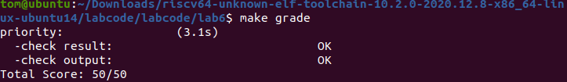
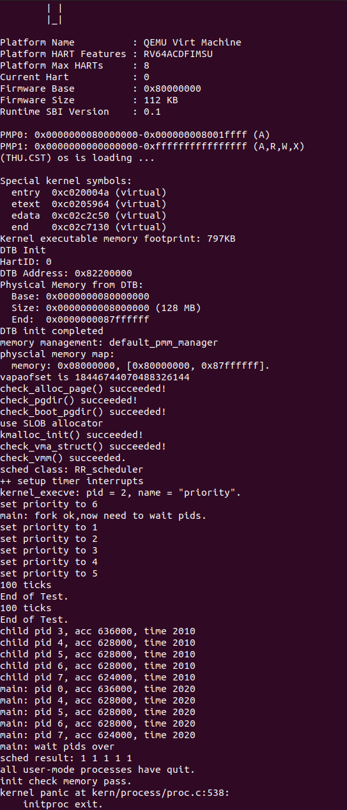

# <center>Lab6</center>

## 练习1 理解调度器框架的实现（不需要编码）

### 1. 请详细解释 sched_class 结构体中每个函数指针的作用和调用时机，分析为什么需要将这些函数定义为函数指针，而不是直接实现函数。

&emsp;&emsp;$sched\_class$结构体定义如下：

```c
// The introduction of scheduling classes is borrrowed from Linux, and makes the
// core scheduler quite extensible. These classes (the scheduler modules) encapsulate
// the scheduling policies.
struct sched_class
{
    // the name of sched_class
    const char *name;
    // Init the run queue
    void (*init)(struct run_queue *rq);
    // put the proc into runqueue, and this function must be called with rq_lock
    void (*enqueue)(struct run_queue *rq, struct proc_struct *proc);
    // get the proc out runqueue, and this function must be called with rq_lock
    void (*dequeue)(struct run_queue *rq, struct proc_struct *proc);
    // choose the next runnable task
    struct proc_struct *(*pick_next)(struct run_queue *rq);
    // dealer of the time-tick
    void (*proc_tick)(struct run_queue *rq, struct proc_struct *proc);
    /* for SMP support in the future
     *  load_balance
     *     void (*load_balance)(struct rq* rq);
     *  get some proc from this rq, used in load_balance,
     *  return value is the num of gotten proc
     *  int (*get_proc)(struct rq* rq, struct proc* procs_moved[]);
     */
};
```

- $init$函数指针的作用是初始化运行队列中的成员变量。在$sched\_init()$函数的系统启动时调用该函数指针。
- $enqueue$函数指针的作用是将进程加入运行队列中，同时更新进程的时间片和队列元数据。在$wakeup\_proc()$函数中，当进程被唤醒时调用该函数指针；在$schedule()$函数中，当前进程仍为可运行状态时，调用该函数指针重新入队。
- $dequeue$函数指针的作用是将进程从运行队列中移除，并更新队列元数据。在$schedule()$函数中，当选中下一个进程后，调用该函数指针将其从队列中移除。
- $pick\_next$函数指针的作用是从运行队列中选择下一个应该运行的进程，返回进程指针。在$schedule()$中，调用该函数指针选择下一个要运行的进程。
- $proc\_tick$函数指针的作用是处理当前进程的时钟中断，更新进程的时间片，并检查是否需要重新调度。在时钟中断处理函数中，每次时钟中断时调用该函数指针。

&emsp;&emsp;这些函数定义为函数指针而不是直接实现函数，这样的设计具有以下优势：

1. **解耦和可扩展性**: 调度框架与具体调度算法解耦，可以在不修改框架代码的情况下切换或添加新的调度算法
2. **多态性**: 通过函数指针实现类似面向对象的多态，不同的调度类可以有不同的实现
3. **易于维护**: 每种调度算法独立实现，互不干扰，便于维护和测试

### 2. 比较lab5和lab6中 run_queue 结构体的差异，解释为什么lab6的 run_queue 需要支持两种数据结构（链表和斜堆）。

&emsp;&emsp;$run\_queue$结构体定义如下：

```c
struct run_queue
{
    list_entry_t run_list;
    unsigned int proc_num;
    int max_time_slice;
    // For LAB6 ONLY
    skew_heap_entry_t *lab6_run_pool;
};
```

&emsp;&emsp;在$Lab5$中没有定义该结构体，$Lab6$中定义了这个结构体，结构体中增加了链表、斜堆两种数据结构以及最大时间片长度。链表用于$RR$调度算法，它在插入和删除的时间复杂度是$O(1) $，按照$FIFO$顺序轮转，这样的实现简单且高效；斜堆用于$Stride$调度算法，它在获取最小元素的时间复杂度是$O(1)$，这样可以快速找到$stride$值最小的进程。同时保留两种数据结构可以兼容多种算法，确保灵活性。

### 3. 分析 sched_init()、wakeup_proc() 和 schedule() 函数在lab6中的实现变化，理解这些函数如何与具体的调度算法解耦。

&emsp;&emsp;$sched\_init()$函数的代码如下所示：

```c
void sched_init(void)
{
    list_init(&timer_list);

    sched_class = &default_sched_class;

    rq = &__rq;
    rq->max_time_slice = MAX_TIME_SLICE;
    sched_class->init(rq);

    cprintf("sched class: %s\n", sched_class->name);
}
```

&emsp;&emsp;该函数在$Lab5$中并没有实现，它通过$sched_class$指针指向具体的调度类$default\_sched\_class$，并初始化运行队列。

&emsp;&emsp;$wakeup\_proc()$函数的代码如下所示：

```c
void wakeup_proc(struct proc_struct *proc)
{
    assert(proc->state != PROC_ZOMBIE);
    bool intr_flag;
    local_intr_save(intr_flag);
    {
        if (proc->state != PROC_RUNNABLE)
        {
            proc->state = PROC_RUNNABLE;
            proc->wait_state = 0;
            if (proc != current)
            {
                sched_class_enqueue(proc);
            }
        }
        else
        {
            warn("wakeup runnable process.\n");
        }
    }
    local_intr_restore(intr_flag);
}
```

&emsp;&emsp;和$Lab5$相比，$Lab6$增加了将进程放入运行队列这个操作。当该进程不是当前进程时，将唤醒的进程加入运行队列，使其可被调度。

&emsp;&emsp;$schedule()$函数的代码如下所示：

```c
void schedule(void)
{
    bool intr_flag;
    struct proc_struct *next;
    local_intr_save(intr_flag);
    {
        current->need_resched = 0;
        if (current->state == PROC_RUNNABLE)
        {
            sched_class_enqueue(current);
        }
        if ((next = sched_class_pick_next()) != NULL)
        {
            sched_class_dequeue(next);
        }
        if (next == NULL)
        {
            next = idleproc;
        }
        next->runs++;
        if (next != current)
        {
            proc_run(next);
        }
    }
    local_intr_restore(intr_flag);
}
```

&emsp;&emsp;$Lab5$直接在函数中实现$RR$调度算法，$Lab6$通过函数指针调用 $sched\_class\_pick\_next()$和 $sched\_class\_dequeue()$函数，支持多种调度算法。$sched.c$文件的其他辅助函数如下所示：

```c
static inline void
sched_class_enqueue(struct proc_struct *proc)
{
    if (proc != idleproc)
    {
        sched_class->enqueue(rq, proc);
    }
}

static inline void
sched_class_dequeue(struct proc_struct *proc)
{
    sched_class->dequeue(rq, proc);
}

static inline struct proc_struct *
sched_class_pick_next(void)
{
    return sched_class->pick_next(rq);
}

void sched_class_proc_tick(struct proc_struct *proc)
{
    if (proc != idleproc)
    {
        sched_class->proc_tick(rq, proc);
    }
    else
    {
        proc->need_resched = 1;
    }
}
```

&emsp;&emsp;上面的辅助函数用于将框架调用转换为对具体调度类的函数指针调用。

### 4. 描述从内核启动到调度器初始化完成的完整流程，分析 default_sched_class 如何与调度器框架关联。

&emsp;&emsp;从内核启动到调度器初始化完成的完整流程如下所示：

```c
内核启动(kern_init)
    ↓
sched_init()
    ↓
1. 初始化timer_list
    ↓
2. sched_class = &default_sched_class  // 指向RR调度类
    ↓
3. rq = &__rq  // 获取运行队列实例
    ↓
4. rq->max_time_slice = MAX_TIME_SLICE  // 设置最大时间片为5
    ↓
5. sched_class->init(rq)  // 调用RR_init初始化运行队列
    ↓
6. 输出调度类名称
    ↓
proc_init()  
    ↓
创建idleproc和initproc
    ↓
clock_init() 
    ↓
intr_enable()
    ↓
cpu_idle()
    ↓
开始调度循环
```

&emsp;&emsp;$default\_sched\_class$结构体的定义如下所示：

```c
struct sched_class default_sched_class = {
    .name = "RR_scheduler",
    .init = RR_init,
    .enqueue = RR_enqueue,
    .dequeue = RR_dequeue,
    .pick_next = RR_pick_next,
    .proc_tick = RR_proc_tick,
};
```

&emsp;&emsp;在这个结构体的定义中，指定了调度器的名称、相关调度函数等。在$sched\_init()$函数初始化时将调度类与该结构体进行绑定，之后通过指针动态调用。

### 5. 绘制一个完整的进程调度流程图，包括：时钟中断触发、proc_tick 被调用、schedule() 函数执行、调度类各个函数的调用顺序。并解释need_resched标志位在调度过程中的作用

```c
┌─────────────────────────────────────────────────────────────┐
│                   时钟中断触发 (IRQ_S_TIMER)                  │
└───────────────────────────┬─────────────────────────────────┘
                            ↓
┌─────────────────────────────────────────────────────────────┐
│  interrupt_handler()               						  │
│  - clock_set_next_event()  // 设置下次中断                    │
│  - ticks++                                                  │
└───────────────────────────┬─────────────────────────────────┘
                            ↓
┌─────────────────────────────────────────────────────────────┐
│  sched_class_proc_tick(current) 						      │
└───────────────────────────┬─────────────────────────────────┘
                            ↓
┌─────────────────────────────────────────────────────────────┐
│  sched_class->proc_tick(rq, proc) [kern/schedule/sched.c:41]│
│  - 对于RR: RR_proc_tick()  								     │
│    * proc->time_slice--                                     │
│    * if (time_slice == 0) proc->need_resched = 1            │
└───────────────────────────┬─────────────────────────────────┘
                            ↓
┌─────────────────────────────────────────────────────────────┐
│  中断返回，检查 need_resched 标志                              │
└───────────────────────────┬─────────────────────────────────┘
                            ↓
                    need_resched == 1?
                            │
                ┌───────────┴───────────┐
                │                       │
              是│                       │否
                │                       │
                ↓                       ↓
┌───────────────────────────┐  ┌───────────────────────────┐
│  schedule() 被调用         │  │  继续执行当前进程            │                           
└─────────── ───────────────┘  └───────────────────────────┘
            ↓
┌─────────────────────────────────────────────────────────────┐
│  schedule()     						                      │
│  1. 关闭中断 (local_intr_save) 						       │
│  2. current->need_resched = 0                               │
│  3. if (current->state == PROC_RUNNABLE)                    │
│       sched_class_enqueue(current)  // 当前进程重新入队        │
│  4. next = sched_class_pick_next()  // 选择下一个进程         │
│  5. if (next != NULL)                                       │
│       sched_class_dequeue(next)  // 从队列移除                │
│  6. if (next == NULL) next = idleproc                       │
│  7. next->runs++                                            │
│  8. if (next != current) proc_run(next)  // 切换进程         │
│  9. 恢复中断 (local_intr_restore)                            │
└─────────────────────────── ─────────────────────────────────┘
                            ↓
┌─────────────────────────────────────────────────────────────┐
│  调度类函数调用顺序:                                           │
│  1. sched_class->pick_next(rq)  // 选择进程                  │
│  2. sched_class->dequeue(rq, next)  // 出队                 │
│  3. proc_run(next)  // 执行进程切换                           │
└─────────────────────────────────────────────────────────────┘
                            ↓
┌─────────────────────────────────────────────────────────────┐
│  新进程开始执行                                               │
└─────────────────────────────────────────────────────────────┘
```

&ensp;&emsp;$need\_resched$标志位的定义如下所示：

```c
    volatile bool need_resched;             // bool value: need to be rescheduled to release CPU?
```

&emsp;&emsp;这个标志位的设置确保了检查和调度的原子性和安全性，它的作用途径有如下几种：

- 设置：在 $RR\_proc\_tick()$函数中，当时间片用完时将这个标志位设置为$1$，这样该进程进入了休眠状态；在 $sched\_class\_proc\_tick()$ 函数中，对于$idle$进程直接设置该标志位为$1$，这样方便统一调度；在 $do\_yield()$函数中，主动让出$CPU$时设置这个标志位为$1$。
- 检查：在 $cpu\_idle()$函数中循环检查进程的该标志位，如果是$1$则调度；在中断返回时检查该标志位，如果是$1$则调度。
- 清除：在$schedule()$函数开始时清除标志位，防止发生混乱。

### 6. 分析如果要添加一个新的调度算法（如stride），需要修改哪些代码？并解释为什么当前的设计使得切换调度算法变得容易。

&emsp;&emsp;以$stride$调度算法为例，如果要添加这个算法，首先需要实现这个算法相关的函数指针，之后创建类似$default\_sched\_class$结构体的新调度算法结构体，包含该算法中的函数，最后将$sched\_init()$函数中的$sched\_class$设置为新的调度算法结构体。

&emsp;&emsp;当前的设计中，所有调度算法都使用相同的$sched\_class$接口，并且通过各类函数指针实现功能调用。在添加新的算法时只需要添加新的文件，并修改$sched\_class$的指向，而不需要修改其他文件中的代码实现，便于维护。

## 练习2 实现 Round Robin 调度算法（需要编码）

&emsp;&emsp;如下是$default\_sched.c$文件中我们编写的$Round{\ }Robin$调度算法的代码，下面将使用注释的形式解释。

```c
#include <defs.h>
#include <list.h>
#include <proc.h>
#include <assert.h>
#include <default_sched.h>

/*
 * RR_init initializes the run-queue rq with correct assignment for
 * member variables, including:
 *
 *   - run_list: should be an empty list after initialization.
 *   - proc_num: set to 0
 *   - max_time_slice: no need here, the variable would be assigned by the caller.
 *
 * hint: see libs/list.h for routines of the list structures.
 */
static void
RR_init(struct run_queue *rq)
{
    // LAB6: YOUR CODE
    // 初始化双向循环链表
    list_init(&(rq->run_list));
    // 进程数为0
    rq->proc_num = 0;
}

/*
 * RR_enqueue inserts the process ``proc'' into the tail of run-queue
 * ``rq''. The procedure should verify/initialize the relevant members
 * of ``proc'', and then put the ``run_link'' node into the queue.
 * The procedure should also update the meta data in ``rq'' structure.
 *
 * proc->time_slice denotes the time slices allocation for the
 * process, which should set to rq->max_time_slice.
 *
 * hint: see libs/list.h for routines of the list structures.
 */
static void
RR_enqueue(struct run_queue *rq, struct proc_struct *proc)
{
    // LAB6: YOUR CODE
    // 确保进程不在队列中
    assert(list_empty(&(proc->run_link)));
    // 添加到队列尾部（FIFO）
    list_add_before(&(rq->run_list), &(proc->run_link));
    // 设置时间片
    if (proc->time_slice == 0 || proc->time_slice > rq->max_time_slice) {
        proc->time_slice = rq->max_time_slice;
    }
    // 设置进程的队列指针
    proc->rq = rq;
    // 增加队列进程计数
    rq->proc_num++;
}

/*
 * RR_dequeue removes the process ``proc'' from the front of run-queue
 * ``rq'', the operation would be finished by the list_del_init operation.
 * Remember to update the ``rq'' structure.
 *
 * hint: see libs/list.h for routines of the list structures.
 */
static void
RR_dequeue(struct run_queue *rq, struct proc_struct *proc)
{
    // LAB6: YOUR CODE
    // 确保进程队列不空
    assert(!list_empty(&(rq->run_list)) && proc->rq == rq);
    // 从链表移除并初始化节点
    list_del_init(&(proc->run_link));
    // 减少进程计数
    rq->proc_num--;
}

/*
 * RR_pick_next picks the element from the front of ``run-queue'',
 * and returns the corresponding process pointer. The process pointer
 * would be calculated by macro le2proc, see kern/process/proc.h
 * for definition. Return NULL if there is no process in the queue.
 *
 * hint: see libs/list.h for routines of the list structures.
 */
static struct proc_struct *
RR_pick_next(struct run_queue *rq)
{
    // LAB6: YOUR CODE
    // 获取第一个实际节点
    list_entry_t *le = list_next(&(rq->run_list));
    // 如果不是头节点（队列不空）
    if (le != &(rq->run_list)) {
        // 使用le2proc函数将其转换为进程结构
        return le2proc(le, run_link);
    }
    // 队列为空
    return NULL;
}

/*
 * RR_proc_tick works with the tick event of current process. You
 * should check whether the time slices for current process is
 * exhausted and update the proc struct ``proc''. proc->time_slice
 * denotes the time slices left for current process. proc->need_resched
 * is the flag variable for process switching.
 */
static void
RR_proc_tick(struct run_queue *rq, struct proc_struct *proc)
{
    // LAB6: YOUR CODE
    // 减少时间片
    if (proc->time_slice > 0) {
        proc->time_slice--;
    }
    // 时间片用完，需要调度
    if (proc->time_slice == 0) {
        proc->need_resched = 1;
    }
}

struct sched_class default_sched_class = {
    .name = "RR_scheduler",
    .init = RR_init,
    .enqueue = RR_enqueue,
    .dequeue = RR_dequeue,
    .pick_next = RR_pick_next,
    .proc_tick = RR_proc_tick,
};
```

&emsp;&emsp;经过上面的修改后，又对$trap.c$中的内容进行了修改，下面将使用注释的形式解释。

```c
static void print_ticks()
{
    cprintf("%d ticks\n", TICK_NUM);
#ifdef DEBUG_GRADE
    cprintf("End of Test.\n");
    // 将下面这一行注释掉，否则会产生恐慌，导致make grade的时候会报错
    // panic("EOT: kernel seems ok.");
#endif
}
```

&emsp;&emsp;使用$make{\ }grade$命令可以得到满分，所有输出检测都显示$OK$，如下所示：



&emsp;&emsp;使用$make{\ }qemu$命令运行结果如下所示：



&emsp;&emsp;从上面的结果可以看出，首先$RR$算法按$FIFO$轮转，时间片固定，因此优先级结果不反映优先级，$sched$呈现出$1{\ }1{\ }1{\ }1{\ }1$的结果，符合预期。所有子进程的$acc$时间相同，运行时间接近，符合$RR$算法公平轮转的特征。最后$initproc$尝试退出时触发保护性$panic$，这是正常保护机制。所有结果符合当前的$RR$调度算法的配置。

### 问题回答

#### 1. 比较一个在lab5和lab6都有, 但是实现不同的函数, 说说为什么要做这个改动, 不做这个改动会出什么问题

&emsp;&emsp;在这里我比较的是$sched.c$文件中的$wakeup\_proc()$函数，两个函数的代码如下所示。

```c
// Lab5
void wakeup_proc(struct proc_struct *proc)
{
    assert(proc->state != PROC_ZOMBIE);
    bool intr_flag;
    local_intr_save(intr_flag);
    {
        if (proc->state != PROC_RUNNABLE)
        {
            proc->state = PROC_RUNNABLE;
            proc->wait_state = 0;
        }
        else
        {
            warn("wakeup runnable process.\n");
        }
    }
    local_intr_restore(intr_flag);
}

// Lab6
void wakeup_proc(struct proc_struct *proc)
{
    assert(proc->state != PROC_ZOMBIE);
    bool intr_flag;
    local_intr_save(intr_flag);
    {
        if (proc->state != PROC_RUNNABLE)
        {
            proc->state = PROC_RUNNABLE;
            proc->wait_state = 0;
            if (proc != current)
            {
                sched_class_enqueue(proc);
            }
        }
        else
        {
            warn("wakeup runnable process.\n");
        }
    }
    local_intr_restore(intr_flag);
}
```

&emsp;&emsp;从上面可以看出，$Lab6$新增了一个判断条件，将唤醒的进程加入运行队列，使其可被调度，并且该进程非当前进程。这个改动实现进程唤醒时立即入队，符合运行队列模型，提高了效率；而在$Lab5$中只改变状态而不入队，需要依赖$schedule()$遍历$proc_list$查找可运行进程，效率会显著降低。

#### 2. 描述你实现每个函数的具体思路和方法，解释为什么选择特定的链表操作方法。对每个实现函数的关键代码进行解释说明，并解释如何处理**边界情况**。

&emsp;&emsp;该问题在上面代码注释中已经回答，这里就不再赘述。

#### 3. 展示 make grade 的**输出结果**，并描述在 QEMU 中观察到的调度现象。

&emsp;&emsp;该问题在上面结果分析中已经回答，这里就不再赘述。

#### 4. 分析 Round Robin 调度算法的优缺点，讨论如何调整时间片大小来优化系统性能，并解释为什么需要在 RR_proc_tick 中设置 need_resched 标志。

&emsp;&emsp;**4.1 $RR$算法的优缺点如下：**

优点：

- 公平性：所有进程获得相等$ CPU $时间

- 响应性：响应时间有界，适合交互式系统

- 实现简单：只需$ FIFO $队列，操作都是$ O(1)$

- 可预测：调度行为可预测

缺点:

- 上下文切换开销大：频繁切换导致性能损失

- 不考虑优先级：所有进程平等对待

- 时间片选择困难：过小开销大，过大响应慢

- 不适合$ I/O $密集型：浪费$ CPU $时间

&emsp;&emsp;**4.2 调整时间片的策略：**对于小系统（进程数小于5个），当前的$5{\ }ticks$足够；对于中等系统（进程数在$5-10$之间），可增大到$5-10 ticks$；对于大型系统（进程数大于10个），应当采用$10-20 ticks$或者采用其他调度算法，这样才能提升效率。

&emsp;&emsp;**4.3 在$RR\_proc\_tick$中设置$need\_resched$标志的原因如下：**

1. 中断上下文限制：$RR\_proc\_tick$在时钟中断处理程序中被调用时，中断上下文不能直接调用$schedule()$
2. 延迟调度机制：处于中断状态时$need\_resched$设置为$1$，中断返回后在安全的地方检查标志并调度
3. 保证原子性：在进程上下文中执行调度，避免中断嵌套和状态不一致
4. 性能优化：中断处理快速返回，减少中断延迟。而多个中断可能连续设置标志，但只调度一次

#### 5. **拓展思考**：如果要实现优先级 RR 调度，你的代码需要如何修改？当前的实现是否支持多核调度？如果不支持，需要如何改进？

&emsp;&emsp;要实现优先级调度，需要修改如下的部分：

- 修改$ run\_queue $结构支持多优先级队列
- 修改$RR\_enqueue $函数，按优先级插入进程
- 修改$RR\_pick\_next$函数，优先选择高优先级队列
- 根据优先级分配时间片

&emsp;&emsp;当前的实现并不支持多核调度，要支持多核调度，需要实现如下的要求：

- 每个$ CPU $拥有独立队列
- 通过指针指向上面的队列，避免全局竞争
- 对于队列设置锁，防止出现冲突
- 支持进程在不同$CPU$之间迁移
