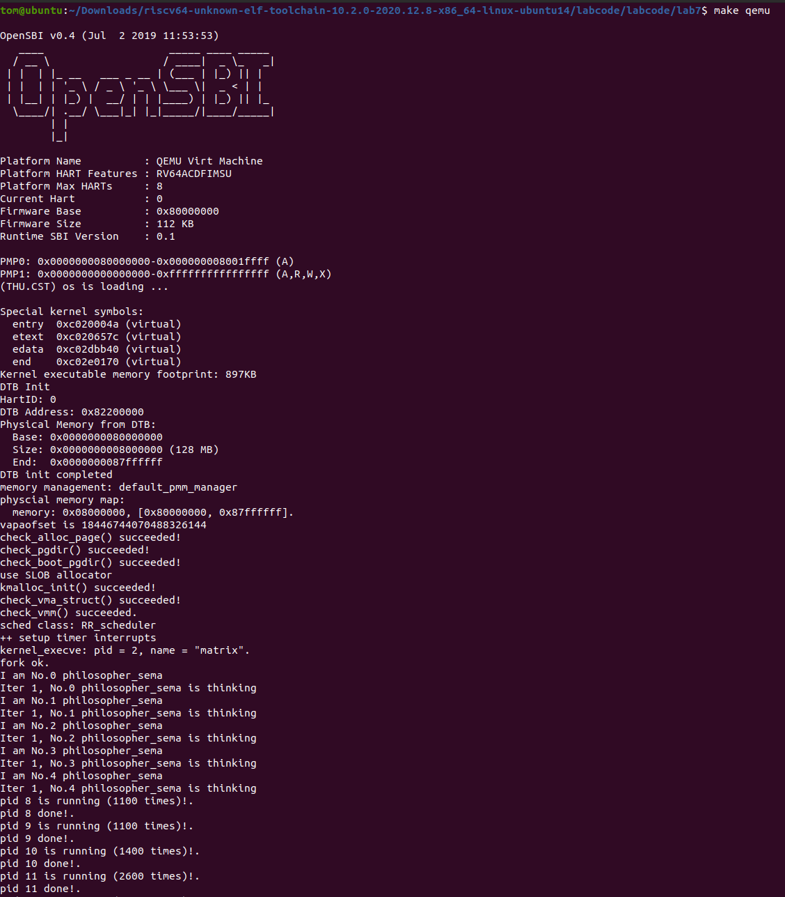
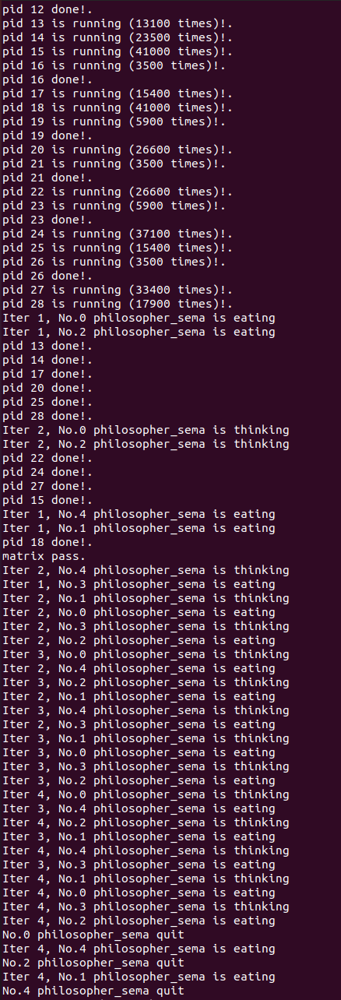
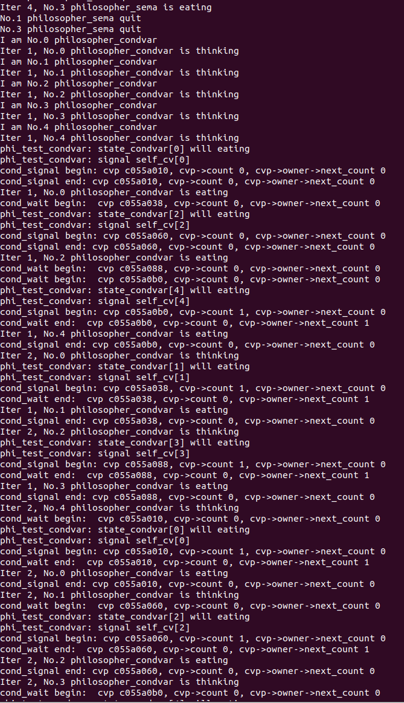
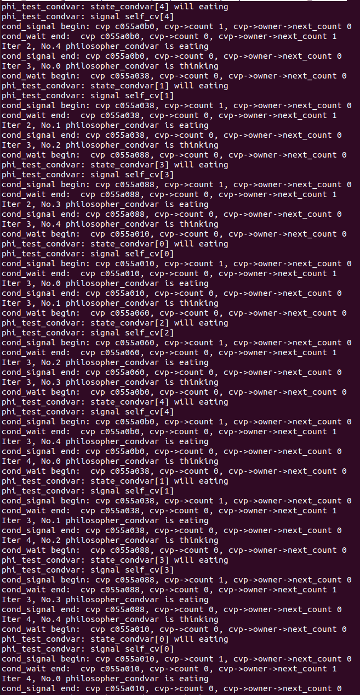
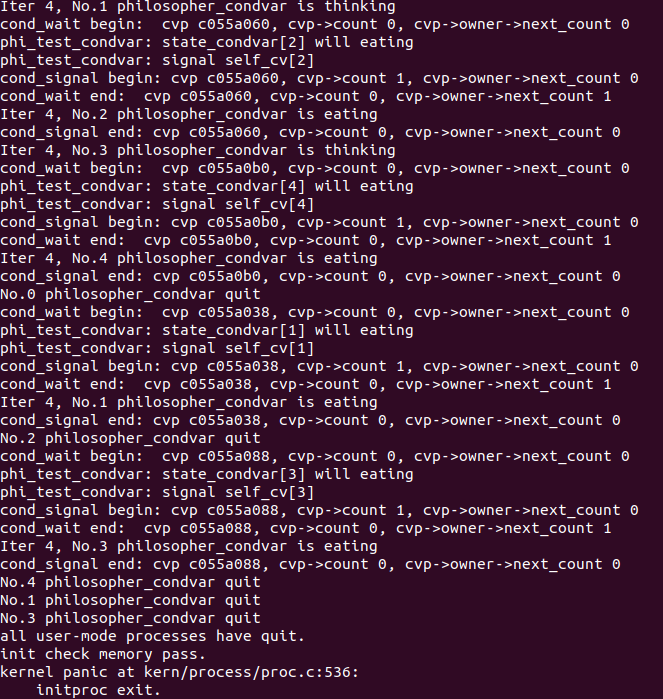

# <center>Lab7</center>

## 练习1 理解内核级信号量的实现和基于内核级信号量的哲学家就餐问题（不需要编码）

### 1.1 Lab7 内容

1.  **代码结构**：
    *   Lab7 在 `kern` 目录下新增了 `sync` 目录，其中包含了 `sem.c`, `sem.h` (信号量实现), `monitor.c`, `monitor.h` (管程实现), `check_sync.c`。

2.  **进程控制块 (`proc_struct`)**：
    *   Lab7 为了支持信号量机制，在 `proc_struct` 中使用了 `wait_state` 字段，并定义了新的等待状态 `WT_KSEM` (等待内核信号量)。虽然 `wait_state` 可能在之前就存在，但其用途在 Lab7 中被扩展到了同步原语的等待。

3.  **系统功能**：
    *   Lab7 的核心功能是实现进程/线程间的同步与互斥，引入了信号量和管程机制，解决了并发执行中的资源竞争问题。

4.  **执行过程分析**：
    *   在 Lab7 中，当一个内核线程执行信号量的 `down` 操作且资源不足时，它不会像忙等待那样消耗 CPU，而是将自己的状态设置为 `WT_KSEM`，加入到信号量的等待队列中，并调用 `schedule()` 主动让出 CPU。这需要调度器（Lab6 的成果）的支持来选择下一个可运行的进程。
    *   当资源被释放（`up` 操作）时，处于等待队列的进程会被唤醒（状态变为 `PROC_RUNNABLE`），并由调度器在未来某个时刻调度执行。

### 1.2 内核级信号量的设计描述

&emsp;&emsp;内核级信号量的数据结构定义在 `kern/sync/sem.h` 中：

```c
typedef struct {
    int value;
    wait_queue_t wait_queue;
} semaphore_t;
```

*   `value`: 信号量的计数值。如果大于 0，表示当前可用的资源数量；如果小于等于 0，表示当前没有可用资源，且 `abs(value)` 可能表示等待该资源的进程数（取决于具体实现，ucore 中 `value` 减到负数表示有等待者，但在 `down` 实现中一旦阻塞就返回了，没有继续减 `value`，见下文分析）。
*   `wait_queue`: 等待队列，用于悬挂因为无法获得资源而阻塞的进程。

&emsp;&emsp;**大致执行流程：**

1.  **初始化 (`sem_init`)**：设置 `value` 的初值，并初始化等待队列为空。

2.  **P 操作 (`down`)**：
    *   首先关中断，保证原子性。
    *   检查 `sem->value > 0`：
        *   若成立，则 `sem->value--`，获得资源，恢复中断并返回。
        *   若不成立（`sem->value <= 0`），当前进程需要等待。
    *   如果需要等待：
        *   将当前进程加入 `sem->wait_queue`。
        *   将当前进程状态设置为 `WT_KSEM`。
        *   调用 `schedule()` 进行调度，切换到其他进程。
    *   当进程被唤醒后，从等待队列中移除，恢复中断。

3.  **V 操作 (`up`)**：
    *   首先关中断。
    *   检查等待队列 `sem->wait_queue` 是否为空：
        *   若为空，表示没有进程在等待，直接 `sem->value++`，释放资源。
        *   若不为空，表示有进程在等待。此时并不增加 `value`（或者说增加后立即被唤醒的进程消耗掉了），而是直接从等待队列中唤醒一个进程 (`wakeup_wait`)。被唤醒的进程将进入 `PROC_RUNNABLE` 状态，等待调度运行。

### 1.3 哲学家就餐问题与死锁证明

&emsp;&emsp;**实现逻辑：**

*   每个哲学家有一个信号量 `s[i]`（初值为 0），用于在没有叉子时阻塞。
*   有一个互斥信号量 `mutex`（初值为 1），用于保护对状态数组 `state_sema` 的访问。
*   `phi_take_forks_sema(i)` 函数流程：
    1.  获取 `mutex`。
    2.  将自己状态设为 `HUNGRY`。
    3.  调用 `phi_test_sema(i)`：检查**左右邻居**是否都在 `EATING`。如果都不是，则自己状态设为 `EATING`，并对 `s[i]` 执行 `up` 操作。
    4.  释放 `mutex`。
    5.  对 `s[i]` 执行 `down` 操作。如果刚才 `test` 成功，`s[i]` 为 1，`down` 不会阻塞；否则 `s[i]` 为 0，哲学家阻塞。

&emsp;&emsp;**为什么不会出现死锁？**

&emsp;&emsp;死锁的四个必要条件是：互斥、请求与保持、不剥夺、循环等待。在该实现中，**请求与保持**条件被破坏了。

*   哲学家只有在**同时**拿到两把叉子（即左右邻居都不在进餐）时，才会开始进餐（状态变为 `EATING` 并通过 `s[i]`）。
*   如果无法同时拿到两把叉子，哲学家会进入阻塞状态，但此时他**并没有持有一把叉子而等待另一把**。他是在什么都没有持有的情况下等待。
*   因为对状态的检查和修改是在 `mutex` 保护的临界区内进行的，这是一个原子操作。哲学家要么拿到了两把叉子，要么一把没拿。
*   因此，不存在“哲学家 A 拿了左手叉子等待右手叉子，而哲学家 B 拿了右手叉子等待左手叉子”的情况，从而避免了死锁。

### 1.4 用户态信号量机制设计方案

&emsp;&emsp;给用户态进程/线程提供信号量机制，需要通过系统调用将内核的信号量功能暴露出来。

&emsp;&emsp;**设计方案：**

1. **系统调用接口**：

   *   `int sys_sem_init(int value)`: 创建一个新的信号量，初值为 `value`。返回一个信号量 ID (sem_id)。
   *   `int sys_sem_wait(int sem_id)`: 对指定 ID 的信号量执行 P 操作。
   *   `int sys_sem_post(int sem_id)`: 对指定 ID 的信号量执行 V 操作.
   *   `int sys_sem_free(int sem_id)`: 释放/销毁指定 ID 的信号量。

2. **内核数据结构**：

   * 在内核中维护一个全局的信号量数组或链表，或者在每个进程的控制块 (`proc_struct`) 中维护一个该进程打开的信号量表（类似文件描述符表）。

   * 如果是全局数组，可以定义：

     ```c
     struct sem_control_block {
         semaphore_t sem;
         int owner_pid; // 可选，用于资源回收
         bool used;
     } sem_array[MAX_SEMS];
     ```

   * 用户态拿到的 `sem_id` 即为该数组的索引。

3. **执行流程**：

   *   用户调用 `sys_sem_wait(sem_id)`。
   *   陷入内核，系统调用处理函数检查 `sem_id` 合法性。
   *   内核调用 `down(&sem_array[sem_id].sem)`。
       *   如果需要阻塞，内核将当前用户进程状态设为等待，并调度其他进程。
       *   当被唤醒后，系统调用返回用户态。

&emsp;&emsp;**内核级与用户态信号量机制的异同：**

| 特性           | 内核级信号量 (Kernel Semaphore)              | 用户态信号量 (User Semaphore)                                |
| :------------- | :------------------------------------------- | :----------------------------------------------------------- |
| **使用对象**   | 内核线程 / 内核代码                          | 用户进程 / 用户线程                                          |
| **访问方式**   | 直接函数调用 (`up`/`down`)，直接访问内存地址 | 系统调用 (System Call)，通过 ID/句柄访问                     |
| **存储位置**   | 内核栈或内核全局数据区                       | 内核空间（用户态仅持有句柄）                                 |
| **原子性保证** | 关中断 (`local_intr_save`) 或 自旋锁         | 陷入内核后由内核机制（关中断/锁）保证                        |
| **开销**       | 较小，仅涉及函数调用和可能的调度             | 较大，涉及用户态/内核态切换的上下文开销                      |
| **安全性**     | 开发者完全可控，但也容易导致内核崩溃         | 需要内核进行严格的参数检查和权限控制，防止用户滥用导致内核问题 |

## 练习2 完成内核级条件变量和基于内核级条件变量的哲学家就餐问题（需要编码）

&emsp;&emsp;如下是$check\_sync.c$文件中我们编写的哲学家就餐问题相关的代码，下面将使用注释的形式解释。

```c
void phi_take_forks_condvar(int i) {
     down(&(mtp->mutex));
//--------into routine in monitor--------------
    // LAB7 EXERCISE1: YOUR CODE
    // I am hungry
    // try to get fork
    // 设置自己为饥饿状态
    state_condvar[i] = HUNGRY;
    // 测试能否就餐
    phi_test_condvar(i);
    // 如果不能就餐，等待条件变量
    while(state_condvar[i] != EATING) {
        cond_wait(&mtp->cv[i]);
    }
//--------leave routine in monitor--------------
    // 离开管程
    if(mtp->next_count>0)
        up(&(mtp->next));
    else
        up(&(mtp->mutex));
}

void phi_put_forks_condvar(int i) {
     down(&(mtp->mutex));

//--------into routine in monitor--------------
    // LAB7 EXERCISE1: YOUR CODE
    // I ate over
    // test left and right neighbors
    // 设置自己为思考状态
    state_condvar[i] = THINKING;
    // 检查左右邻居是否能就餐
    phi_test_condvar(LEFT);
    phi_test_condvar(RIGHT);
//--------leave routine in monitor--------------
    // 离开管程
    if(mtp->next_count>0)
        up(&(mtp->next));
    else
        up(&(mtp->mutex));
}
```

&emsp;&emsp;经过上面的修改后，又对$monitor.c$中的内容进行了修改，下面将使用注释的形式解释。

```c
// Unlock one of threads waiting on the condition variable. 
void 
cond_signal (condvar_t *cvp) {
   //LAB7 EXERCISE1: YOUR CODE
   cprintf("cond_signal begin: cvp %x, cvp->count %d, cvp->owner->next_count %d\n", cvp, cvp->count, cvp->owner->next_count);  
  /*
   *      cond_signal(cv) {
   *          if(cv.count>0) {
   *             mt.next_count ++;
   *             signal(cv.sem);
   *             wait(mt.next);
   *             mt.next_count--;
   *          }
   *       }
   */
   // 如果有进程在等待
   if(cvp->count > 0) {
       // 增加next等待计数
       cvp->owner->next_count++;
       // 唤醒一个等待进程
       up(&(cvp->sem));
       // 自身在next上等待（让出管程）
       down(&(cvp->owner->next));
       // 被唤醒后减少计数
       cvp->owner->next_count--;
   }
   cprintf("cond_signal end: cvp %x, cvp->count %d, cvp->owner->next_count %d\n", cvp, cvp->count, cvp->owner->next_count);
}

// Suspend calling thread on a condition variable waiting for condition Atomically unlocks 
// mutex and suspends calling thread on conditional variable after waking up locks mutex. Notice: mp is mutex semaphore for monitor's procedures
void
cond_wait (condvar_t *cvp) {
    //LAB7 EXERCISE1: YOUR CODE
    cprintf("cond_wait begin:  cvp %x, cvp->count %d, cvp->owner->next_count %d\n", cvp, cvp->count, cvp->owner->next_count);
   /*
    *         cv.count ++;
    *         if(mt.next_count>0)
    *            signal(mt.next)
    *         else
    *            signal(mt.mutex);
    *         wait(cv.sem);
    *         cv.count --;
    */
    // 增加等待计数
    cvp->count++;
    // 如果有进程在next上等待
    if(cvp->owner->next_count > 0)
        // 唤醒其中一个
        up(&(cvp->owner->next));
    // 否则释放管程锁
    else
        up(&(cvp->owner->mutex));
    // 在条件变量上等待
    down(&(cvp->sem));
    // 被唤醒后减少计数
    cvp->count--;
    cprintf("cond_wait end:  cvp %x, cvp->count %d, cvp->owner->next_count %d\n", cvp, cvp->count, cvp->owner->next_count);
}
```

&emsp;&emsp;使用$make{\ }grade$命令可以得到满分，所有输出检测都显示$OK$，如下所示：


&emsp;&emsp;使用$make{\ }qemu$命令运行结果如下所示，输出了很多内容，包含五个哲学家就餐和思考的过程。











