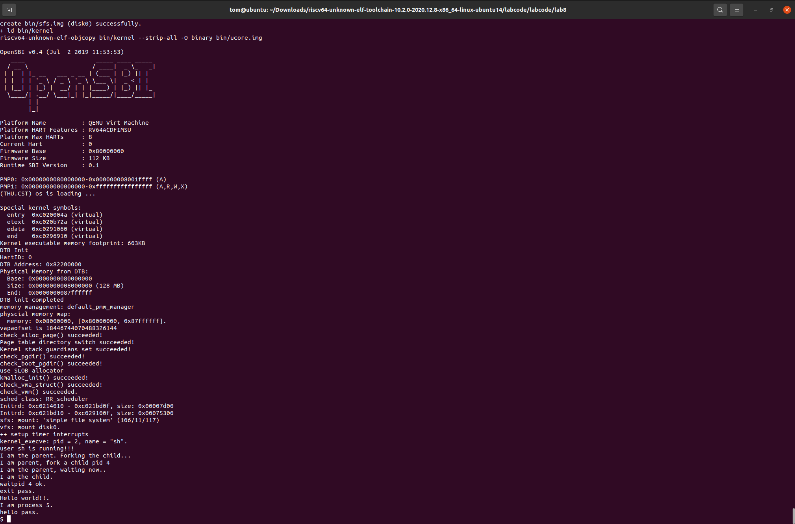

# <center>Lab8</center>

## 练习0：填写已有实验

&emsp;&emsp;如下是初始化进程控制块的代码，在这里面新增了文件结构指针的初始化，下面将使用注释的形式解释。

```c
// alloc_proc - alloc a proc_struct and init all fields of proc_struct
static struct proc_struct *
alloc_proc(void)
{
    struct proc_struct *proc = kmalloc(sizeof(struct proc_struct));
    if (proc != NULL)
    {
        // LAB4:填写你在lab4中实现的代码 已填写
        /*
         * below fields in proc_struct need to be initialized
         *       enum proc_state state;                      // Process state
         *       int pid;                                    // Process ID
         *       int runs;                                   // the running times of Proces
         *       uintptr_t kstack;                           // Process kernel stack
         *       volatile bool need_resched;                 // bool value: need to be rescheduled to release CPU?
         *       struct proc_struct *parent;                 // the parent process
         *       struct mm_struct *mm;                       // Process's memory management field
         *       struct context context;                     // Switch here to run process
         *       struct trapframe *tf;                       // Trap frame for current interrupt
         *       uintptr_t pgdir;                            // the base addr of Page Directroy Table(PDT)
         *       uint32_t flags;                             // Process flag
         *       char name[PROC_NAME_LEN + 1];               // Process name
         */

        // LAB5:填写你在lab5中实现的代码 (update LAB4 steps)已填写
        /*
         * below fields(add in LAB5) in proc_struct need to be initialized
         *       uint32_t wait_state;                        // waiting state
         *       struct proc_struct *cptr, *yptr, *optr;     // relations between processes
         */

        // LAB6:填写你在lab6中实现的代码 (update LAB5 steps)已填写
        /*
         * below fields(add in LAB6) in proc_struct need to be initialized
         *       struct run_queue *rq;                       // run queue contains Process
         *       list_entry_t run_link;                      // the entry linked in run queue
         *       int time_slice;                             // time slice for occupying the CPU
         *       skew_heap_entry_t lab6_run_pool;            // entry in the run pool (lab6 stride)
         *       uint32_t lab6_stride;                       // stride value (lab6 stride)
         *       uint32_t lab6_priority;                     // priority value (lab6 stride)
         */

        //LAB8 YOUR CODE : (update LAB6 steps)
        /*
         * below fields(add in LAB6) in proc_struct need to be initialized
         *       struct files_struct * filesp;                file struct point        
         */
        proc->state = PROC_UNINIT;
        proc->pid = -1;
        proc->runs = 0;
        proc->kstack = 0;
        proc->need_resched = 0;
        proc->parent = NULL;
        proc->mm = NULL;
        memset(&(proc->context), 0, sizeof(struct context));
        proc->tf = NULL;
        proc->pgdir = boot_pgdir_pa;
        proc->flags = 0;
        memset(proc->name, 0, PROC_NAME_LEN);
        // LAB5新增     
        proc->wait_state = 0;
        proc->cptr = NULL;
        proc->optr = NULL;
        proc->yptr = NULL;

        // Lab6新增
        proc->rq = NULL;
        list_init(&(proc->run_link));
        proc->time_slice = 0;
        skew_heap_init(&(proc->lab6_run_pool));
        proc->lab6_stride = 0;
        proc->lab6_priority = 0;
        // lab8 add
        proc->filesp = NULL;

        
    }
    return proc;
}
```

&emsp;&emsp;如下是进程切换函数的新增内容，下面将使用注释的形式解释

```c
// proc_run - make process "proc" running on cpu
// NOTE: before call switch_to, should load  base addr of "proc"'s new PDT
void proc_run(struct proc_struct *proc)
{
    // LAB4:填写你在lab4中实现的代码
        /*
        * Some Useful MACROs, Functions and DEFINEs, you can use them in below implementation.
        * MACROs or Functions:
        *   local_intr_save():        Disable interrupts
        *   local_intr_restore():     Enable Interrupts
        *   lcr3():                   Modify the value of CR3 register
        *   switch_to():              Context switching between two processes
        */
    //LAB8 YOUR CODE : (update LAB4 steps)
        /*
        * below fields(add in LAB6) in proc_struct need to be initialized
        *       before switch_to();you should flush the tlb
        *        MACROs or Functions:
        *       flush_tlb():          flush the tlb        
        */
        unsigned long intrflag;
        struct proc_struct *prev = current;
        
        local_intr_save(intrflag);
        current = proc;
        
        lsatp(proc->pgdir);
        proc->need_resched = 0;
        proc->runs++;
        // 刷新TLB（快表）
        flush_tlb();
        
        switch_to(&(prev->context), &(proc->context));
        local_intr_restore(intrflag);
}
```

## 练习1 完成读文件操作的实现（需要编码）

&emsp;&emsp;如下是$sfs\_io\_nolock()$函数，下面将使用注释解释

```c
/*  
 * sfs_io_nolock - Rd/Wr a file contentfrom offset position to offset+ length  disk blocks<-->buffer (in memroy)
 * @sfs:      sfs file system
 * @sin:      sfs inode in memory
 * @buf:      the buffer Rd/Wr
 * @offset:   the offset of file
 * @alenp:    the length need to read (is a pointer). and will RETURN the really Rd/Wr lenght
 * @write:    BOOL, 0 read, 1 write
 */
static int
sfs_io_nolock(struct sfs_fs *sfs, struct sfs_inode *sin, void *buf, off_t offset, size_t *alenp, bool write) {
    struct sfs_disk_inode *din = sin->din;
    assert(din->type != SFS_TYPE_DIR);
    off_t endpos = offset + *alenp, blkoff;
    *alenp = 0;
	// calculate the Rd/Wr end position
    if (offset < 0 || offset >= SFS_MAX_FILE_SIZE || offset > endpos) {
        return -E_INVAL;
    }
    if (offset == endpos) {
        return 0;
    }
    if (endpos > SFS_MAX_FILE_SIZE) {
        endpos = SFS_MAX_FILE_SIZE;
    }
    if (!write) {
        if (offset >= din->size) {
            return 0;
        }
        if (endpos > din->size) {
            endpos = din->size;
        }
    }

    int (*sfs_buf_op)(struct sfs_fs *sfs, void *buf, size_t len, uint32_t blkno, off_t offset);
    int (*sfs_block_op)(struct sfs_fs *sfs, void *buf, uint32_t blkno, uint32_t nblks);
    if (write) {
        sfs_buf_op = sfs_wbuf, sfs_block_op = sfs_wblock;
    }
    else {
        sfs_buf_op = sfs_rbuf, sfs_block_op = sfs_rblock;
    }

    int ret = 0;
    size_t size, alen = 0;
    uint32_t ino;
    uint32_t blkno = offset / SFS_BLKSIZE;          // The NO. of Rd/Wr begin block
    uint32_t nblks = endpos / SFS_BLKSIZE - blkno;  // The size of Rd/Wr blocks

  //LAB8:EXERCISE1 YOUR CODE HINT: call sfs_bmap_load_nolock, sfs_rbuf, sfs_rblock,etc. read different kind of blocks in file
	/*
	 * (1) If offset isn't aligned with the first block, Rd/Wr some content from offset to the end of the first block
	 *       NOTICE: useful function: sfs_bmap_load_nolock, sfs_buf_op
	 *               Rd/Wr size = (nblks != 0) ? (SFS_BLKSIZE - blkoff) : (endpos - offset)
	 * (2) Rd/Wr aligned blocks 
	 *       NOTICE: useful function: sfs_bmap_load_nolock, sfs_block_op
     * (3) If end position isn't aligned with the last block, Rd/Wr some content from begin to the (endpos % SFS_BLKSIZE) of the last block
	 *       NOTICE: useful function: sfs_bmap_load_nolock, sfs_buf_op	
	*/

    // (1) 处理第一个块（可能未对齐）
    blkoff = offset % SFS_BLKSIZE;
    if (blkoff != 0) {
        // (1) 计算第一部分的大小
        size = (nblks != 0) ? (SFS_BLKSIZE - blkoff) : (endpos - offset);
        // 获取逻辑块号对应的物理块号
        if ((ret = sfs_bmap_load_nolock(sfs, sin, blkno, &ino)) != 0) {
            goto out;
        }
        // 执行部分块读写
        if ((ret = sfs_buf_op(sfs, buf, size, ino, blkoff)) != 0) {
            goto out;
        }
        // 更新已处理的长度和缓冲区指针
        alen += size;
        buf += size;
        // 如果还有更多块需要处理
        if (nblks == 0) {
            goto out;
        }
        blkno++;
        nblks--;
    }

    // (2) 处理中间的对齐块
    while (nblks > 0) {
        // 获取当前块的物理块号
        if ((ret = sfs_bmap_load_nolock(sfs, sin, blkno, &ino)) != 0) {
            goto out;
        }
        // 读写多个完整块
        if ((ret = sfs_block_op(sfs, buf, ino, nblks)) != 0) {
            goto out;
        }
        // 更新已处理的长度和缓冲区指针
        alen += nblks * SFS_BLKSIZE;
        buf += nblks * SFS_BLKSIZE;
        blkno += nblks;
        nblks -= nblks;
    }
    
    // (3) 处理最后一个块
    size = endpos % SFS_BLKSIZE;
    // 如果结束位置不在块边界上
    if (size != 0) {
        if ((ret = sfs_bmap_load_nolock(sfs, sin, blkno, &ino)) != 0) {
            goto out;
        }
        // 从块的开始位置读写部分数据
        if ((ret = sfs_buf_op(sfs, buf, size, ino, 0)) != 0) {
            goto out;
        }
        alen += size;
    }

out:
    *alenp = alen;
    if (offset + alen > sin->din->size) {
        sin->din->size = offset + alen;
        sin->dirty = 1;
    }
    return ret;
}
```

&emsp;&emsp;在这里出现了一些问题，后来排查发现在处理中间对齐块的时候需要调用$sfs\_block\_op()$函数而不是$sfs\_buf\_op()$函数，这样才能一次性读取所有的块，否则读取部分块可能导致错误。

## 练习2 完成基于文件系统的执行程序机制的实现（需要编码）

&emsp;&emsp;如下是我们编写的$load\_icode()$函数，下面将使用注释的形式解释。

```c
// load_icode -  called by sys_exec-->do_execve

static int
load_icode(int fd, int argc, char **kargv)
{
    /* LAB8:EXERCISE2 YOUR CODE  HINT:how to load the file with handler fd  in to process's memory? how to setup argc/argv?
     * MACROs or Functions:
     *  mm_create        - create a mm
     *  setup_pgdir      - setup pgdir in mm
     *  load_icode_read  - read raw data content of program file
     *  mm_map           - build new vma
     *  pgdir_alloc_page - allocate new memory for  TEXT/DATA/BSS/stack parts
     *  lsatp             - update Page Directory Addr Register -- CR3
     */
    //You can Follow the code form LAB5 which you have completed  to complete 
    /* (1) create a new mm for current process
     * (2) create a new PDT, and mm->pgdir= kernel virtual addr of PDT
     * (3) copy TEXT/DATA/BSS parts in binary to memory space of process
     *    (3.1) read raw data content in file and resolve elfhdr
     *    (3.2) read raw data content in file and resolve proghdr based on info in elfhdr
     *    (3.3) call mm_map to build vma related to TEXT/DATA
     *    (3.4) callpgdir_alloc_page to allocate page for TEXT/DATA, read contents in file
     *          and copy them into the new allocated pages
     *    (3.5) callpgdir_alloc_page to allocate pages for BSS, memset zero in these pages
     * (4) call mm_map to setup user stack, and put parameters into user stack
     * (5) setup current process's mm, cr3, reset pgidr (using lsatp MARCO)
     * (6) setup uargc and uargv in user stacks
     * (7) setup trapframe for user environment
     * (8) if up steps failed, you should cleanup the env.
     */
    int ret = -E_NO_MEM;
    struct mm_struct *mm;
    
    // (1) 创建新内存管理结构
    if ((mm = mm_create()) == NULL) {
        goto bad_mm;
    }
    
    // (2) 建立页目录表
    if (setup_pgdir(mm) != 0) {
        goto bad_pgdir_cleanup_mm;
    }
    
    // (3) 复制TEXT/DATA/BSS段内容到进程的内存空间
    struct Page *page;
    struct elfhdr elf;
    struct proghdr ph;
    
    // 解析ELF文件头
    if ((ret = load_icode_read(fd, &elf, sizeof(struct elfhdr), 0)) != 0) {
        goto bad_elf_cleanup_pgdir;
    }
    
    // ELF程序是否有效
    if (elf.e_magic != ELF_MAGIC) {
        ret = -E_INVAL_ELF;
        goto bad_elf_cleanup_pgdir;
    }
    
    uint32_t vm_flags, perm;
    uintptr_t elf_entry = elf.e_entry;
    
    // 加载程序段
    for (uint32_t i = 0; i < elf.e_phnum; i++) {
        off_t phoff = elf.e_phoff + sizeof(struct proghdr) * i;
        if ((ret = load_icode_read(fd, &ph, sizeof(struct proghdr), phoff)) != 0) {
            goto bad_cleanup_mmap;
        }
        
        // 读取每个程序段头
        if (ph.p_type != ELF_PT_LOAD) {
            continue;
        }
        if (ph.p_filesz > ph.p_memsz) {
            ret = -E_INVAL_ELF;
            goto bad_cleanup_mmap;
        }
        
        // 设置段权限
        vm_flags = 0, perm = PTE_U | PTE_V;
        if (ph.p_flags & ELF_PF_X)
            vm_flags |= VM_EXEC;
        if (ph.p_flags & ELF_PF_W)
            vm_flags |= VM_WRITE;
        if (ph.p_flags & ELF_PF_R)
            vm_flags |= VM_READ;
        
        // 将ELF权限转换为页表权限
        if (vm_flags & VM_READ)
            perm |= PTE_R;
        if (vm_flags & VM_WRITE)
            perm |= (PTE_W | PTE_R);
        if (vm_flags & VM_EXEC)
            perm |= PTE_X;
        // 建立虚拟内存区域
        if ((ret = mm_map(mm, ph.p_va, ph.p_memsz, vm_flags, NULL)) != 0) {
            goto bad_cleanup_mmap;
        }
        
        size_t off, size;
        uintptr_t start = ph.p_va, end, la = ROUNDDOWN(start, PGSIZE);
        ret = -E_NO_MEM;
        
        // 加载文件内容到内存
        end = ph.p_va + ph.p_filesz;
        
        // 复制文本和数据段
        while (start < end) {
            if ((page = pgdir_alloc_page(mm->pgdir, la, perm)) == NULL) {
                goto bad_cleanup_mmap;
            }
            off = start - la, size = PGSIZE - off, la += PGSIZE;
            if (end < la) {
                size -= la - end;
            }
            
            // 从文件中读取
            if ((ret = load_icode_read(fd, page2kva(page) + off, size, ph.p_offset + (start - ph.p_va))) != 0) {
                goto bad_cleanup_mmap;
            }
            start += size;
        }
        
        // 建立BSS段
        end = ph.p_va + ph.p_memsz;
        if (start < la) {
            if (start == end) {
                continue;
            }
            off = start + PGSIZE - la, size = PGSIZE - off;
            if (end < la) {
                size -= la - end;
            }
            memset(page2kva(page) + off, 0, size);
            start += size;
            assert((end < la && start == end) || (end >= la && start == la));
        }
        while (start < end) {
            if ((page = pgdir_alloc_page(mm->pgdir, la, perm)) == NULL) {
                goto bad_cleanup_mmap;
            }
            off = start - la, size = PGSIZE - off, la += PGSIZE;
            if (end < la) {
                size -= la - end;
            }
            memset(page2kva(page) + off, 0, size);
            start += size;
        }
    }
    
    sysfile_close(fd);
    
    // (4) 设置用户栈
    vm_flags = VM_READ | VM_WRITE | VM_STACK;
    if ((ret = mm_map(mm, USTACKTOP - USTACKSIZE, USTACKSIZE, vm_flags, NULL)) != 0) {
        goto bad_cleanup_mmap;
    }
    if (pgdir_alloc_page(mm->pgdir, USTACKTOP - PGSIZE, PTE_USER) == NULL) {
        ret = -E_NO_MEM;
        goto bad_cleanup_mmap;
    }
    if (pgdir_alloc_page(mm->pgdir, USTACKTOP - 2 * PGSIZE, PTE_USER) == NULL) {
        ret = -E_NO_MEM;
        goto bad_cleanup_mmap;
    }
    if (pgdir_alloc_page(mm->pgdir, USTACKTOP - 3 * PGSIZE, PTE_USER) == NULL) {
        ret = -E_NO_MEM;
        goto bad_cleanup_mmap;
    }
    if (pgdir_alloc_page(mm->pgdir, USTACKTOP - 4 * PGSIZE, PTE_USER) == NULL) {
        ret = -E_NO_MEM;
        goto bad_cleanup_mmap;
    }
    
    // (5) 设置内存管理结构
    mm_count_inc(mm);
    current->mm = mm;
    current->pgdir = PADDR(mm->pgdir);
    lsatp(PADDR(mm->pgdir));
    
    // (6) 设置命令行参数
    uint32_t stacktop = USTACKTOP;
    uint32_t argv_size = 0;
    for (int i = 0; i < argc; i++) {
        argv_size += strlen(kargv[i]) + 1;
    }
    
    // 计算参数所需空间
    uint32_t argv_strs_size = argv_size;
    uint32_t argv_array_size = (argc + 1) * sizeof(uintptr_t);
   
    // 放置字符串
    uint32_t argv_strs_start = stacktop - argv_strs_size;
    argv_strs_start = ROUNDDOWN(argv_strs_start, 4); // 对齐4字节
  
    uint32_t argv_array = argv_strs_start - argv_array_size;
    argv_array = ROUNDDOWN(argv_array, 4); // 对齐4字节
    
    // 复制参数字符串到用户栈
    uintptr_t argv_strs[EXEC_MAX_ARG_NUM];
    uint32_t current_pos = argv_strs_start;
    for (int i = 0; i < argc; i++) {
        uint32_t len = strlen(kargv[i]) + 1;
        argv_strs[i] = current_pos;
        
        // 确保对应的页面存在
        uintptr_t la = ROUNDDOWN(current_pos, PGSIZE);
        pte_t *ptep;
        struct Page *p = get_page(mm->pgdir, la, &ptep);
        if (p == NULL) {
            p = pgdir_alloc_page(mm->pgdir, la, PTE_USER);
            if (p == NULL) {
                ret = -E_NO_MEM;
                goto bad_cleanup_current_mm;
            }
        }
        memcpy(page2kva(p) + (current_pos - la), kargv[i], len);
        current_pos += len;
    }
    
    // 复制参数指针数组
    uintptr_t la = ROUNDDOWN(argv_array, PGSIZE);
    pte_t *ptep;
    struct Page *p = get_page(mm->pgdir, la, &ptep);
    if (p == NULL) {
        p = pgdir_alloc_page(mm->pgdir, la, PTE_USER);
        if (p == NULL) {
            ret = -E_NO_MEM;
            goto bad_cleanup_current_mm;
        }
    }
    uintptr_t *argv_ptr = (uintptr_t *)(page2kva(p) + (argv_array - la));
    for (int i = 0; i < argc; i++) {
        argv_ptr[i] = argv_strs[i];
    }
    argv_ptr[argc] = 0; // 空终止符
    
    // (7) 初始化陷阱帧
    struct trapframe *tf = current->tf;
    uintptr_t sstatus = tf->status;
    memset(tf, 0, sizeof(struct trapframe));
    
    /* set user stack pointer */
    tf->gpr.sp = (uintptr_t)argv_array;
    
    /* set program entry point (sepc) */
    tf->epc = (uintptr_t)elf_entry;
    
    /* set return value for exec in user mode (argc) */
    tf->gpr.a0 = (uintptr_t)argc;
    
    /* set argv pointer */
    tf->gpr.a1 = (uintptr_t)argv_array;
    
    /* Adjust sstatus: clear SPP (so sret goes to user-mode), set SPIE (enable interrupts after sret) */
    tf->status = (sstatus & ~SSTATUS_SPP) | SSTATUS_SPIE;
    
    ret = 0;
out:
    return ret;
bad_cleanup_current_mm:
    // (8) 清理当前mm
    lsatp(boot_pgdir_pa);
    if (mm_count_dec(mm) == 0) {
        exit_mmap(mm);
        put_pgdir(mm);
        mm_destroy(mm);
    }
    current->mm = NULL;
    current->pgdir = boot_pgdir_pa;
    goto out;
bad_cleanup_mmap:
    exit_mmap(mm);
bad_elf_cleanup_pgdir:
    put_pgdir(mm);
bad_pgdir_cleanup_mm:
    mm_destroy(mm);
bad_mm:
    goto out;
}
```

&emsp;&emsp;经过上面的修改后，又对$trap.c$中的错误处理部分进行简化处理，去除了$pgfault\_handler()$函数，下面将使用注释的形式解释。

```c
// 具体错误处理
void exception_handler(struct trapframe *tf)
{
    int ret;
    switch (tf->cause)
    {
    case CAUSE_MISALIGNED_FETCH:
        cprintf("Instruction address misaligned\n");
        break;
    case CAUSE_FETCH_ACCESS:
        cprintf("Instruction access fault\n");
        break;
    case CAUSE_ILLEGAL_INSTRUCTION:
        cprintf("Illegal instruction\n");
        break;
    case CAUSE_BREAKPOINT:
        cprintf("Breakpoint\n");
        break;
    case CAUSE_MISALIGNED_LOAD:
        cprintf("Load address misaligned\n");
        break;
    case CAUSE_LOAD_ACCESS:
        cprintf("Load access fault\n");
        break;
    case CAUSE_MISALIGNED_STORE:
        panic("AMO address misaligned\n");
        break;
    case CAUSE_STORE_ACCESS:
        cprintf("Store/AMO access fault\n");
        break;
    case CAUSE_USER_ECALL:
        // cprintf("Environment call from U-mode\n");
        tf->epc += 4;
        syscall();
        break;
    case CAUSE_SUPERVISOR_ECALL:
        cprintf("Environment call from S-mode\n");
        tf->epc += 4;
        syscall();
        break;
    case CAUSE_HYPERVISOR_ECALL:
        cprintf("Environment call from H-mode\n");
        break;
    case CAUSE_MACHINE_ECALL:
        cprintf("Environment call from M-mode\n");
        break;
    // 指令取值异常
    case CAUSE_FETCH_PAGE_FAULT:
        cprintf("Instruction page fault at 0x%08x\n", tf->tval);
        print_trapframe(tf);
        if (current != NULL) {
            do_exit(-E_KILLED);
        } else {
            panic("kernel page fault");
        }
        break;
    // 数据加载异常
    case CAUSE_LOAD_PAGE_FAULT:
        cprintf("Load page fault at 0x%08x\n", tf->tval);
        print_trapframe(tf);
        if (current != NULL) {
            do_exit(-E_KILLED);
        } else {
            panic("kernel page fault");
        }
        break;
    // 数据存储异常
    case CAUSE_STORE_PAGE_FAULT:
        cprintf("Store/AMO page fault at 0x%08x\n", tf->tval);
        print_trapframe(tf);
        if (current != NULL) {
            do_exit(-E_KILLED);
        } else {
            panic("kernel page fault");
        }
        break;
    default:
        print_trapframe(tf);
        break;
    }
}
```

&emsp;&emsp;经过上面的改动，在使用$make{\ }qemu$命令时终于可以看到$sh$用户程序的执行界面，输入$exit、hello$命令均能够执行，说明实验基本成功！结果如下所示：



