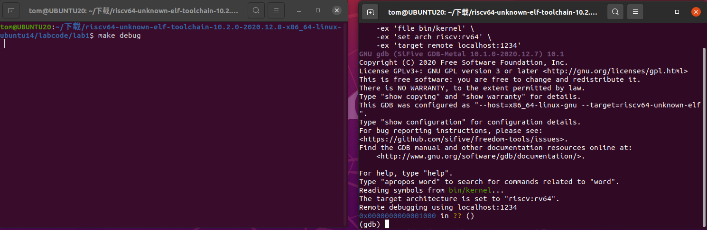
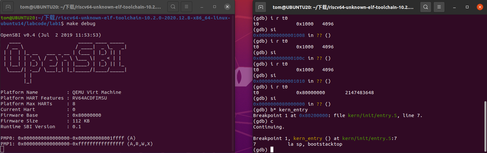
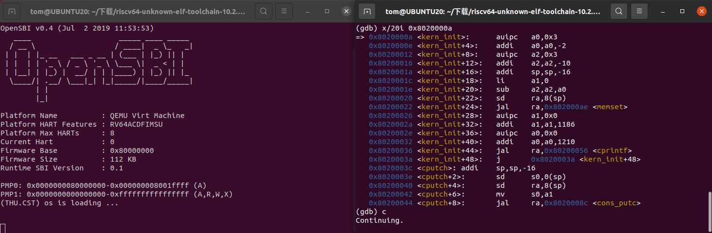

# Lab1

## 练习一

1. la sp, bootstacktop：这一指令将栈顶地址bootstacktop加载到栈指针寄存器sp中，为C代码的执行准备栈空间
2. tail kern_init：tail指令进行尾调用，跳转到kern_init函数，这一函数通常来说是C语言编写的主初始化函数，也就是操作系统的入口。此外，尾调用优化不会占用额外的栈帧。

## 练习二

### 实验过程

打开两个终端后，在左边终端里输入make debug，在右边终端里输入make gdb，得到如下的界面，说明成功进入调试阶段



输入l(list)可以显示当下的10行源代码，如下所示：

```c
1	#include <mmu.h>
2	#include <memlayout.h>
3	
4	    .section .text,"ax",%progbits
5	    .globl kern_entry
6	kern_entry:
7	    la sp, bootstacktop
8	
9	    tail kern_init
10	
```

但是这些源码不够底层，无法确定单步调试直到0x80200000需要的次数，因此经过查阅资料，可以使用x/10i 0x1000指令显示当下的10行汇编代码，如下所示：

```assembly
   0x1000:	auipc	t0,0x0		;将当前PC值的高20位加上立即数0x0，结果存入t0
   0x1004:	addi	a1,t0,32	;将 t0 + 32 存入 a1
   0x1008:	csrr	a0,mhartid	;读取 mhartid CSR (控制和状态寄存器) 到 a0
   0x100c:	ld	t0,24(t0)		;从内存地址 (t0 + 24) 加载双字到 t0
   0x1010:	jr	t0				;跳转到 t0 寄存器指定的地址
   0x1014:	unimp
   0x1016:	unimp
   0x1018:	unimp
   0x101a:	0x8000
   0x101c:	unimp
```

通过上面的代码我们发现在0x1010处的指令会跳转到t0所在的位置，因此得到了如下的调试结果：

```assembly
(gdb) si
0x0000000000001004 in ?? ()
(gdb) i r t0
t0             0x1000	4096
(gdb) si
0x0000000000001008 in ?? ()
(gdb) i r t0
t0             0x1000	4096
(gdb) si 
0x000000000000100c in ?? ()
(gdb) i r t0
t0             0x1000	4096
(gdb) si
0x0000000000001010 in ?? ()
(gdb) i r t0
t0             0x80000000	2147483648   ;在这里跳转，因此t0的值发生变化
(gdb) si
0x0000000080000000 in ?? ()
```

接着使用b* kern_entry指令直接在入口处设置断点，得到如下结果：

```assembly
Breakpoint 1 at 0x80200000: file kern/init/entry.S, line 7.
```

执行c(continue)指令后，发现程序运行到0x80200000处并停止，输出如下所示：

```assembly
Breakpoint 1, kern_entry () at kern/init/entry.S:7
7	    la sp, bootstacktop
```

同时左边的qemu模拟器中也呈现了如下的输出：



根据练习一可知这是将栈顶地址bootstacktop加载到栈指针寄存器sp中，接下来查看汇编指令：

```assembly
(gdb) x/10i 0x80200000
   0x80200000 <kern_entry>:	auipc	sp,0x3					;sp = PC + (0x3 << 12) = 0x80200000 + 0x3000 = 0x80203000
   0x80200004 <kern_entry+4>:	mv	sp,sp					;没有实际用途，可能是用于调试
   0x80200008 <kern_entry+8>:	j	0x8020000a <kern_init>	;直接跳转到内核初始化函数
   0x8020000a <kern_init>:	auipc	a0,0x3					;a0 = PC + (0x3 << 12) = 0x8020000a + 0x3000 = 0x8020300a
   0x8020000e <kern_init+4>:	addi	a0,a0,-2			;a0 = a0 - 2 = 0x8020300a -2 = 0x80203008
   0x80200012 <kern_init+8>:	auipc	a2,0x3				;a2 = PC + (0x3 << 12) = 0x80200012 + 0x3000 = 0x80203012
   0x80200016 <kern_init+12>:	addi	a2,a2,-10			;a2 = a2 - 10 = 0x80200012 - 10 = 0x80203008
   0x8020001a <kern_init+16>:	addi	sp,sp,-16			;在栈上分配16字节空间
   0x8020001c <kern_init+18>:	li	a1,0					;将 a1 寄存器清零
   0x8020001e <kern_init+20>:	sub	a2,a2,a0				;计算内存区域大小
```

从上面汇编指令中可以发现在入口点之后就是初始化函数，因此在kern_init处设置断点，得到如下结果：

```assembly
Breakpoint 2 at 0x8020000a: file kern/init/init.c, line 8.
```

这说明初始化函数的地址是0x8020000a，接着执行指令c，然后查看汇编代码，部分结果如下：

```assembly
(gdb) x/20i 0x8020000a
   0x8020000a <kern_init>:	auipc	a0,0x3					;a0 = PC + (0x3 << 12) = 0x8020000a + 0x3000 = 0x8020300a
   0x8020000e <kern_init+4>:	addi	a0,a0,-2			;a0 = a0 - 2 = 0x8020300a -2 = 0x80203008
   0x80200012 <kern_init+8>:	auipc	a2,0x3				;a2 = PC + (0x3 << 12) = 0x80200012 + 0x3000 = 0x80203012
   0x80200016 <kern_init+12>:	addi	a2,a2,-10			;a2 = a2 - 10 = 0x80200012 - 10 = 0x80203008
   0x8020001a <kern_init+16>:	addi	sp,sp,-16			;在栈上分配16字节空间
   0x8020001c <kern_init+18>:	li	a1,0					;将 a1 寄存器清零
   0x8020001e <kern_init+20>:	sub	a2,a2,a0				;计算内存区域大小
   0x80200020 <kern_init+22>:	sd	ra,8(sp)				;保存返回地址到栈上
   0x80200022 <kern_init+24>:	jal	ra,0x802000ae <memset>	;调用memset函数清零BSS段
   0x80200026 <kern_init+28>:	auipc	a1,0x0				
   0x8020002a <kern_init+32>:	addi	a1,a1,1186			;a1 = 0x80200026 + 1186 = 0x802004c8
   0x8020002e <kern_init+36>:	auipc	a0,0x0				
   0x80200032 <kern_init+40>:	addi	a0,a0,1210			;a0 = 0x8020002e + 1210 = 0x802004e8
   0x80200036 <kern_init+44>:	jal	ra,0x80200056 <cprintf>	;调用cprintf输出内核启动信息
   0x8020003a <kern_init+48>:	j	0x8020003a <kern_init+48>;跳转到自身，进入无限循环
```

从上面的代码可知，该程序在执行j	0x8020003a指令后会跳转回自己的位置，因此操作系统会一直运行，也就是如下的显示：



这样就完成了riscv从加电到执行内核第一条指令的全部过程！

### 题目回答

1. RISC-V 硬件加电后最初执行的几条指令在0x1000-0x1010的地址范围内
2. 这些指令主要是获取硬件信息并跳转到主程序，每条指令及功能如下

```assembly
auipc	t0,0x0		;将当前PC值的高20位加上立即数0x0，结果存入t0
addi	a1,t0,32	;将 t0 + 32 存入 a1
csrr	a0,mhartid	;读取 mhartid CSR (控制和状态寄存器) 到 a0
ld	t0,24(t0)		;从内存地址 (t0 + 24) 加载双字到 t0
jr	t0				;跳转到 t0 寄存器指定的地址
```

